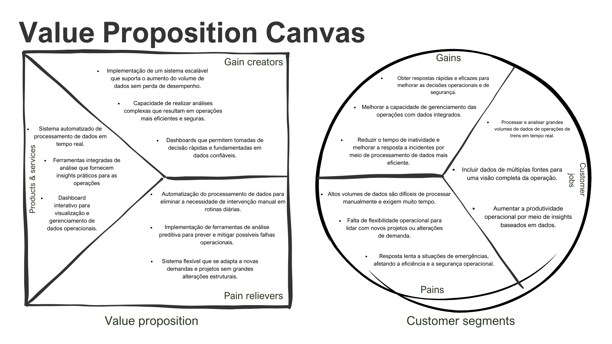

# 2. Análise de Negócios

&emsp;&emsp;A seção de Análise de Negócios é fundamental para compreender os elementos-chave que influenciam o sucesso do projeto. Nesta parte, são explorados componentes essenciais que permitem definir a proposta de valor, entender a dimensão e o alcance do mercado em que se atua e identificar os riscos associados ao negócio. Nessa documentação, serão abordado o Canvas de Proposta de Valor, a análise TAM, SAM, SOM e a Matriz de Risco do projeto.

&emsp;&emsp;O Canvas de Proposta de Valor auxilia no alinhamento dos produtos e serviços às necessidades e desejos dos stakeholders, garantindo que sejam oferecidas soluções adequadas. Através desta ferramenta, é possível visualizar de forma clara como o projeto entrega valor ao público-alvo.

&emsp;&emsp;A análise do Mercado Endereçável Total (TAM), do Mercado Disponível de Serviço (SAM) e do Mercado Obtido de Serviço (SOM) é crucial para dimensionar o potencial de mercado. Compreender essas métricas permite identificar o tamanho total do mercado, a parcela que pode ser atendida e o segmento que efetivamente será alcançado, estabelecendo metas realistas e estratégias eficazes.

&emsp;&emsp;Por fim, a Matriz de Risco permite identificar, avaliar e priorizar os possíveis riscos que podem afetar o negócio. Ao antecipar desafios e obstáculos, o projeto está melhor preparado para desenvolver planos de mitigação e garantir a resiliência e a sustentabilidade de suas operações.

&emsp;&emsp;Ao abordar esses aspectos, a Análise de Negócios fornece uma base para o planejamento estratégico e a tomada de decisões.

## 2.1 Canvas Proposta de Valor

Este Canvas de Proposta de Valor é projetado para mostrar claramente como o projeto de Big Data irá atender às necessidades específicas da Companhia Paulista de Trens Metropolitanos (CPTM). Com foco nos principais desafios enfrentados pela empresa na análise de grandes volumes de dados, este Canvas define  as tarefas críticas dos clientes, as dores atuais, e os ganhos que o projeto visa proporcionar. Além disso, detalha os produtos e serviços que serão oferecidos, os alívios de dor que serão proporcionados, e os criadores de ganho que irão diferenciar nossa proposta de valor no mercado de transporte público.

### Canvas Proposta de Valor:

    
Imagem 3: Canvas Proposta de Valor

 
Imagem produzida pelos autores

- Segmentos de Clientes e Principais Tarefas (Customer Jobs)
No lado direito do Canvas, identificamos as principais tarefas que os segmentos de clientes da CPTM precisam executar. Entre elas:

    - Processar e analisar grandes volumes de dados operacionais em tempo real.
    - Incluir dados de múltiplas fontes para obter uma visão integrada das operações.
    - Aumentar a produtividade operacional por meio de insights baseados em dados.

&emsp;&emsp;Essas necessidades mostram a importância de uma infraestrutura que suporte grandes volumes de dados e permita uma análise em tempo real, importante para uma operação como a da CPTM.

- Dores (Pains)
O CPV também identifica as dores enfrentadas pela CPTM:

    - Altos volumes de dados são difíceis de processar manualmente, exigindo muito tempo.
    - Falta de flexibilidade operacional para lidar com mudanças de demanda.
    - Respostas lentas em situações de emergência, afetando a segurança e a eficiência operacional.

&emsp;&emsp;Esses pontos de dor destacam a necessidade de uma solução que não só automatize e análise de dados, mas também ofereça flexibilidade para lidar com mudanças e incidentes inesperados, melhorando o tempo de resposta em situações críticas.

- Ganhos Esperados (Gains)
Do lado positivo, os ganhos que o projeto de Big Data promete oferecer são claros:

    - Obter respostas rápidas e eficazes para decisões operacionais e de segurança.
    - Melhorar a capacidade de gerenciamento das operações com dados integrados.
    - Reduzir o tempo de inatividade e melhorar a resposta a incidentes através de um processamento de dados mais eficiente.

&emsp;&emsp;Esses ganhos refletem os benefícios de um sistema mais automatizado e flexível, capaz de fornecer insights em tempo real e otimizar a operação como um todo.

- Proposta de Valor (Value Proposition)
A proposta de valor que o projeto traz à CPTM envolve:

    - Sistema automatizado de processamento de dados em tempo real, permitindo uma visualização clara e uma gestão eficaz das operações.
    - Ferramentas integradas de análise, que fornecem insights práticos para operações e decisões estratégicas.
    - Dashboards interativos, que possibilitam a tomada de decisões rápidas e baseadas em dados confiáveis.

&emsp;&emsp;Esses produtos e serviços visam resolver diretamente os problemas de ineficiência e tempo de resposta lenta identificados nos segmentos de clientes.

- Alívios das Dores (Pain Relievers)
Para aliviar as dores mencionadas, a proposta inclui:

    - Automatização do processamento de dados, eliminando a necessidade de intervenções manuais.
    - Ferramentas de análise preditiva, que ajudam a prever e mitigar possíveis falhas operacionais.
    - Um sistema escalável e flexível, capaz de se adaptar a novas demandas sem grandes alterações estruturais.

&emsp;&emsp;Esses alívios tornam o sistema mais ágil e adaptável às constantes mudanças nas operações ferroviárias, proporcionando mais eficiência e segurança.

- Criadores de Ganho (Gain Creators)
Por fim, os criadores de ganho descritos no Canvas incluem:

    - Implementação de um sistema escalável, que suporta o aumento do volume de dados sem comprometer o desempenho.
    - Capacidade de realizar análises complexas, resultando em operações mais seguras e eficientes.
    - Dashboards que permitem decisões rápidas, fundamentadas em dados precisos e atualizados.

&emsp;&emsp;Esses criadores de ganho diferenciam a proposta no mercado de transporte público, oferecendo uma solução robusta para os desafios enfrentados pela CPTM.

&emsp;&emsp;O Canvas apresentado demonstra uma estrutura bem planejada para apoiar a CPTM em superar as dificuldades de análise de grandes volumes de dados e em transformar esses dados em insights acionáveis para uma operação mais eficiente. Com a realização  das soluções propostas, a CPTM será capaz de melhorar significativamente a gestão e análise de dados, resultando em operações otimizadas e em uma resposta mais rápida às necessidades operacionais e emergenciais. Ê esperado que, ao final, este projeto não só melhore a eficácia operacional da CPTM, mas também contribua para sua sustentabilidade e crescimento contínuos.

## 2.2 TAM-SAM-SOM
&emsp;&emsp;No desenvolvimento de um projeto Big Data, a utilização das métricas TAM, SAM e SOM é fundamental para garantir que as decisões estratégicas e insights sejam bem estruturados. Essas métricas permitem identificar o tamanho total do mercado, quais segmentos são mais acessíveis e qual a parte realista que pode ser atingida a curto prazo. 

    
Imagem 4: TAM, SAM e SOM

 
INSTITUTO PHD. O que são TAM, SAM e SOM e como calcular. Disponível em: https://www.institutophd.com.br/o-que-sao-tam-sam-e-som-e-como-calcular/. Acesso em: 25 out. 2024. 

&emsp;&emsp;Como visto na imagem, essas três camadas, TAM, SAM e SOM, ajudam a limitar o alcance do mercado, guiando o foco do projeto para os aspectos mais viáveis e mensuráveis. No caso do projeto, o entendimento dessas métricas facilita a definição de objetivos claros e atingíveis, permitindo que a análise de dados seja otimizada para gerar os maiores impactos na operação da CPTM. Isso inclui, por exemplo, a capacidade de priorizar os dados mais relevantes para a tomada de decisões, como a otimização de processos operacionais e o aumento da eficiência na gestão dos recursos.

### 2.2.1 TAM
#### **Cálculo do TAM do Ramo Ferroviário no Brasil**

&emsp;&emsp;O Total Addressable Market (TAM) é uma estimativa do tamanho total do mercado em termos de receita que pode ser alcançado por todos os fornecedores de um determinado produto ou serviço, considerando um cenário ideal em que não há restrições ou limitações. Medir o TAM é crucial para entender o potencial de um mercado e identificar oportunidades de crescimento e investimento (WILLIAMS, 2023).

&emsp;&emsp;Para o projeto da equipe Biggie, que visa a análise do setor ferroviário no Brasil, o cálculo do TAM ajuda a fornecer uma visão clara do tamanho do mercado e do potencial econômico que pode ser explorado. Além disso, essa métrica é essencial para definir estratégias de entrada no mercado e desenvolver soluções competitivas.

**Objetivo**

&emsp;&emsp;O cálculo do TAM busca oferecer uma estimativa precisa do mercado ferroviário brasileiro, especificamente no transporte de cargas e nos novos projetos de infraestrutura. Entender o TAM permite ao grupo Biggie visualizar o impacto econômico que inovações tecnológicas e novos investimentos podem gerar.

**Fatores limitantes**

&emsp;&emsp;Ao calcular o TAM, é importante considerar riscos e fatores limitantes que podem impactar o mercado potencial, incluindo:

- **Regulamentações governamentais**: Leis específicas para concessões e operação de ferrovias podem limitar o crescimento do setor. A Lei nº 13.448/2017, por exemplo, regula a renovação de concessões ferroviárias e pode afetar diretamente a expansão das operações ferroviárias (BRASIL, 2017).
- **Questões econômicas**: O crescimento do setor ferroviário está diretamente ligado ao desempenho das indústrias que utilizam o transporte ferroviário. Uma desaceleração econômica pode reduzir o volume de carga transportada, impactando a receita gerada pelas operadoras (CNI, 2023).
- **Infraestrutura deficiente**: A falta de modernização e manutenção adequada de parte da malha ferroviária pode limitar a eficiência do setor, aumentando custos e reduzindo a capacidade de geração de receita. Segundo o Relatório de Infraestrutura da CNT, apenas 30% da malha ferroviária está em condições satisfatórias (CNT, 2023).
- **Concorrência de outros modais**: O transporte rodoviário continua sendo o principal meio de transporte de cargas no Brasil, o que pode restringir a competitividade das ferrovias. Em 2023, o transporte rodoviário representou cerca de 60% do total de cargas movimentadas no Brasil, contra 20% das ferrovias (IBGE, 2023).

**Lógica aplicada no cálculo do TAM**

1. **Identificação do público-alvo**
    
    &emsp;&emsp;O público-alvo inclui:
    
    - Empresas concessionárias de ferrovias no Brasil, como Vale e Rumo Logística.
    - Grandes indústrias de setores como agronegócio e mineração, que utilizam o transporte ferroviário.
    - O governo brasileiro, responsável por investimentos e concessões.
2. **A Associação Nacional dos Transportadores Ferroviários (ANTF)** aponta que 20 empresas possuem concessões ferroviárias no Brasil, sendo essas as principais operadoras do mercado. Neste cálculo, consideramos as grandes operadoras que dominam a maior parte do mercado.
3. **Metodologia para calcular o preço médio**
    
    &emsp;&emsp;Para calcular o TAM, foi utilizado o relatório da ANTF, que estima que a receita bruta anual do setor ferroviário de cargas seja de R$50 bilhões (ANTF, 2023). Para determinar o preço médio por empresa, dividiu-se esse valor total entre as 20 principais concessionárias: Preço médio = (R$50 bilhões/20 empresas) = R$2,5 bilhões por empresa. Esse valor representa uma estimativa aproximada, englobando grandes concessionárias de ferrovias. O cálculo inclui principalmente empresas de maior porte, responsáveis pela maior fatia de mercado. Pequenas operadoras não foram consideradas separadamente, mas seu impacto é marginal em comparação com as grandes players do setor.
    
4. **Multiplicação do número de clientes pelo preço médio**
    
    &emsp;&emsp;Com base nos dados levantados, o TAM pode ser calculado da seguinte forma: TAM = 20 empresas R$2,5 bilhões (receita média anual) + R$30 bilhões (novos projetos). O resultado é um TAM estimado de **R$80 bilhões por ano**, incluindo tanto a receita das operadoras atuais quanto os novos investimentos em infraestrutura previstos pelo governo brasileiro.
    

&emsp;&emsp;Dessa forma, o cálculo realizado pela equipe Biggie estima que o TAM do setor ferroviário brasileiro, no contexto de transporte de cargas e novos projetos, seja de R$80 bilhões anuais. Esse valor reflete o mercado potencial que pode ser explorado pelas operadoras, considerando também os fatores limitantes mencionados, como regulamentações, infraestrutura deficiente e concorrência com outros modais de transporte.

### 2.2.2 SAM

#### Cálculo do SAM para o Ramo Ferroviário no Brasil

&emsp;&emsp;O **Service Addressable Market (SAM)**, ou Mercado Endereçável de Serviço, representa a parte do **Total Addressable Market (TAM)** que uma empresa pode efetivamente atender com seus produtos ou serviços, levando em consideração limitações operacionais, geográficas e demográficas (Klipfolio, 2023). O SAM oferece uma visão mais realista do mercado acessível e é fundamental para a definição de estratégias focadas em segmentos viáveis, permitindo alocação eficiente de recursos (HubSpot, 2023). Além disso, o SAM é crucial para projeções financeiras e para identificar oportunidades de crescimento em nichos específicos (Amazon Ads, 2023).

#### Geografia e Capacidade de Entrega

&emsp;&emsp;No setor ferroviário brasileiro, as principais operadoras têm malhas geograficamente restritas, limitando sua capacidade de atendimento a determinadas regiões e setores:

- **MRS Logística** opera uma malha de 1.643 km nos estados de São Paulo, Rio de Janeiro e Minas Gerais. A empresa transporta quase 20% das exportações do Brasil, focando no transporte de produtos industriais e agrícolas. Sua atuação é limitada a essas três regiões (Vale S.A., 2023).
  
- **Rumo Logística** controla cerca de 14.000 km de malha ferroviária, conectando os principais portos do Brasil. A empresa é responsável por 24% do volume de grãos exportados, sendo sua atuação geograficamente ampla, mas com foco no setor agrícola (Vale S.A., 2023).

- **Vale S.A.** administra duas importantes ferrovias: a Estrada de Ferro Carajás (892 km) e a Estrada de Ferro Vitória a Minas (905 km), totalizando 1.797 km. Sua atuação está fortemente concentrada no transporte de minério de ferro e passageiros em regiões de extração mineral (Vale S.A., 2023).

- **VLI Logística** possui mais de 7.000 km de malha ferroviária e está expandindo suas operações com investimentos significativos, concentrando-se no transporte de cargas agrícolas e minerais (VLI Logística, 2023).

#### Segmentação de Clientes

&emsp;&emsp;O SAM para essas operadoras será composto pelas cargas que podem ser transportadas nas regiões onde elas operam, considerando fatores como:

- **Contratos de concessão** que regulam o uso das malhas ferroviárias (Klipfolio, 2023).
- **Acordos com grandes indústrias** dos setores de mineração e agronegócio, que são os principais clientes do transporte ferroviário (HubSpot, 2023).
- **Proximidade com portos**, que é vital para as exportações, especialmente no caso de grãos e minério de ferro (Amazon Ads, 2023).

#### Capacidade de Mercado e Limitações

&emsp;&emsp;Embora o setor ferroviário no Brasil esteja em expansão, existem limitações significativas que afetam o SAM, restringindo o mercado que as operadoras podem efetivamente atender:

- **Geografia Restrita**: Apesar da extensão da malha ferroviária no Brasil, as principais operadoras têm áreas de atuação geograficamente limitadas. MRS Logística, por exemplo, opera em três estados (SP, RJ e MG), enquanto a Vale S.A. se concentra no transporte de minério em regiões específicas. Isso restringe o alcance total das operações em termos de captura de mercado nacional (Klipfolio, 2023).

- **Segmentação de Mercado**: As operadoras atendem principalmente a setores específicos, como o agronegócio e a mineração. Isso significa que, embora o TAM seja estimado em R$ 80 bilhões, as operadoras só conseguem capturar a parte desse mercado que corresponde às demandas desses setores, o que limita o escopo total de atendimento (HubSpot, 2023).

- **Concorrência com o Transporte Rodoviário**: O transporte rodoviário continua a dominar o Brasil, respondendo por cerca de 60% do total de cargas transportadas. Isso cria um desafio competitivo significativo para as ferrovias, já que nem todas as regiões ou tipos de carga são adequadas para o transporte ferroviário (Amazon Ads, 2023).

- **Capacidade Operacional e Infraestrutura**: Muitas ferrovias enfrentam desafios relacionados à infraestrutura. Há uma falta de modernização e manutenção em partes da malha ferroviária, o que diminui a eficiência e a capacidade operacional. O aumento dos custos operacionais e a falta de eficiência limitam o número de cargas que podem ser transportadas, impactando o potencial de geração de receita (Klipfolio, 2023).

- **Dependência dos Setores de Agronegócio e Mineração**: A demanda por transporte ferroviário está intimamente ligada ao desempenho dos setores como o agronegócio e a mineração. Flutuações nesses setores impactam diretamente o volume de carga transportada e, portanto, o potencial de receita para as operadoras (HubSpot, 2023).

&emsp;&emsp;Esses fatores justificam a restrição do SAM em comparação ao TAM, uma vez que as operadoras enfrentam desafios estruturais, concorrência e limitações específicas em termos de geografia e capacidade de atendimento.

#### Estimativa do SAM

&emsp;&emsp;Para estimar o SAM, consideramos que, embora o TAM do setor ferroviário seja estimado em **R$ 80 bilhões anuais**, as operadoras ferroviárias conseguem capturar entre **50% e 60%** do valor estimado.

### 2.2.3 SOM

#### Cálculo do SOM para o Ramo Ferroviário no Brasil

&emsp;&emsp;O **Serviceable Obtainable Market (SOM)**, ou Mercado Alcançável, representa a parcela do **Serviceable Addressable Market (SAM)** que uma empresa pode efetivamente capturar, considerando suas capacidades operacionais, limitações financeiras e estratégias de mercado (G4 Educação, 2024). No contexto do setor ferroviário, o SOM reflete uma estimativa baseada na capacidade operacional e em fatores como a extensão limitada da malha ferroviária e a baixa eletrificação. Diferente do SAM, que inclui todos os clientes potenciais dentro do mercado endereçável, o SOM fornece uma visão mais realista da fatia de mercado que pode ser conquistada no curto e médio prazo, dadas as restrições específicas do setor (HubSpot, 2024).

#### Situação Atual do Transporte Ferroviário

&emsp;&emsp;O setor ferroviário no Brasil está passando por uma revitalização, com um aumento significativo de investimentos e projetos. No entanto, a capacidade de capturar uma fatia relevante do mercado ainda enfrenta diversos desafios:

- **Extensão da Malha Ferroviária**: O Brasil possui cerca de 30.000 km de ferrovias operacionais, com uma densidade de 3,1 metros por km². Isso é muito baixo em comparação com países como os EUA (150 m/km²) e Argentina (15 m/km²), o que limita a abrangência das operações ferroviárias (FGV, 2024).

- **Distribuição Regional**: A maior parte da malha ferroviária está concentrada na Região Sudeste, que representa quase 47% da rede total. As Regiões Norte e Centro-Oeste, onde está localizada grande parte das áreas de expansão agrícola, possuem apenas 8% da malha, o que limita o alcance das operações ferroviárias nessas áreas críticas para o transporte de commodities (FGV, 2024).

- **Eletrificação**: Apenas 2.450 km de ferrovias são eletrificadas, o que limita a eficiência do transporte. A falta de eletrificação impacta diretamente os custos operacionais e a competitividade com outros modais, como o rodoviário (Brasil Escola, 2024).

#### Investimentos e Projetos em Andamento

&emsp;&emsp;O governo brasileiro está investindo fortemente na modernização e expansão do setor ferroviário, o que aumenta o potencial de crescimento do SOM:

- **Novo PAC**: O Plano de Aceleração do Crescimento (PAC) prevê um investimento de R$ 94,2 bilhões até 2026 para fortalecer o transporte ferroviário. Entre os projetos estratégicos estão a Ferrovia de Integração Oeste-Leste (Fiol) e a Transnordestina, que visam aumentar a conectividade entre as regiões produtoras e os portos, ampliando as rotas de exportação (Agência Brasil, 2024).

- **Contratos Recentes**: Em 2023, foram assinados 15 novos contratos de autorizações ferroviárias em estados como Minas Gerais, São Paulo e Paraná, o que deverá contribuir para aumentar a malha e a competitividade do modal ferroviário (Agência Brasil, 2024).

Esses investimentos e projetos criam novas oportunidades para a expansão do SOM no Brasil, especialmente no setor de transporte de cargas.

#### Desafios e Limitações

&emsp;&emsp;Embora o setor ferroviário esteja em processo de modernização, existem barreiras que limitam o quanto desse mercado pode ser capturado no curto prazo:

- **Declínio Histórico**: O setor ferroviário brasileiro passou por décadas de declínio após seu auge entre 1870 e 1920. Esse declínio resultou na perda de competitividade do modal ferroviário, que até 1996 era responsável por menos de 20% da movimentação de cargas no país. Embora haja previsão de que a participação das ferrovias aumente para cerca de 35% com as novas obras, essa transição será gradual (FGV, 2024).

- **Dependência do Transporte Rodoviário**: Apesar dos investimentos no setor ferroviário, o modal rodoviário continua a ser o principal meio de transporte de cargas no Brasil. A falta de integração entre as malhas ferroviária e rodoviária, além das limitações regionais das ferrovias, dificulta a captura de um mercado maior (Brasil Escola, 2024).

- **Infraestrutura e Eficiência**: A falta de eletrificação e a densidade limitada da malha ferroviária reduzem a eficiência operacional das ferrovias. Isso significa que, embora haja um mercado potencial para ser capturado, a infraestrutura atual não suporta a competitividade necessária para atender às demandas de forma eficiente (G4 Educação, 2024).

#### Estimativa do SOM

&emsp;&emsp;Com base nos investimentos em andamento e nas limitações estruturais, podemos estimar que o SOM, ou a parcela do mercado que as operadoras ferroviárias podem capturar no curto prazo, será uma fração do SAM. Considerando que o SAM está fortemente concentrado no transporte de commodities e que o modal ferroviário deve aumentar sua participação de 20% para cerca de 35% no mercado de cargas, podemos estimar que o SOM estaria entre **25% a 30%** do SAM (HubSpot, 2024), com uma perspectiva de crescimento gradual à medida que a infraestrutura melhora.

Em termos financeiros, se considerarmos um SAM de **R$ 40 bilhões a R$ 48 bilhões**:

- **25% do SAM**: **R$ 10 bilhões a R$ 12 bilhões** anuais.
- **30% do SAM**: **R$ 12 bilhões a R$ 14,4 bilhões** anuais.

&emsp;&emsp;Esses números refletem a fatia de mercado que pode ser capturada no curto prazo, considerando as limitações atuais do setor ferroviário, como a extensão reduzida da malha e a falta de eletrificação. No entanto, com a modernização e expansão das ferrovias em andamento, existe um potencial significativo para o crescimento gradual do SOM. À medida que a infraestrutura melhora e novos projetos são concluídos, as operadoras ferroviárias poderão capturar uma parcela maior do mercado, aumentando sua competitividade e eficiência.

### 2.2.4 Conclusão TAM-SAM-SOM
&emsp;&emsp;A análise do TAM, SAM e SOM para o setor ferroviário brasileiro evidencia um mercado com potencial significativo, porém com desafios que limitam sua plena exploração. O TAM estimado em R$ 80 bilhões indica um amplo mercado potencial. No entanto, restrições geográficas, operacionais e a forte concorrência do transporte rodoviário reduzem o SAM para entre R$ 40 e R$ 48 bilhões. Além disso, o SOM estimado entre R$ 10 e R$ 14,4 bilhões demonstra que, apesar das limitações atuais, há oportunidades reais para expansão e aumento de participação no mercado a curto e médio prazo.

&emsp;&emsp;Esses insights ressaltam a importância de investimentos contínuos em infraestrutura e modernização da malha ferroviária para superar os desafios existentes. A diversificação além dos setores de agronegócio e mineração e a implementação de tecnologias avançadas, como soluções de Big Data, podem otimizar operações e identificar novas oportunidades de mercado. Com o apoio de projetos governamentais como o PAC, o setor ferroviário tem o potencial de aumentar sua competitividade e contribuir significativamente para o desenvolvimento econômico do país.

## 2.3 Matriz de Risco

&emsp;&emsp;A matriz de risco é uma ferramenta crucial para que seja possível prever e mensurar erros. Para isso, dois critérios são estabelecidos para cada risco, probabilidade e impacto. A partir da união dessas características é formada a matriz

&emsp;&emsp; A matriz é dividida em células, onde cada combinação de probabilidade e impacto é representada. Quanto mais à direita (maior impacto) e quanto mais ao topo (maior probabilidade) o risco se localiza, mais crítica é a sua avaliação.

&emsp;&emsp;Os riscos são classificados em cores (ou categorias) para facilitar a visualização:

- Verde: Riscos de baixo impacto e baixa probabilidade (aceitáveis).

- Amarelo: Riscos de impacto ou probabilidade moderada (monitoramento necessário).

- Vermelho: Riscos de alta probabilidade e alto impacto (necessitam de ações imediatas para mitigação).

### 2.3.1 Riscos

&emsp;&emsp; Agora, segue abaixo a matriz de risco e seus respectivos riscos descritos juntamente a formula definição de risco(Probabilidade x Impacto)

    
Imagem 5: Matriz de Risco

    
    
Imagem produzida pelos autores

|ID |Riscos                                                     |Descrição                                                                                                                                                                                                                                              |Probabilidade|Impacto|Risco = P X I|
|---|-----------------------------------------------------------|-------------------------------------------------------------------------------------------------------------------------------------------------------------------------------------------------------------------------------------------------------|-------------|-------|-------------|
|1  |Dados incorretos                                           |Dados enviados pelo parceiro não serem suficientes para a solução                                                                                                                                                                                      |3            |2      |6            |
|2  |Segurança de dados                                         |Dados inviados contem informações sensíveis às quais não deviamos ter acesso, causando uma pausa no projeto                                                                                                                                            |2            |4      |8            |
|3  |Complexidade Técnica                                       |a implantação de um Data app é um tema extremamente denso, com isso, o aprendizado pode &#124; &emsp &#124; &emsp &#124;     &#124;ser lento, com isso causando atrasos na entrega                                                                                         |4            |2      |8            |
|4  |Depêndencia de novos dados                                 |Com a dependência de novos dados, podem ocorrer atrasos e períodos de inatividade da equipe. Com isso causando estresse e períodos de trabalho conturbados                                                                                             |3            |3      |9            |
|5  |Escopo mal definido                                        |Um escopo mal definido pode causar mudanças bruscas não previstas no projeto, causando impactos negativos que podem afetar a entrega final                                                                                                             |4            |5      |20           |
|6  |Escolha inadequada de tecnologias                          |Com a ampla gama de tecnologias possíveis, é possivel ocorrer a escolha de uma que não supra as necessidades do cliente, com isso necessitando um maior tempo para implantação.                                                                        |1            |1      |1            |
|7  |Gerenciamento de Expectativas de Stakeholders              |Stakeholders podem ter expectativas irreais sobre os resultados e capacidades do DataApp. Com isso, a falta de alinhamento entre as entregas do projeto e as expectativas pode gerar insatisfação, mesmo que o projeto seja tecnicamente bem-sucedido. |5            |1      |5            |
|8  |Desempenho Insatisfatório                                  |O DataApp pode apresentar problemas de desempenho, como lentidão ou falhas.                                                                                                                                                                            |1            |3      |3            |
|9  |Atrasos no Desenvolvimento por Requisitos Não Claros       |Requisitos de negócio ou técnicos mal definidos ou que mudam frequentemente podem levar a retrabalho, confusão e atrasos significativos no desenvolvimento do projeto.                                                                                 |2            |3      |6            |
|10 |Esgotamento de Créditos da AWS por Mau Gerenciamento de Uso|Durante o desenvolvimento, a equipe pode usar os serviços da AWS de forma ineficiente, levando ao uso excessivo de recursos e ao esgotamento rápido dos créditos disponíveis na conta, o que pode interromper o progresso do projeto.                  |1            |5      |5            |

#### Mitigação de Riscos

&emsp;&emsp; Com os riscos definidos, é de suma importância definir como mitigar e quais os planos de contingência para cada um dos riscos apresentados na matriz.

|ID |Mitigação                                                                                                                                                                                                                                                                                                                                                                                                                                                                                 |Plano de Contingência                                                                                                                                                                            |Responsável   |
|---|------------------------------------------------------------------------------------------------------------------------------------------------------------------------------------------------------------------------------------------------------------------------------------------------------------------------------------------------------------------------------------------------------------------------------------------------------------------------------------------|-------------------------------------------------------------------------------------------------------------------------------------------------------------------------------------------------|--------------|
|1  | - Planejamento de dados: Definir, desde o início, os requisitos mínimos de dados necessários para que seja possível implementar o projeto no escopo definido pelo grupo.   - Comunicação clara: Manter um canal de comunicação aberto e contínuo com os stakeholders para garantir que os dados enviados estejam corretos                                                                                                                                                                |Definir um plano de ação caso dados inadequados sejam recebidos, permitindo correções rápidas.                                                                                                   |Erik          |
|2  |- Anonimização de dados sensíveis;  - Questionar stakeholders acerca de dados que aparentemente não deveriam ser acessados por nós.                                                                                                                                                                                                                                                                                                                                                       |Esperar o contato do responsável no parceiro por aqueles dados para que possamos decidir o que fazer com os dados sensíveis.                                                                     |Pedro Henrique|
|3  |- Dividir tarefas complexas em tarefas menores e de complexidade reduzida;   - Realizar estudos em conjunto com o grupo para que possamos desenvolver o projeto                                                                                                                                                                                                                                                                                                                           |Ao ver um atraso, parcionar a tarefa de alta complexidade entre diversos integrantes                                                                                                             |Kaylane       |
|4  | - Criação de backlog: Desenvolver tarefas secundárias para a equipe executar durante períodos de inatividade, para otimizar o uso do tempo;  - Ter um contato constante com o parceiro para que os dados sejam enviados o quanto antes                                                                                                                                                                                                                                                   |Realizar tarefas secundárias                                                                                                                                                                     |Izadora       |
|5  | - Definição clara do escopo: Documentar detalhadamente o escopo do projeto, com metas claras e resultados esperados, garantindo o alinhamento com todas as partes interessadas.   - Revisão periódica: Fazer revisões regulares do escopo com a equipe e stakeholders, ajustando conforme necessário, mas evitando mudanças drásticas de última hora.                                                                                                                                    |Reorganizar as tarefas da equipe e durante o status report, definir novos prazos juntamente ao cliente, alinhando sempre as espectativas, dado o tempo reduzido para realizar um pjeto em atraso.|Pedro Faria   |
|6  |Análise técnica profunda: Realizar uma análise detalhada das necessidades do projeto e das capacidades das tecnologias disponíveis antes de escolher a solução.                                                                                                                                                                                                                                                                                                                           |Refazer a pesquisa de tecnologias para que seja possivel reimplantar o projeto                                                                                                                   |Henrique Cox  |
|7  | - Comunicação regular: Manter uma comunicação contínua com os stakeholders, atualizando-os sobre o progresso, limitações e resultados realistas esperados do projeto.   - Definição clara de resultados: Estabelecer desde o início quais são os resultados esperados e alinhar esses objetivos com todos os stakeholders.   - Demonstrações regulares: Apresentar protótipos ou versões intermediárias do DataApp para demonstrar progresso e ajustar expectativas conforme necessário. |Realizar um status report, informando detalhadamente o que está sendo decidido, se possível, demonstrar a Lean Inception para o cliente                                                          |Freddy        |
|8  | - Testes de carga e estresse: Realizar testes de carga e estresse em ambientes de pré-produção, simulando as condições reais de operação antes do lançamento;   - Escalabilidade planejada: Garantir que a arquitetura do DataApp seja escalável, usando infraestrutura distribuída e dimensionável para lidar com picos de tráfego ou volume de dados.                                                                                                                                  |Realizar uma reavaliação da arquitetura implementada                                                                                                                                             |Pedro Henrique|
|9  |Validação incremental: Validar os requisitos em cada sprint de desenvolvimento com os stakeholders, garantindo que o projeto esteja alinhado às expectativas continuamente.(Status report)                                                                                                                                                                                                                                                                                                |Reajustar o escopo do projeto, concentrando-se primeiro nos requisitos mais claros e urgentes, deixando questões ambíguas para sprints posteriores.                                              |Erik          |
|10 | - Monitoramento contínuo: Utilizar as ferramentas de monitoramento de gastos da AWS, como AWS Cost Explorer e Billing Alerts, para rastrear o uso dos serviços e identificar padrões de consumo excessivo.   - Definir limites de uso: Implementar cotas e limites de uso em serviços críticos (como EC2, S3, e Lambda), prevenindo o consumo além do necessário. Configurar alertas automáticos para notificar quando o uso estiver perto do limite dos créditos.                       |Reduzir o uso de serviços não essenciais, como ambientes de teste ou desenvolvimento, priorizando os recursos críticos para o andamento do projeto.                                              |Izadora           |

### 2.3.2 Oportunidades

&emsp;&emsp; Além disso, utilizando a mesma linha de raciocínio, é possível definir uma matriz de oportunidades, ainda seguindo a mesma formula. Sendo de suma importância para ter planos definidos para o melhor aproveitamento de oportunidades que surgem repentinamente.

    
Imagem 6: Matriz de Oportunidades

    
    
Imagem produzida pelos autores

#### Definição das oportunidades

&emsp;&emsp; A matriz apresentada acima foi construída a partir de dados da tabela abaixo:

|ID |Oportunidade                                          |Descrição                                                                                                                                                                                                                                                                                                                                                  |Probabilidade|Impacto|Oportunidade = Probabilidade x Impacto|
|---|------------------------------------------------------|-----------------------------------------------------------------------------------------------------------------------------------------------------------------------------------------------------------------------------------------------------------------------------------------------------------------------------------------------------------|-------------|-------|--------------------------------------|
|1  |Reconhecimento pela Inovação                          | Ao utilizar tecnologias avançadas como Big Data e AWS com excelencia, o grupo de desenvolvimento pode ser reconhecido pelo parceiro, o qual se trata de uma grande empresa no ramo de transporte, com isso trazendo notoriedade para os integrantes e a possibilidade de apresentar para pessoas de cargos altos, como ja aconteceu em projetos da empresa|3            |5      |15                                    |
|2  |Desenvolvimento de Soft Skills e Trabalho Colaborativo|O projeto oferece uma oportunidade para aprimorar habilidades de comunicação, resolução de conflitos e trabalho em equipe, especialmente ao lidar com diferentes stakeholders e departamentos do cliente                                                                                                                                                   |4            |4      |16                                    |
|3  |Aumento da rede de contatos(Networking)               |O envolvimento em um projeto inovador como o desenvolvimento de um DataApp pode gerar interações com diversas áreas da empresa, fornecedores e parceiros externos, expandindo a rede de contatos dos profissionais envolvidos.                                                                                                                             |3            |4      |12                                    |
|4  |Valorização através de Resultados                     |O projeto pode gerar resultados mensuráveis, como melhorias em eficiência, aumento na satisfação do cliente ou redução de custos                                                                                                                                                                                                                           |2            |5      |10                                    |
|5  |Melhorias na Eficiência Operacional                   |O DataApp pode permitir melhorias significativas na eficiência operacional da empresa, reduzindo tempos de processamento e otimizando fluxos de trabalho.                                                                                                                                                                                                  |3            |3      |9                                     |

&emsp;&emsp; Com a identificação clara de oportunidades e riscos, é possível tornar um projeto de DataApp — que possui uma série de variáveis e fatores suscetíveis a mudanças inesperadas — muito mais previsível e gerenciável. Essa abordagem não apenas permite que a equipe antecipe desafios e desenvolva estratégias de mitigação eficazes, mas também capitaliza sobre as oportunidades que podem surgir durante o processo.

# 3. Plano de Comunicação

&emsp;&emsp;Um plano de comunicação é um documento estratégico que descreve como as informações críticas serão disseminadas entre os stakeholders de um projeto, garantindo que todos estejam alinhados aos objetivos e às expectativas definidas. Segundo Lucidchart (2024), um plano de comunicação eficaz organiza o fluxo de informações, promove transparência e facilita o monitoramento do progresso.

&emsp;&emsp;No contexto do projeto de desenvolvimento de um pipeline de Big Data para a CPTM, este plano detalha as diretrizes para garantir a troca eficiente de informações entre os stakeholders. A seguir, cada elemento do plano será descrito em profundidade, com justificativas para as decisões tomadas.

&emsp;&emsp;Os principais elementos de um plano de comunicação incluem:
1. **Objetivo:** Define claramente o propósito da comunicação.
2. **Stakeholders:** Identifica os públicos-alvo e seus interesses no projeto.
3. **Mensagens-chave:** Determina os principais tópicos a serem comunicados.
4. **Canais de Comunicação:** Estabelece os meios adequados para transmitir as mensagens.
5. **Plano de Implementação:** Detalha as ações necessárias para executar o plano.
6. **Medidas de Sucesso:** Define indicadores para avaliar o impacto da comunicação.
7. **Feedback e Ajustes:** Explica como serão coletadas e aplicadas as sugestões de melhoria.

&emsp;&emsp;A seguir, detalhamos o plano de comunicação desenvolvido para o projeto de implementação do pipeline de Big Data para a **CPTM**, considerando suas especificidades e objetivos estratégicos.

    
Imagem 7: Plano de Comunicação

 
Imagem produzida pelos autores (2024)

## 3.1 Objetivo

&emsp;&emsp;O objetivo deste plano de comunicação é **garantir o alinhamento estratégico entre todos os stakeholders do projeto**, promovendo a troca de informações claras e tempestivas. Ele busca assegurar que todos os stakeholders sejam mantidos informados sobre o progresso, desafios e entregas do projeto de desenvolvimento do pipeline de Big Data. A comunicação contínua sobre o status das tarefas, marcos e realizações da equipe é essencial para que o projeto seja concluído dentro do prazo e atenda às expectativas da CPTM.

- **Relevância:** Este objetivo é central para o sucesso do projeto, pois a falta de comunicação pode levar a atrasos, desalinhamento e decisões inadequadas (Lucidchart, 2024).

- **Impacto:** Um objetivo bem definido facilita o planejamento das ações de comunicação e orienta a equipe na priorização de informações relevantes.

&emsp;&emsp;A comunicação eficiente evitará problemas de desalinhamento, como atrasos no desenvolvimento ou expectativas inadequadas sobre os resultados do projeto (Lucidchart, 2024).

## 3.2 Stakeholders

### **Identificação e categorização**
&emsp;&emsp;Os stakeholders foram classificados com base, no TAPI, em sua influência no projeto e o impacto esperado:

| **Stakeholder**       | **Interesse**                           | **Influência** |
|------------------------|-----------------------------------------|----------------|
| Sérgio Barbosa        | Otimização de processos operacionais   | Alta           |
| Maicon Satiro         | Monitoramento de custos e recursos     | Alta           |
| Roberto Morina        | Implementação técnica do pipeline      | Média          |
| Sarah de Sá Fernandes | Apoio e backup técnico                 | Média          |
| Usuárias do Serviço   | Benefícios e melhorias no transporte   | Alta           |
| José Romoaldo         | Supervisão pedagógica do projeto       | Média          |

&emsp;&emsp;Essa categorização facilita a priorização da comunicação e garante que os stakeholders mais influentes sejam envolvidos de forma intensiva (Lucidchart, 2024).

## 3.3 Mensagens-chave

### **Definição**
&emsp;&emsp;As mensagens foram personalizadas para atender às necessidades de cada stakeholder:
- **Gestores operacionais:** Progresso semanal e impacto nas operações.
- **Gestores administrativos:** Resultados financeiros e alinhamento estratégico.
- **Equipe técnica:** Status das etapas do pipeline e desafios técnicos.
- **Usuárias do serviço:** Benefícios esperados, como eficiência nos horários e melhor experiência de uso.
- **José Romoaldo:** Alinhamento pedagógico e supervisão do cumprimento dos objetivos acadêmicos.

&emsp;&emsp;As mensagens-chave personalizadas aumentam a relevância e a eficácia da comunicação, promovendo o engajamento e evitando sobrecarga de informações desnecessárias (Lucidchart, 2024).

## 3.4 Canais de Comunicação

&emsp;&emsp;Os canais foram selecionados com base nas preferências e necessidades dos stakeholders:

| **Stakeholder**       | **Canal**                | **Frequência**      |
|------------------------|--------------------------|---------------------|
| Sérgio Barbosa        | Relatórios por e-mail    | Semanal             |
| Maicon Satiro         | Reuniões quinzenais      | Quinzenal           |
| Roberto Morina        | Slack e stand-ups        | Diário              |
| Sarah de Sá Fernandes | Relatórios técnicos      | Diário e semanal    |
| Usuárias do Serviço   | Redes sociais e estações | Mensal              |
| José Romoaldo         | Reuniões online          | Quinzenal           |

&emsp;&emsp;A escolha dos canais reflete a acessibilidade e a familiaridade dos stakeholders com cada ferramenta, garantindo que as informações sejam recebidas no momento certo (Lucidchart, 2024).

## 3.5 Plano de Implementação

### **Etapas**
1. **Preparação:**
   - Configuração de canais de comunicação (Slack, e-mail).
   - Criação de templates de relatórios e materiais informativos.
2. **Execução:**
   - Envio de atualizações conforme o cronograma.
   - Divulgação pública nas redes sociais e estações para informar as usuárias.
3. **Monitoramento:**
   - Coleta de feedback durante as sprints.
4. **Ajustes e Encerramento:**
   - Implementação de melhorias no plano com base nas avaliações.

&emsp;&emsp;Um plano bem estruturado reduz os riscos de falhas na comunicação e garante que os recursos sejam utilizados de forma eficiente (Lucidchart, 2024).

## 3.6 Medidas de Sucesso

### **Indicadores**
- **Taxa de participação em reuniões:** >= 80%.
- **Taxa de abertura de e-mails:** >= 90%.
- **Engajamento nas redes sociais:** >= 85% de interações positivas nas publicações.
- **Nível de satisfação dos stakeholders:** >= 85% em pesquisas mensais.

&emsp;&emsp;Esses indicadores permitem avaliar de forma objetiva a eficácia do plano e identificar pontos de melhoria (Lucidchart, 2024).

## 3.7 Feedback e Ajustes

&emsp;&emsp;O feedback será coletado de forma contínua por meio de:
- **Pesquisas online:** Enviadas mensalmente para stakeholders e usuárias.
- **Sessões de feedback nas reuniões quinzenais.**
- **Análises de interações nas redes sociais e canais de comunicação públicos.**

&emsp;&emsp;Incorporar feedback ao longo do projeto é essencial para ajustar o plano e garantir que ele continue atendendo às necessidades dos stakeholders (Lucidchart, 2024).

&emsp;&emsp;Este plano de comunicação será fundamental para o sucesso do projeto da CPTM. Por exemplo:
- As reuniões quinzenais com gestores administrativos permitirão alinhar expectativas financeiras e operacionais.
- O uso de Slack para a equipe técnica garantirá respostas rápidas a desafios emergentes.
- Publicações em redes sociais e comunicação nas estações manterão as usuárias informadas sobre os benefícios do projeto.
- O acompanhamento pedagógico de José Romoaldo garantirá o alinhamento acadêmico e técnico.

&emsp;&emsp;Ao promover uma comunicação clara, consistente e orientada às necessidades dos stakeholders, este plano fortalecerá o engajamento e a eficiência do projeto, aumentando as chances de atingir seus objetivos no prazo e com qualidade.
