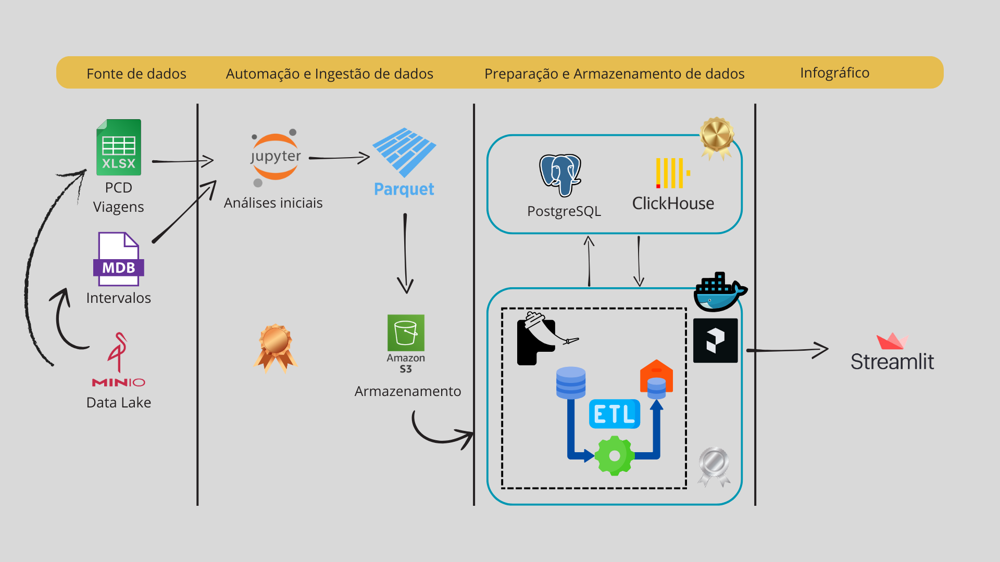

# 6. Diagrama de Componentes - Pipeline de Big Data para a CPTM

&emsp;&emsp;Este diagrama ilustra o pipeline de Big Data desenvolvido para a **CPTM (Companhia Paulista de Trens Metropolitanos)**, com o objetivo de criar uma solução escalável para ingestão, processamento e análise de dados. A arquitetura adota a estrutura de camadas da **Arquitetura Medalhão** (camadas Bronze, Silver e Gold), que organiza os dados em diferentes níveis de processamento e maturidade, cada um com funções específicas. Vamos entender cada componente do diagrama presente da figura abaixo.

 

Figura 20 - Arquitetura

Fonte: Material produzido pelos autores (2024)

 

## 6.1 Componentes do Diagrama

**1. Fonte de Dados**

- MinIO - Data Lake: MinIO é uma plataforma de armazenamento de objetos semelhante ao AWS S3, utilizada para manter os dados brutos coletados pela CPTM (MinIO, 2024).
    - Função na Arquitetura: O MinIO armazena arquivos de acompanhamento de PCDs e viagens em formato .xlsx e intervalos em formato .mdb, que são importados manualmente para a leitura e o processamento no Jupyter Notebook.
    - Exemplo Prático: A tabela de intervalos entre trens em diferentes horários são armazenados no MinIO, possibilitando que sejam extraídos manualmente para análises iniciais no Jupyter Notebook e por ter formato .mdb foi necessário transformá-lo em .csv para facilitar a leitura do dataset.
    - Benefício para o Projeto: Fornece um repositório centralizado e escalável para armazenar dados brutos, garantindo que toda a equipe tenha acesso a uma única "fonte da verdade".

**2. Automação e Ingestão de Dados (Camada Bronze):**

- **Jupyter Notebook:** O Jupyter Notebook é utilizado para realizar análises e transformações iniciais dos dados brutos extraídos manualmente do MinIO. Após a análise, os dados são convertidos para o formato Parquet e enviados para o AWS S3 (Jupyter, 2024).
    - Função na Arquitetura: Serve como a camada Bronze do pipeline, onde os dados brutos são transformados e preparados para o processamento automatizado. Por exemplo, são eliminadas duplicidades e tratados valores nulos antes de enviar os dados para o S3.
    - Exemplo Prático: Dados sobre viagens podem ser limpos e padronizados, incluindo a remoção de entradas duplicadas de horários de partida, para garantir que o pipeline receba dados consistentes.
    - Benefício para o Projeto: Realiza uma camada inicial de limpeza e organização dos dados, garantindo uma entrada de qualidade para o pipeline automatizado.

- **AWS S3:** O AWS S3 armazena os dados transformados em Parquet, criando uma camada intermediária antes do processamento automatizado.
    - Função na Arquitetura: Age como a camada de armazenamento intermediária (Bronze) que centraliza os dados processados no Jupyter, prontos para serem ingeridos pelo pipeline automatizado.
    - Exemplo Prático: Dados transformados sobre fluxos de passageiros em cada estação são armazenados no S3, prontos para futuras etapas de processamento e análise.
    - Benefício para o Projeto: Facilita o gerenciamento e armazenamento de dados transformados, garantindo uma transição suave para as próximas etapas do pipeline.

**3. Preparação e Armazenamento de Dados:**

- **Clickhouse (Camada Ouro):** O Clickhouse é um sistema de banco de dados colunar, altamente otimizado para consultas de alta performance, utilizado como a camada Ouro do Data Lake (Clickhouse, 2024).
    - Função na Arquitetura: Armazena dados transformados e enriquecidos, prontos para consultas rápidas e análises detalhadas. A camada Ouro contém dados no formato final, que podem ser consultados diretamente para visualização e relatórios.
    - Exemplo Prático: Dados de pontualidade de trens, consolidados ao longo do dia, podem ser armazenados no Clickhouse para fornecer relatórios diários de desempenho operacional.
    - Benefício para o Projeto: Proporciona armazenamento otimizado para análises rápidas e eficazes, permitindo consultas de alto volume e garantindo suporte a relatórios em tempo real.

- **PostgreSQL (Armazenamento de Logs):** O PostgreSQL é um banco de dados relacional confiável, amplamente utilizado para armazenar dados estruturados e fornecer suporte a transações complexas.
    - Função na Arquitetura: Armazena os logs de eventos gerados pelos códigos da arquitetura, permitindo rastrear operações realizadas no pipeline de dados. Esse repositório centralizado de logs auxilia no monitoramento, auditoria e depuração do sistema.
    - Exemplo Prático: Logs de execução do ETL, como o tempo de processamento de cada etapa e eventuais erros encontrados, são armazenados no PostgreSQL para facilitar análises futuras e resolução de problemas.
    - Benefício para o Projeto: Proporciona uma base organizada e confiável para monitorar o histórico do sistema, aumentando a transparência e permitindo ajustes precisos no pipeline conforme necessário.

- **DataApp (inclui a API Flask e ETL):** O DataApp é o controlador do pipeline, realizando o ETL (extração, transformação e carga) dos dados e enviando-os para o Clickhouse. A API Flask, que faz parte do DataApp, permite a integração com o Streamlit e facilita o acesso aos dados processados.
    - Função na Arquitetura: Centraliza o processamento de dados e as transformações necessárias, conectando o Clickhouse ao Streamlit para visualização. O DataApp, junto com a API Flask, é responsável por enviar dados para o Clickhouse e também receber dados dele, permitindo a comunicação bidirecional.
    - Exemplo Prático: O DataApp pode transformar dados sobre intervalos de trens em um formato adequado para relatórios de pontualidade e enviar esses dados para o Clickhouse para armazenagem e consulta.
    - Benefício para o Projeto: Garante a consistência e organização dos dados ao longo do pipeline e facilita o acesso para a visualização, centralizando o fluxo de ETL e a integração com a camada de visualização.

- **Docker:** Docker é utilizado para o deploy da API Flask do DataApp, garantindo que o ambiente seja padronizado e facilmente escalável (Docker, 2024).
    - Função na Arquitetura: Facilita o deploy da API Flask, permitindo que o DataApp se comunique com o Clickhouse e o Streamlit de maneira eficiente.
    - Exemplo Prático: A API Flask é encapsulada em um contêiner Docker, permitindo que seja facilmente replicada ou movida para outro ambiente, garantindo a consistência do deploy.
    - Benefício para o Projeto: Simplifica a implementação e manutenção do pipeline, garantindo que a API Flask seja sempre executada em um ambiente consistente e otimizado.

**4. Infográficos**

- **Streamlit (inclui Streamlit Authenticator):** O Streamlit é a ferramenta de visualização de dados utilizada para criar dashboards interativos. Ele inclui o Streamlit Authenticator para controlar o acesso aos painéis, garantindo que apenas usuários autorizados possam visualizar as informações (Streamlit, 2024; Khorasani, 2024).
    - Função na Arquitetura: Fornece uma interface intuitiva e segura para que analistas e gestores possam visualizar relatórios e dashboards com os dados processados e transformados.
    - Exemplo Prático: O Streamlit exibe um dashboard com métricas de pontualidade dos trens, permitindo que os gestores identifiquem horários de pico e planejem melhorias operacionais em tempo real.
    - Benefício para o Projeto: Oferece uma camada de visualização acessível e segura, permitindo que a CPTM tome decisões rápidas e informadas com base nos dados processados.

## 6.2 Fluxo de Dados no Pipeline

MinIO -> Jupyter Notebook: Os dados brutos armazenados no MinIO são baixados manualmente para o Jupyter Notebook, onde são transformados em arquivos .csv para facilitar a leitura e análise inicial.

Jupyter Notebook -> AWS S3: Após a análise inicial, os dados são convertidos para o formato Parquet e carregados no AWS S3, criando a camada Bronze.

AWS S3 -> AWS Lambda: O AWS Lambda monitora o S3 e, sempre que novos dados são carregados, aciona o DataApp para iniciar o processamento automatizado.

DataApp (Flask API) -> Clickhouse: O DataApp realiza as transformações necessárias nos dados e os armazena no Clickhouse, formando a camada Ouro, que é otimizada para consultas.

Clickhouse -> DataApp (Flask API): O Clickhouse permite a consulta de dados pela API Flask, que então envia essas informações para o Streamlit para visualização.

DataApp -> Streamlit: O DataApp utiliza a API Flask para fornecer dados processados ao Streamlit em tempo real, permitindo a criação de relatórios e dashboards.

Streamlit -> Streamlit Authenticator: O Streamlit Authenticator controla o acesso aos infográficos e painéis, garantindo que apenas usuários autorizados possam visualizar os dados sensíveis.

&emsp;&emsp;Este diagrama de componentes é essencial para a equipe de desenvolvimento e as partes interessadas, pois:
- **Facilita o entendimento**: Ao visualizar a estrutura e interações do sistema, fica mais fácil compreender o funcionamento geral e o papel de cada componente no pipeline.
- **Melhora a comunicação**: Fornece uma visão clara para os stakeholders, permitindo discussões e feedback mais efetivos sobre a arquitetura.
- **Auxilia no planejamento**: Serve como uma referência para a implementação e manutenção do sistema, garantindo que todos os componentes e fluxos sejam corretamente considerados no desenvolvimento.
- **Permite a identificação de problemas**: Ao mapear todas as interações, a equipe pode identificar possíveis gargalos ou pontos de falha, garantindo uma estrutura mais resiliente.

&emsp;&emsp;Essa arquitetura permite que a CPTM tenha uma visão holística dos dados, desde a ingestão até a análise e visualização. Por exemplo, a camada Bronze fornece uma fonte confiável de dados brutos, enquanto a camada Silver transforma esses dados para análise rápida no Clickhouse, e a camada Gold permite visualizações dinâmicas e seguras no Streamlit. Isso torna o processo de análise não apenas eficiente, mas também confiável e seguro.

&emsp;&emsp;Na prática, com essa estrutura, a CPTM pode otimizar suas operações. Um caso de uso seria o monitoramento do fluxo de passageiros em diferentes estações para identificar e corrigir problemas de tráfego em horários de pico, reduzindo atrasos e melhorando a experiência do passageiro. Além disso, o processo automatizado e modular facilita a expansão do sistema para novas fontes de dados ou novas métricas, tornando-o flexível para o crescimento futuro da empresa.

&emsp;&emsp;Esse diagrama, portanto, é uma ferramenta essencial para garantir a eficiência operacional e a adaptabilidade do pipeline de Big Data, proporcionando insights valiosos que ajudarão a CPTM a tomar decisões estratégicas e a atender melhor os passageiros.

## 6.3 Pipeline Completo de Dados na AWS

&emsp;&emsp;Com base na Arquitetura Medalhão, o pipeline organiza os dados em camadas Bronze, Prata e Ouro, facilitando a estruturação e o fluxo de dados, desde a ingestão até as análises. Esta seção da documentação foca nos componentes implementados utilizando serviços da AWS, destacando os benefícios proporcionados por cada recurso e sua integração com os demais elementos da arquitetura.

### 1. **AWS S3 (Simple Storage Service)**

&emsp;&emsp;O Amazon S3 é utilizado como o repositório principal para armazenamento de dados nas camadas Bronze, Prata e Ouro.. Cada camada organiza os dados conforme seu nível de processamento e qualidade.

&emsp;&emsp;Dados brutos extraídos do MinIO são convertidos para o formato Parquet e armazenados no S3.

&emsp;&emsp;Ele provisiona alta escalabilidade e disponibilidade para armazenamento de grandes volumes de dados, além de integração com outros serviços AWS para automação e processamento.

**Exemplo:** Dados de fluxo de passageiros são transformados no Jupyter Notebook e enviados para o bucket do S3.

### 2. **AWS Lambda**

&emsp;&emsp;O AWS Lambda é utilizado para organizar a automação do pipeline, monitorando os eventos no S3 e acionando o processamento automatizado. Portanto, monitora os buckets S3 para identificar novos arquivos carregados e aciona o DataApp para executar as transformações ETL e armazenar os dados processados no ClickHouse.

&emsp;&emsp;É bom para o projeto pois possui processamento serverless, reduzindo custos operacionais, e escalabilidade automática para lidar com grandes volumes de dados.

**Exemplo:** Ao identificar a chegada de um arquivo Parquet na camada Bronze do S3, a Lambda aciona o processamento automatizado para transformar e enriquecer os dados.

### 3. **AWS Glue**

&emsp;&emsp;AWS Glue é usado para tarefas de ETL (Extração, Transformação e Carga), automatizando o processamento e a organização dos dados armazenados no S3. Ele opera na limpeza e padronização de dados em lotes, além da conversão de formatos de arquivos para compatibilidade com as ferramentas analíticas utilizadas.

&emsp;&emsp;Proporciona redução do trabalho manual no processamento de dados, e possui integração nativa com o AWS S3 e outros serviços.

**Exemplo:** Dados transformados na camada Prata são refinados e otimizados para consultas rápidas, sendo armazenados na camada Ouro.

### 4. **Amazon EC2**

&emsp;&emsp;Embora o ClickHouse esteja implementado On-Premise, o Amazon EC2 é considerado como uma alternativa para hospedar componentes do pipeline, garantindo flexibilidade em futuras expansões.

&emsp;&emsp;Ele é uma boa opção de escalabilidade para hospedar bancos de dados ou sistemas de alta performance, visto que possui uma infraestrutura gerenciada para executar as aplicações.

### Conclusão Pipeline AWS

&emsp;&emsp;O pipeline desenvolvido com serviços da AWS possibilita uma solução escalável para atender às necessidades de processamento e análise de dados da CPTM. A combinação de serviços como S3, Lambda, Glue e QuickSight permite automatizar o fluxo de dados desde a ingestão até a visualização. Ademais, garante alta disponibilidade e segurança no armazenamento e processamento, enquanto prove insights para tomada de decisão estratégica.

&emsp;&emsp;Apesar de o ClickHouse estar hospedado On-Premise, a arquitetura está preparada para futuras integrações com EC2, caso necessário. Essa flexibilidade garante que o pipeline possa evoluir conforme as demandas da organização.

