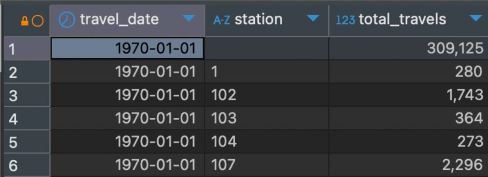
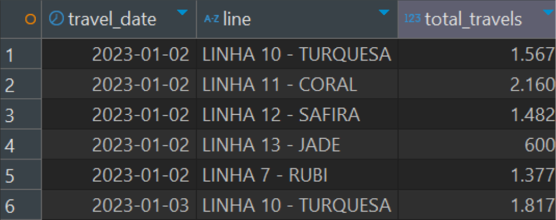
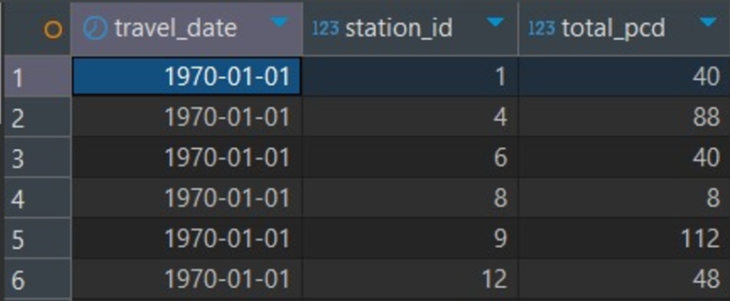

# 9. Documentação do Cubo de Dados

## 9.1 Introdução

&emsp;&emsp;O uso de cubos de dados é essencial para análises OLAP (Online Analytical Processing), onde múltiplas dimensões são analisadas em conjunto. Quando falamos de um cubo de dados, as dimensões são categorias que definem os eixos de análise, enquanto as métricas (ou medidas) representam os valores quantitativos que queremos observar e monitorar. Em geral, uma dimensão pode ser qualquer característica que permite segmentar e organizar os dados em diferentes níveis de granularidade, como tempo, localização ou tipo de usuário. A escolha adequada das dimensões é crucial, pois permite realizar cortes e segmentações dos dados para extrair insights relevantes. [(Microsoft, 2024)](https://support.microsoft.com/pt-br/office/vis%C3%A3o-geral-do-olap-processamento-anal%C3%ADtico-online-15d2cdde-f70b-4277-b009-ed732b75fdd6)

&emsp;&emsp;Um exemplo prático, para facilitar o entendimento, é o caso de uma análise de vendas em uma rede de lojas. As dimensões de análise poderiam incluir "Localização" (cidade ou estado), "Produto" (categoria de produto), e "Tempo" (ano ou mês). Já as métricas nesse cenário poderiam ser "Total de Vendas" e "Quantidade de Produtos Vendidos". As dimensões permitem que se explore o comportamento das vendas em diferentes locais e períodos, enquanto as métricas oferecem uma visão quantitativa da performance.

&emsp;&emsp;No contexto do projeto com a CPTM, em que buscamos entender padrões e otimizar as operações de viagens, o estabelecimento de dimensões e métricas adequadas permitirá a análise das operações, facilitando a identificação de gargalos, a previsão de demanda e a alocação de recursos.

## **9.2 Cubo de Dados**

### **9.2.1 O que é um Cubo de Dados?**

&emsp;&emsp;No contexto do projeto, um **Cubo de Dados** é uma estrutura que organiza os dados operacionais da CPTM em múltiplas dimensões, como **tempo**, **linha de trem**, **estação** e **indicadores operacionais** (e.g., atrasos, passageiros transportados). Essa estrutura permitirá análises rápidas e multidimensionais, integrando-se ao pipeline de Big Data para extrair insights estratégicos e operacionais.

&emsp;&emsp;Por exemplo, o cubo permitirá que os dados de atrasos sejam analisados ao longo de períodos específicos, identificando padrões de acordo com diferentes estações ou linhas, como "Qual linha teve o maior número de atrasos no último trimestre?" ou "Quais estações apresentaram maior fluxo de passageiros em horários de pico?".

&emsp;&emsp;O pipeline de Big Data que está sendo desenvolvido pela equipe Biggie utiliza uma infraestrutura em nuvem da **AWS** para ingerir, processar e visualizar grandes volumes de dados operacionais da CPTM. O cubo de dados é uma etapa chave desse pipeline, desempenhando os seguintes papéis:

- **Estruturação dos Dados:** Organiza os dados processados em dimensões e fatos para permitir consultas eficientes.
- **Análises Estatísticas:** Facilita a análise dos dados operacionais com ferramentas OLAP (Online Analytical Processing).
- **Integração com Visualizações:** Serve como fonte para dashboards interativos que serão apresentados à persona principal, **Roberto**, especialista em operações.

&emsp;&emsp;A criação de um Cubo de Dados no pipeline da CPTM oferece os seguintes benefícios diretos:

- **Análise Multidimensional:** Permite explorar atrasos, fluxo de passageiros e indicadores financeiros de diferentes perspectivas (tempo, estação, linha, etc.).
- **Eficiência nas Consultas:** Reduz o tempo necessário para recuperar insights de grandes volumes de dados operacionais.
- **Apoio à Decisão:** Auxilia gestores como Roberto a identificar gargalos operacionais e tomar decisões informadas sobre melhorias no sistema.
- **Escalabilidade:** Pode ser ampliado para incluir novas dimensões, como dados climáticos, para análises mais sofisticadas.

&emsp;&emsp;Os cubos de dados também trazem vantagens mais amplas para o projeto, como:

- **Velocidade de Geração de Relatórios:** Reduz a carga de processamento durante a consulta, otimizando o tempo de resposta.
- **Integração com Ferramentas de BI:** Pode ser conectado diretamente a ferramentas como Power BI ou Tableau para dashboards interativos.

### **9.2.2 Estrutura do Cubo de Dados**

&emsp;&emsp;A estrutura do cubo de dados organiza os dados operacionais em torno de **fatos**, **dimensões** e **medidas**, permitindo uma análise eficiente e multidimensional. Essa estrutura é a base para explorar insights estratégicos sobre os serviços ferroviários.

&emsp;&emsp;**Fatos**

&emsp;&emsp;Os **fatos** representam os dados quantitativos que queremos analisar. No caso do projeto, o cubo de dados inclui fatos como:

- **Número de atrasos registrados:** Indicador-chave de desempenho operacional.
- **Quantidade de passageiros transportados:** Métrica para avaliar a utilização das linhas.
- **Receitas obtidas:** Dados financeiros que apoiam a análise de sustentabilidade e eficiência.

&emsp;&emsp;Esses fatos são armazenados na tabela central do cubo, conectada às dimensões por chaves que identificam o contexto dos valores numéricos.

&emsp;&emsp;**Dimensões**

&emsp;&emsp;As **dimensões** fornecem o contexto para interpretar os fatos, permitindo que os dados sejam analisados sob diferentes perspectivas. Essas dimensões serão exploradas com mais detalhes nas seções seguintes, onde analisaremos suas hierarquias e como elas permitem diferentes níveis de granularidade.

&emsp;&emsp;**Views**

&emsp;&emsp;As **views** são os cálculos aplicados aos fatos, como:

- Quantidade de viagens por dia.
- quantidade de viagens por estação, por dia.
- quantidade de viagens por linha, por dia.

&emsp;&emsp;Essas medidas são usadas em análises para revelar padrões e tendências. Elas também serão abordadas com mais especificidades nas seções seguintes.

### **9.2.3 Fontes de Dados**

&emsp;&emsp;Os dados para o cubo são extraídos das bases operacionais da CPTM por meio do pipeline de Big Data, utilizando processos **ETL** (Extract, Transform, Load), todo esse processo está documentado na seção 7. Documentação do ETL, mas, basicamente, há os seguintes processos.

1. **Extração:** Dados sobre atrasos, fluxo de passageiros e receitas coletados dos sistemas operacionais da CPTM.
2. **Transformação:** Limpeza, agregação e enriquecimento dos dados com informações adicionais, como clima.
3. **Carregamento:** Armazenamento na infraestrutura da AWS.

&emsp;&emsp;O cubo de dados desempenha um papel importante na organização e análise de grandes volumes de informações operacionais. A estrutura e a modelagem apresentadas garantem que os dados sejam acessíveis de maneira eficiente e que permitam análises multidimensionais, apoiando decisões estratégicas e operacionais.

&emsp;&emsp;Por meio do **Esquema Estrela**, o cubo integra fatos e dimensões relevantes, como atrasos, fluxo de passageiros e receitas, com o contexto fornecido pelas dimensões de tempo, linha, estação e tipo de evento. Isso possibilita a exploração de padrões e tendências sob diferentes perspectivas, promovendo insights estratégicos e identificando áreas de melhoria.

&emsp;&emsp;Integrado ao pipeline de Big Data, o cubo potencializa o uso de ferramentas de BI e relatórios interativos, alinhando-se às necessidades do principal stakeholder, **Roberto**, especialista em operações. Além disso, a flexibilidade do modelo permite sua escalabilidade, podendo ser expandido para atender novas demandas e incorporar dados adicionais.

## 9.3 Conjunto de dimensões

&emsp;&emsp;A partir da análise dos dados e do entendimento do objetivo do DataApp para a CPTM, definimos um conjunto de dimensões preliminares que trará valor analítico para a solução. Essas dimensões foram selecionadas com base nas informações operacionais e de fluxo de viagens que, quando combinadas, poderiam oferecer uma visão completa sobre as operações ferroviárias e o comportamento das viagens. As dimensões preliminares foram escolhidas considerando os seguintes fatores:

- Relevância para entender a eficiência das operações.

- Capacidade de segmentação dos dados em múltiplos níveis.

- Cobertura das necessidades do projeto em termos de análise de tempo, volume e acessibilidade.

### 9.3.1 Dimensões

**Tempo:**

- Descrição: Permite segmentação por períodos como ano, mês, dia da semana e hora, para análise de sazonalidade e padrão temporal.

- Exemplo de uso: Identificar picos de uso em horários de maior demanda, como horários de pico matinal e vespertino.

---

**Volume (quantidade):**

- Descrição: Refere-se à quantidade de viagens, de passageiros ou outros dados quantitativos.

- Exemplo de uso: Avaliar o volume de viagens em um dia específico para entender o movimento e mapear necessidades operacionais.

---

**Linha CPTM:** 

- Descrição: Identifica cada linha ferroviária da CPTM.

- Exemplo de uso: Comparar a quantidade de viagens entre linhas para alocar recursos de acordo com a demanda.

---

**Estação:**

- Descrição: Identifica as estações de origem e destino, fundamentais para o estudo dos fluxos entre diferentes regiões.

- Exemplo de uso: Identificar as estações mais movimentadas, ajudando na priorização de melhorias na infraestrutura.

---

**Tipo de Passageiro:** 

- Descrição: Segmentação dos passageiros entre comuns e PCD, importante para analisar a demanda de acessibilidade.

- Exemplo de uso: Avaliar a quantidade de passageiros PCD por estação para definir se há necessidade de adaptações e melhorias na acessibilidade ou alocação de funcionários para apoio.

---

**Trem:** 

- Descrição: Prefixo de identificação do trem, permitindo rastrear viagens, paradas e tempos de operação.

- Exemplo de uso: Calcular o tempo médio de permanência dos trens em cada estação, monitorando atrasos e identificando pontos críticos.

---

### 9.3.2 Justificativa para cada dimensão

&emsp;&emsp;Cada dimensão foi selecionada com base na sua capacidade de segmentar e categorizar os dados operacionais e de passageiros da CPTM. Veja a justificativa para cada uma delas:

**Tempo:** Essencial para entender a sazonalidade e identificar horários e dias com maior demanda.

**Volume (Quantidade):** Permite a contagem de viagens, oferecendo insights sobre a capacidade necessária para atender a demanda.

**Linha CPTM:** Diferenciar as linhas é crucial para otimizar a operação de cada uma, garantindo que as necessidades específicas de cada linha sejam atendidas.

**Estação:** Conhecer o fluxo entre estações facilita a melhoria da infraestrutura e a gestão de operações, especialmente em estações de maior movimento.

**Tipo de Passageiro:** Diferenciar passageiros comuns e PCD ajuda a monitorar o atendimento de acessibilidade e aprimorar a experiência dos passageiros com necessidades especiais.

**Trem:** Rastrear cada trem individualmente permite monitorar a eficiência operacional, especialmente no cálculo de tempos de parada e intervalos entre trens.

&emsp;&emsp;Vale ressaltar que para o desenvolvimento das dimensões procuramos estar em constante validação com o cliente, visando garantir que elas irão contemplar todos os objetivos do DataApp e gerar bons insights. Ademais, a escolha das dimensões foi pautada também nas análises que pensamos em extrair dos gráficos presentes no DataApp.

### 9.3.3 Métricas derivadas das dimensões

&emsp;&emsp;Com as dimensões listadas acima, foi possível chegar nas seguintes métricas para obter insights operacionais:

**Número de Viagens**

- Descrição: Total de viagens realizadas em uma linha, estação, ou período específico.

- Exemplo de uso: Comparar o número de viagens realizadas em cada linha diariamente para identificar picos de demanda.

**Total de Passageiros**

- Descrição: Número total de passageiros transportados em determinado período.

- Exemplo de uso: Avaliar a demanda total em uma linha durante um mês, ajustando a operação conforme necessário.

**Tempo Médio de Parada nas Estações**

- Descrição: Tempo médio de parada dos trens nas estações.

- Exemplo de uso: Analisar as paradas em estações específicas, ajudando a identificar gargalos.

**Tempo Médio de Viagem**

- Descrição: Tempo médio gasto entre estações de origem e destino.

- Exemplo de uso: Avaliar a eficiência da operação e identificar atrasos frequentes.

**Número de Passageiros PCD**

- Descrição: Total de passageiros PCD transportados.

- Exemplo de uso: Verificar a demanda por acessibilidade em cada estação, melhorando o atendimento a PCDs.

**Intervalo entre um Trem e Outro nas Estações**

- Descrição: Tempo médio de espera entre trens.

- Exemplo de uso: Avaliar a frequência dos trens e ajustar a operação para reduzir o tempo de espera.

&emsp;&emsp;Essas dimensões e métricas foram definidas com o objetivo de desenvolver um DataApp que forneça insights operacionais para melhorar a eficiência das viagens. Ao monitorar as métricas com base nas dimensões, o DataApp permitirá uma análise detalhada das operações ferroviárias, com foco específico no monitoramento das viagens, ajudando a CPTM a tomar decisões baseadas em dados para otimizar o fluxo de viagens, melhorar a experiência do usuário e adaptar-se às necessidades dos passageiros.

## 9.4 Estrutura das Planilhas e Atributos

&emsp;&emsp;Nesta seção, será apresentada a documentação detalhada da estrutura das views criadas a partir das dimensões citadas acimada. O objetivo é fornecer uma visão clara de cada view, incluindo a explicação de suas respectivas estruturas e os dados gerados por elas. Essa documentação é fundamental para garantir a rastreabilidade dos dados e facilitar o entendimento das transformações aplicadas em cada etapa.

&emsp;&emsp;A estrutura das views será descrita com base em atributos específicos, como nome das colunas, tipo de dado, descrição funcional e exemplos de valores. Além disso, serão detalhados os retornos de cada query executada e resultados obtidos a partir dessas operações. Dessa forma, a seção busca assegurar que todas as partes interessadas no projeto compreendam os artefatos gerados no pipeline de dados, promovendo transparência no uso das informações documentadas.

### Quantidade de Viagens por Dia

&emsp;&emsp;Query utilizada:

```SQL
SELECT
    toDate(JSONExtractFloat(data_linha, 'dt_origin')) AS travel_date,
    COUNT(*) AS total_travels
FROM grupo3.working_travels
GROUP BY
    travel_date
ORDER BY
    travel_date ASC;
```

&emsp;&emsp;Esta consulta realiza o seguinte:

- Extração e Conversão da Data: A coluna data_linha é tratada como JSON e o campo dt_origin é extraído e convertido para o tipo Date.
- Contagem de Viagens: É realizado o cálculo do número total de registros (viagens) para cada data.
- Agrupamento por Data: Os dados são agrupados pela data de viagem (travel_date) para que as contagens sejam realizadas de forma acumulativa por dia.
- Ordenação Crescente: O resultado final é ordenado pela data em ordem crescente.

<br>
<div align="center">
<sub>Figura 31 - Select de Quantidade de Viagens por Dia</sub>

<sup>Fonte: Interface DBeaver (2024)</sup>
</div>
<br>

&emsp;&emsp;O Select permite observar que, por exemplo, no dia 16 de maio de 2023, ocorreram 1329 viagens. Entretanto, a primeira linha representa todas as viagens registradas no banco de dados, desde o dia 1 de janeiro de 1970, até o dia 16 de maio de 2023.

### Quantidade de viagens por estação, por dia

```SQL
SELECT
    toDate(JSONExtractFloat(data_linha, 'dt_origin')) AS travel_date,
    JSONExtractString(data_linha, 'TX_ORIGEM_PROG') AS station,
    COUNT(*) AS total_travels
FROM grupo3.working_travels
GROUP BY
    travel_date,
    station
ORDER BY
    travel_date ASC,
    station ASC;
```

&emsp;&emsp;Esta consulta SQL foi desenvolvida para calcular a quantidade de viagens realizadas por estação, para cada dia registrado no dataset. Ela é útil para entender como as viagens estão distribuídas entre as estações de origem e como esses padrões se comportam ao longo do tempo. Os resultados dessa query podem auxiliar na identificação de padrões operacionais, como dias de maior movimentação ou estações mais utilizadas.

<br>
<div align="center">
<sub>Figura 32 - Select de Quantidade de Viagens por estação, por dia</sub>

<sup>Fonte: Interface DBeaver (2024)</sup>
</div>
<br>

&emsp;&emsp;A consulta demonstra a quantidade de viagens em dias específicos, por exemplo, na estação com o ID 1, tivemos 280 viagens no dia 1 de janeiro de 1970.

### Quantidade de viagens por linha, por dia

```SQL
SELECT
    toDate(JSONExtractFloat(data_linha, 'DT_INI_VIAGEM')) AS travel_date,
    JSONExtractString(data_linha, 'TX_DESCR_LINHA') AS line,
    COUNT(*) AS total_travels
FROM grupo3.working_travels
WHERE data_tag = 'big-data-viagem_viagem_tabela_principal'
GROUP BY
    travel_date,
    line
ORDER BY
    travel_date ASC,
    line ASC;
```

&emsp;&emsp;Esta consulta foi projetada para contar o número de viagens realizadas por linha de transporte em cada dia registrado no dataset.

<br>
<div align="center">
<sub>Figura 33 - Select de Quantidade de Viagens por linha, por dia</sub>

<sup>Fonte: Interface DBeaver (2024)</sup>
</div>
<br>

&emsp;&emsp;A partir desta consulta, podemos observar  que, no dia 2 de Janeiro de 2023, tivemos 1567 viagens totais na Linha 10 - Turquesa, por exemplo.

### Quantidade de PCD por Estação, por dia

```SQL
SELECT
    toDate(JSONExtractFloat(data_linha, 'dt_origin')) AS travel_date,
    JSONExtractInt(data_linha, 'alert_station_id') AS station_id,
    COUNT(*) AS total_pcd
FROM grupo3.working_travels
WHERE
    JSONExtractString(data_linha, 'pcd_type') != ''
GROUP BY
    travel_date,
    station_id
ORDER BY
    travel_date ASC,
    station_id ASC;
```

&emsp;&emsp;Essa consulta foi desenvolvida para contar o número de viagens realizadas por Pessoas com Deficiência (PCD) em cada estação, em cada dia registrado no dataset. A query filtra exclusivamente os registros relacionados a PCDs e organiza os resultados por estação e data, permitindo uma análise detalhada do uso das estações por esse grupo.

<br>
<div align="center">
<sub>Figura 34 - Select de Quantidade de PCD por estação, por dia</sub>

<sup>Fonte: Interface DBeaver (2024)</sup>
</div>
<br>

&emsp;&emsp;Essa consulta nos ajuda a identificar quais estações são mais utilizadas por Pessoas com Deficiência, auxiliando no planejamento de melhorias de acessibilidade. Ademais, ajuda a avaliar a necessidade de alocação de recursos ou adaptações em estações específicas.

### Intervalo de trens por estação, por linha, por dia

```SQL
WITH
   data_completa AS (
       SELECT
           JSONExtractString(data_linha, 'Open_Time') AS raw_open_time,
           trimBoth(JSONExtractString(data_linha, 'Open_Time')) AS open_time,
           JSONExtractInt(data_linha, 'Station_ID') AS station_id,
           parseDateTimeBestEffort(substring(trimBoth(JSONExtractString(data_linha, 'Open_Time')), 1, 10)) AS dia
       FROM
           grupo5.data_ingestion di
       WHERE
           JSONExtractString(data_linha, 'Open_Time') != '' 
   ),
   data_ordenada AS (
       SELECT
           dia,
           station_id,
           arraySort(groupArray(open_time)) AS horarios
       FROM
           data_completa
       GROUP BY
           dia, station_id
   ),
   intervalos AS (
       SELECT
           dia,
           station_id,
           arrayDifference(arrayMap(x -> toUnixTimestamp(parseDateTimeBestEffort(x)), horarios)) / 60 AS intervalos_minutos
       FROM
           data_ordenada
   )
SELECT
   dia,
   station_id,
   AVG(arrayJoin(intervalos_minutos)) AS media_intervalo
FROM
   intervalos
GROUP BY
   dia, station_id
ORDER BY
   dia, station_id;
```

&emsp;&emsp;A consulta calcula a média de intervalos entre trens para cada estação em cada dia. Isso é feito a partir dos horários de abertura (Open_Time) registrados no sistema, transformando-os em intervalos de tempo em minutos. O objetivo é identificar o intervalo médio entre chegadas de trens em cada estação e dia.

&emsp;&emsp;A função AVG calcula a média dos intervalos gerados para cada estação por dia, considerando todos os intervalos do array intervalos_minutos.

<br>
<div align="center">
<sub>Figura 35 - Intervalo de trens por estação, por linha, por dia</sub>

<sup>Fonte: Interface DBeaver (2024)</sup>
</div>
<br>

&emsp;&emsp;Média de Intervalos: Refere-se ao intervalo médio de tempo, em minutos, entre os trens registrados em uma estação durante um determinado dia. Valores mais altos indicam maior tempo de espera entre os trens, enquanto valores baixos indicam maior frequência.

- Possíveis Correções e Próximos Passos
    - Verificação de Valores Inválidos ou Zeros:
      Algumas estações apresentam média de intervalo como 0, o que pode indicar:
      - Apenas um horário registrado para aquele dia.
      - Registros com horários ausentes ou inválidos.
      - É necessário filtrar registros com menos de dois horários por estação antes de calcular os intervalos.

### Média de tempo parada de trem por estação

```SQL
SELECT
    JSONExtractString(data_linha, 'Station_ID') AS station,
    AVG(
        toUnixTimestamp(parseDateTimeBestEffort(JSONExtractString(data_linha, 'Closed_Time'))) -
        toUnixTimestamp(parseDateTimeBestEffort(JSONExtractString(data_linha, 'Open_Time')))
    ) AS avg_train_stop_seconds
FROM 
    grupo5.data_ingestion
WHERE 
    "data_tag" = 'caixapreta/trem_passageiros.parquet'
GROUP BY
    station;
```

&emsp;&emsp;Esta consulta calcula a média de tempo que os trens permanecem parados em cada estação, baseada nos registros de horário de abertura (Open_Time) e fechamento (Closed_Time). O resultado é expresso em segundos, representando a duração média da parada de cada trem em uma estação específica.

<br>
<div align="center">
<sub>Figura 36 - Select de Intervalo de trens por estação, por linha, por dia</sub>

<sup>Fonte: Interface DBeaver (2024)</sup>
</div>
<br>

- Média em Segundos: Os valores calculados representam o tempo médio de parada dos trens em segundos, podendo ser convertidos para minutos para maior facilidade de interpretação.
- Estação 0: O tempo de parada excepcionalmente alto pode indicar registros inconsistentes ou uma falha no sistema de registro para essa estação.

### Tempo de transição do trem entre estações

```SQL
WITH
    -- Dados filtrados com as viagens
    FilteredData AS (
        SELECT
            JSONExtractInt(data_linha, 'Station_ID') AS Curr_Station,
            JSONExtractInt(data_linha, 'NextStation_ID') AS Next_Station,
            JSONExtractInt(data_linha, 'Line_ID') AS Line_ID,
            JSONExtractInt(data_linha, 'Train_ID') AS Train_ID,
            parseDateTimeBestEffort(JSONExtractString(data_linha, 'Closed_Time')) AS Closed_Time,
            parseDateTimeBestEffort(JSONExtractString(data_linha, 'Open_Time')) AS Open_Time
        FROM grupo5.data_ingestion
        WHERE data_tag = 'caixapreta/trem_passageiros.parquet'
          AND JSONHas(data_linha, 'Station_ID') 
          AND JSONHas(data_linha, 'NextStation_ID') 
          AND JSONHas(data_linha, 'Closed_Time')
          AND JSONHas(data_linha, 'Open_Time')
    ),
    -- Numerando as estações para relacioná-las por viagens consecutivas
    NumberedStations AS (
        SELECT
            *,
            ROW_NUMBER() OVER (PARTITION BY Line_ID, Train_ID ORDER BY Closed_Time) AS Row_Num
        FROM FilteredData
    ),
    -- Mapeamento dos nomes das estações
    StationInfo AS (
        SELECT
            JSONExtractInt(replaceAll(data_linha, '''', '"'), 'id_estacao') AS Station_ID,
            JSONExtractString(replaceAll(data_linha, '''', '"'), 'tx_nome') AS Station_Name
        FROM grupo3.working_travels wt 
        WHERE data_tag = 'big-data-estacoes/estacoes.parquet'
    )
SELECT
    t1.Curr_Station,
    s1.Station_Name AS Curr_Station_Name,
    t1.Next_Station,
    s2.Station_Name AS Next_Station_Name,
    AVG(dateDiff('second', t1.Closed_Time, t2.Open_Time)) / 60 AS Avg_Travel_Time_Minutes
FROM
    NumberedStations t1
INNER JOIN
    NumberedStations t2
    ON t1.Row_Num + 1 = t2.Row_Num
    AND t1.Line_ID = t2.Line_ID
    AND t1.Train_ID = t2.Train_ID
LEFT JOIN
    StationInfo s1
    ON t1.Curr_Station = s1.Station_ID
LEFT JOIN
    StationInfo s2
    ON t1.Next_Station = s2.Station_ID
GROUP BY
    t1.Curr_Station,
    s1.Station_Name,
    t1.Next_Station,
    s2.Station_Name
ORDER BY
    t1.Curr_Station,
    t1.Next_Station;
```

&emsp;&emsp;Esta consulta calcula o tempo médio de transição dos trens entre estações consecutivas em uma linha específica. A análise considera as informações de tempo de fechamento da estação atual e de abertura da próxima estação. O resultado é expresso em minutos e agrupado por pares de estações consecutivas.

<br>
<div align="center">
<sub>Figura 37 - Tempo de transição do trem entre estações
</sub>

<sup>Fonte: Interface DBeaver (2024)</sup>
</div>
<br>

&emsp;&emsp;Essa consulta permite identificar próximos passos de correção, podemos perceber isso através das 2 primeiras linhas com dados nulos, e as médias Avg_Travel_Time_Minutes possue valores negativos, o que pode indicar possíveis erros.

## 9.5  Conclusão da Documentação do Cubo de Dados

&emsp;&emsp;O cubo de dados é uma ferramenta central para organizar e analisar informações operacionais da CPTM de forma estruturada e eficiente. Com dimensões como tempo, linha, estação e tipo de passageiro, combinadas a métricas como número de viagens e tempo médio de parada, conseguimos explorar os dados de maneira mais intuitiva e prática. Essa abordagem permite identificar pontos de melhoria, antecipar demandas e otimizar os recursos disponíveis, oferecendo insights que fazem a diferença na operação do sistema ferroviário e na experiência dos passageiros.

&emsp;&emsp;Além disso, a integração do cubo de dados ao pipeline de Big Data na AWS, aliada ao uso de ferramentas de BI, viabiliza análises detalhadas e relatórios interativos de forma ágil e escalável. Com isso, o DataApp se posiciona como uma solução não apenas técnica, mas também estratégica, capaz de apoiar decisões importantes, promover melhorias contínuas e garantir que a CPTM continue entregando um serviço eficiente, pensado para atender às reais necessidades dos usuários.
