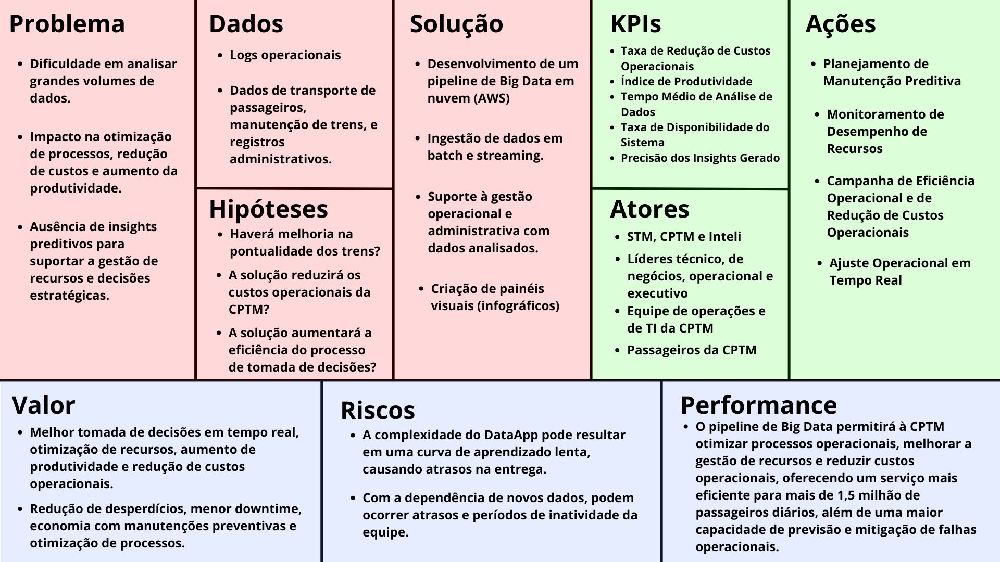

# 4. Data Model Canvas

## 4.1 Data Model Canvas

&emsp;&emsp;O **Data Model Canvas** é uma ferramenta visual que permite organizar e estruturar informações sobre produtos de dados, garantindo que os objetivos de negócio estejam alinhados com a solução tecnológica proposta. No contexto deste projeto, o **Data Model Canvas** está sendo desenvolvido para a **Companhia Paulista de Trens Metropolitanos (CPTM)**, com o objetivo de implementar um pipeline de **Big Data** para analisar grandes volumes de dados e auxiliar na tomada de decisões estratégicas e operacionais (Carvalho, 2022).

&emsp;&emsp;A **CPTM** enfrenta desafios relacionados à gestão de dados em grande escala, como a otimização de processos, a previsão de falhas e a melhoria da eficiência operacional. Este **Data Model Canvas** guia o desenvolvimento do pipeline, garantindo que as partes interessadas estejam alinhadas, os dados necessários sejam identificados e que a solução proposta gere impacto tangível e mensurável para a organização.

**Estrutura do Data Model Canvas**

&emsp;&emsp;O **Data Model Canvas** é dividido em três áreas principais, que cobrem diferentes aspectos do planejamento e execução do produto de dados (Carvalho, 2022):

1. **Visão do Produto**: Aborda o problema, a solução, os dados necessários e as hipóteses a serem testadas.
2. **Visão da Estratégia**: Define os atores envolvidos, as ações que serão implementadas e os KPIs (indicadores de sucesso) que serão monitorados.
3. **Visão de Negócio**: Envolve a proposta de valor, os riscos mapeados e o impacto esperado da solução.

&emsp;&emsp;Com essa estrutura, foi desenvolvido o **Data Model Canvas** do projeto, que facilita o planejamento estratégico e técnico, assegurando que todos os pontos relevantes sejam considerados e discutidos com as partes interessadas para o sucesso do projeto.

 

Figura 8 - Data Model Canvas

Fonte: Material produzido pelos autores (2024)

 

### 4.1.1. Problema

&emsp;&emsp;Através da proposta de valor presente no **Canvas Proposta de Valor** documentado no arquivo **AnaliseDeNegocios.md** e do **TAPI**, retiramos as seguintes informações sobre os principais desafios enfrentados pela **CPTM**. Para ver mais detalhes sobre esses desafios e a solução proposta, você pode acessar o documento completo [aqui](../docs/AnaliseDeNegocios.md#31-canvas-proposta-de-valor).

&emsp;&emsp;A **CPTM** enfrenta os seguintes desafios principais: 

- Dificuldade em analisar grandes volumes de dados operacionais e administrativos, o que impacta negativamente a eficiência da operação de transporte.
- A falta de insights preditivos afeta a capacidade de suportar decisões estratégicas e de melhorar a gestão de recursos.
- O processo de otimização de operações e a redução de custos são prejudicados pela ausência de uma infraestrutura de dados robusta.

**Por que isso é um problema?**

&emsp;&emsp;Esses desafios afetam diretamente a capacidade da CPTM de fornecer um serviço de transporte de alta qualidade, impactando a pontualidade, a manutenção dos trens e a satisfação dos passageiros.

**De quem é o problema?**

&emsp;&emsp;O problema é enfrentado pelas equipes operacionais e administrativas da **CPTM**, que dependem de análises e relatórios gerados a partir de grandes volumes de dados para melhorar a tomada de decisões e garantir a eficiência das operações.

### 4.1.2. Solução

&emsp;&emsp;A solução proposta envolve o desenvolvimento de um **pipeline de Big Data**, que para fins acadêmicos será desenvolvido em nuvem (AWS), capaz de processar grandes volumes de dados e fornecer análises detalhadas e preditivas que suportem a tomada de decisões da CPTM.

**Detalhes da solução:**
- **Ingestão de dados**: Dados serão coletados em batch e streaming, dependendo dos requisitos operacionais e administrativos.
- **Infraestrutura**: O pipeline será construído utilizando serviços da AWS, como **S3**, **Glue**, **EMR** (Elastic MapReduce), e **QuickSight** para criação de painéis e visualizações (Carvalho, 2022).
- **Suporte à gestão operacional**: A solução permitirá à CPTM analisar dados de transporte, manutenção e registros administrativos para melhorar a eficiência e reduzir custos.
- **Criação de painéis visuais**: Utilizando os insights gerados, serão desenvolvidos infográficos e dashboards para facilitar a visualização de dados em tempo real.

### 4.1.3. Dados

&emsp;&emsp;Esses pontos garantem que todas as etapas críticas do gerenciamento de dados estejam mapeadas e que o pipeline de Big Data esteja preparado para lidar com os desafios da CPTM de forma eficiente e precisa.

**Fonte dos dados:**
- **Logs operacionais**: Dados sobre o funcionamento diário dos trens e estações.
- **Dados de transporte de passageiros**: Volume de passageiros, rotas e horários.
- **Dados de manutenção de trens**: Informações sobre manutenções preventivas e corretivas.
- **Registros administrativos**: Informações financeiras e gerenciais relacionadas à operação da CPTM.

**Qualidade dos dados:**
- **Critérios de qualidade**: Precisão, consistência, completude e atualização dos dados são fundamentais para garantir a eficácia das análises.
- **Processo de transformação**: A solução utilizará ferramentas de ETL (Extração, Transformação e Carga), como o **AWS Glue** ou **Lambda**, para transformar e limpar os dados, assegurando sua qualidade antes da análise.

**Acesso vs. Disponibilidade:**
- **Acesso**: A equipe do projeto tem permissões para acessar dados em tempo real e históricos, armazenados em sistemas locais e na nuvem.
- **Disponibilidade**: Os dados estarão disponíveis continuamente via batch e streaming, com armazenamento centralizado no **AWS S3**.

**Saídas:**
- **Formatos de saída**: As análises geradas pelo pipeline estarão disponíveis em formatos como **CSV**, **JSON**, e dashboards interativos via **AWS QuickSight**.

&emsp;&emsp;Para mais informações sobre os dados, incluindo hipóteses, análises e insights, acesse a sessão de [Análise de dados](#42-análise-dos-dados) desta documentação.

Segue a arquitetura de dados oferecida e analizada durante a sprint:

#### Documentação para Acompanhamento de Tabelas e Arquitetura de Dados

**1. Estrutura e Armazenamento de Dados na AWS com Arquitetura em Nuvem**

&emsp;&emsp;Os dados deste projeto foram coletados de fontes operacionais, sistemas internos e registros de atividades da CTPM. Eles serão armazenados na AWS seguindo uma arquitetura de dados escalável, organizada em pastas e buckets separados para cada etapa do processamento. É interessante reforçar que, apesar de que usarmos a AWS para armazenamento, esta será uma solução para fins de aprendizado, atualmente a CPTM não armazena os seus dados em nuvem e não tem interesse em iniciá-lo. O armazenamento será realizado utilizando o **Esquema Medalhão** (Bronze, Prata e Ouro), uma abordagem que permite estruturar e organizar os dados em camadas conforme a qualidade e tratamento dos dados. Esse modelo facilita a padronização, organização e uso dos dados, além de promover a escalabilidade da solução.

**Esquema Medalhão**

1. **Bronze**: Dados crus e não processados, conforme coletados das fontes. Nesta camada, os dados são armazenados em sua forma original. É a primeira camada do pipeline e será implementada na **Sprint 1**.
2. **Prata**: Dados transformados, onde a estrutura é padronizada e são aplicadas limpezas e transformações básicas para garantir a qualidade dos dados. É a segunda camada do pipeline e será desenvolvida na **Sprint 2**.
3. **Ouro**: Dados prontos para consumo e análise, processados e refinados para análises e relatórios. É a última camada do pipeline, que será desenvolvida na **Sprint 3**.

**2. Descrição das Tabelas e Campos**

Cada tabela abaixo faz parte do pipeline e será utilizada conforme sua finalidade, desde o armazenamento inicial até a análise final dos dados:

**Tabela: `tabela_big_data_ft_ocorrencias`**

- **Descrição**: Armazena ocorrências registradas, incluindo data, classificação e detalhes sobre a ocorrência.
- **Uso**: Monitoração de incidentes e geração de relatórios de segurança operacional.

| # | Column |  |
| --- | --- | --- |
| 0 | class_manchete | object |
| 1 | classificacao_manchete | object |
| 2 | data_atualizacao | float64 |
| 3 | data_normalizacao | object |
| 4 | desc_ocorrencia | object |
| 5 | eventos_relacionados | float64 |
| 6 | fl_estimados | int64 |
| 7 | flag_controle | object |
| 8 | hora_ocorrencia | object |
| 9 | id_datanormalizacao | float64 |
| 10 | id_dataocorrencia | int64 |
| 11 | id_localidade | int64 |
| 12 | id_sic_classificacao | int64 |
| 13 | id_tipo_relevancia | float64 |
| 14 | manchete | object |
| 15 | nr_acoes | float64 |
| 16 | pass_estimados | int64 |
| 17 | sic_id_ocorrencia | int64 |
| 18 | sic_id_ocorrencia_3 | int64 |
| 19 | total_ajustes | int64 |
| 20 | trecho | object |
| 21 | tx_tipo_relevancia | object |
| 22 | tx_trem | float64 |

Tabela: `doni_stg_ghr_vw_viagem_mstrbi_dados`

- **Descrição**: Contém dados de viagens, incluindo datas de início e fim, duração e informações sobre as linhas e estações.
- **Uso**: Análise de desempenho operacional das linhas de transporte, previsão de tempos de viagem e identificação de atrasos.

| # | Column | Dtype |
| --- | --- | --- |
| 0 | dt_operacional | object |
| 1 | id_linha | int64 |
| 2 | tx_descr_linha | object |
| 3 | tx_cor_linha | object |
| 4 | nr_ordem | int64 |
| 5 | tx_prefixo | object |
| 6 | dt_ini_viagem | object |
| 7 | dt_fim_viagem | object |
| 8 | dt_atualiza | object |
| 9 | nr_duracao | int64 |
| 10 | id_origem | int64 |
| 11 | id_destino | int64 |
| 12 | tx_origem | object |
| 13 | tx_destino | object |
| 14 | tx_composicao | object |
| 15 | id_origem_prog | object |
| 16 | tx_origem_prog | object |
| 17 | id_destino_prog | object |
| 18 | tx_destino_prog | object |
| 19 | dt_ini_viagem_prog | object |
| 20 | dt_fim_viagem_prog | object |
| 21 | nr_ocorr_sic | object |
| 22 | nr_cco_sic | float64 |
| 23 | nr_ano_sic | float64 |
| 24 | nr_duracao_real | float64 |
| 25 | nr_duracao_prog | float64 |
| 26 | tx_tp_grafico | object |
| 27 | tx_tp_dia | object |
| 28 | fl_considerar | object |
| 29 | tx_ippm | object |
| 30 | tx_fppm | object |
| 31 | tx_ippt | object |
| 32 | tx_fppt | object |
| 33 | tx_pico | object |

Tabela: `doni_stg_ghr_vw_viagem_mstrbi_colunas`

- **Descrição**: Metadados das colunas da tabela de viagens, incluindo tipos de dados e restrições de nulidade.
- **Uso**: Documentação e controle de qualidade das tabelas de viagem para garantir consistência e validação de dados.

| # | Column | Dtype |
| --- | --- | --- |
| 0 | column_name | object |
| 1 | data_type | object |
| 2 | nullable | object |
| 3 | data_default | float64 |
| 4 | column_id | int64 |
| 5 | comments | object |

Tabela: `acompanhamento_pcd`

- **Descrição**: Registro de acompanhamento de Pessoas com Deficiência (PCD), com informações sobre localização, alertas e condições operacionais.
- **Uso**: Análise e relatórios de acessibilidade e segurança, além de monitoramento da movimentação de PCDs nas estações.

| # | Column | Dtype |
| --- | --- | --- |
| 0 | dt_destino | object |
| 1 | dt_operacional | object |
| 2 | dt_origem | object |
| 3 | fl_alerta | object |
| 4 | grupos_pcd | object |
| 5 | id_carro | object |
| 6 | id_estacao_alerta | object |
| 7 | id_estacao_destino | object |
| 8 | id_estacao_origem | object |
| 9 | id_registro | object |
| 10 | id_tipo_pcd | object |
| 11 | nr_ordem | object |
| 12 | nr_posicao_carro | object |
| 13 | nr_qtde_pcd | object |
| 14 | tx_cor_linha | object |
| 15 | tx_descr_linha | object |
| 16 | tx_estacao_destino | object |
| 17 | tx_linha | object |
| 18 | tx_obs | object |
| 19 | tx_porta | object |
| 20 | tx_prefixo | object |
| 21 | tx_tipo_pcd | object |
| 22 | tx_trem | object |
| 23 | tx_username_destino | object |
| 24 | tx_username_origem | object |

Tabela: `dmo_anl_vw_estacao`

- **Descrição**: Contém dados de estações, incluindo ID, nome e prefixos.
- **Uso**: Mapeamento e identificação das estações no sistema, sendo essencial para a vinculação de dados de viagem e ocorrências.

| # | Column | Dtype |
| --- | --- | --- |
| 0 | id_estacao | int64 |
| 1 | tx_prefixo | object |
| 2 | tx_nome | object |
| 3 | cd_estacao_bu | int64 |

Tabela: `dmo_anl_vw_intervalos_dia`

- **Descrição**: Registra intervalos de tempo durante o dia para análise de movimentações.
- **Uso**: Auxilia no cálculo de intervalos de pico e baixa movimentação, otimizando alocações e recursos.

| # | Column | Dtype |
| --- | --- | --- |
| 0 | dt_hora_minuto | object |
| 1 | id_dt_hora_minuto | int64 |
| 2 | hora_ini | object |
| 3 | hora_fim | object |

Tabela: `dmo_anl_vw_tot_mov_periodo`

- **Descrição**: Totaliza as validações de bilhetes por período e tipo de dia.
- **Uso**: Analisa padrões de movimentação de passageiros, contribuindo para relatórios de tráfego.

| # | Column | Dtype |
| --- | --- | --- |
| 0 | id_dt_hora_minuto | int64 |
| 1 | cod_bilh | int64 |
| 2 | cd_estac_bu | int64 |
| 3 | dt_validacao | object |
| 4 | total_validacoes | int64 |
| 5 | tipo_dia | object |

Tabela: `dmo_anl_vw_tipo_embarque`

- **Descrição**: Contém dados sobre os tipos de embarque, incluindo lançamentos e tipos de movimentos.
- **Uso**: Classificação de movimentos de passageiros e análise de comportamento de embarque.

| # | Column | Dtype |
| --- | --- | --- |
| 0 | cd_tipo_embarque | int64 |
| 1 | tx_movimento | object |
| 2 | cod_bilh | int64 |
| 3 | cd_tipo_lancamento_fk | int64 |
| 4 | tx_lancamento | object |

**3. Coleta, Armazenamento e Utilização dos Dados**

- **Coleta**: Os dados são coletados de sistemas internos de monitoramento e operação em intervalos regulares, sendo atualizados diretamente nos buckets de armazenamento da AWS.
- **Armazenamento**: Seguindo o esquema medalhão, cada camada será armazenada em pastas separadas (bronze, prata e ouro), onde a estrutura será padronizada conforme o nível de processamento. Cada tabela será organizada com separação de registros por data e tipo de informação.
- **Utilização**: As tabelas e seus dados serão consumidos principalmente para fins de análise operacional, relatórios de desempenho, segurança e acessibilidade. Além disso, os dados de ouro serão integrados a painéis e relatórios para apoio à tomada de decisões estratégicas.

**4. Considerações Finais**

A estrutura proposta garante que os dados estejam organizados e acessíveis para análise eficiente. Além disso, o modelo de armazenamento na AWS e o uso do esquema medalhão aumentam a escalabilidade e confiabilidade da solução, permitindo um processo de coleta, armazenamento e transformação de dados que atende às necessidades operacionais e de análise da organização.

### 4.1.4. Hipóteses

&emsp;&emsp;As hipóteses que serão testadas para verificar se a solução atende às necessidades identificadas:

1.  **H1**: O pipeline de Big Data melhorará a pontualidade dos trens.
  - Resposta esperada: Sim, ao utilizar dados preditivos para ajustar operações em tempo real, espera-se um aumento na pontualidade dos trens.
  - O que fazer com a resposta?
    - Se sim, manter a utilização do pipeline como parte das operações diárias, implementando ajustes contínuos com base nas análises preditivas.
    - Se não, revisar os processos operacionais e analisar se há dados adicionais que podem ser integrados ao pipeline para melhorar a predição de atrasos.

2.  **H2**: A solução reduzirá os custos operacionais da CPTM.
  - Resposta esperada: Sim, ao otimizar os recursos e planejar manutenções preventivas, espera-se uma redução significativa nos custos de manutenção e operação.
  - O que fazer com a resposta?
    - Se sim, expandir o uso do pipeline para outras áreas da empresa que possam se beneficiar de otimizações baseadas em dados.
    - Se não, avaliar a eficiência das métricas e ajustes utilizados no planejamento de manutenção e otimização de recursos, buscando áreas que possam estar gerando desperdícios ou ineficiências.

3.  **H3**: A solução aumentará a eficiência do processo de tomada de decisões.
  - Resposta esperada: Sim, com relatórios em tempo real e insights preditivos, espera-se uma melhora significativa na velocidade e precisão das decisões gerenciais.
  - O que fazer com a resposta?
    - Se sim, integrar o pipeline com outras ferramentas de análise de dados usadas pela CPTM para aumentar a eficiência em todas as áreas da empresa.
    - Se não, revisar o formato dos relatórios e dashboards fornecidos pelo pipeline para torná-los mais intuitivos e relevantes para os gestores.

### 4.1.5. Atores

&emsp;&emsp;Esse mapeamento garante que o produto tenha um público claro e bem definido, além de garantir o comprometimento dos principais stakeholders para o sucesso da implementação. As informações sobre os atores foram retiradas da documentação **AnaliseDeUsuarios.md** e do **TAPI**, onde é possível visualizar com mais detalhes o mapeamento completo dos envolvidos no projeto. Para mais informações, você pode acessar o documento [aqui](./AnaliseDeUsuario.md#21-personas).

**Quem são os atores envolvidos?**

- **Patrocinador**: Secretaria de Transportes Metropolitanos (STM) e Instituto de Tecnologia e Liderança.
- **Cliente final**: CPTM.
- **Stakeholders**:
  - **Roberto Morina** (Líder Técnico)
  - **Sarah de Sá Fernandes** (Líder de Negócio)
  - **Maicon Satiro de Oliveira** (Líder Executivo)
  - **Sérgio Barbosa** (Gestor Operacional)
  - **Equipes de Operações e TI** da CPTM
- **Usuários diretos**:
  - **Equipe de Operações**: Usará o pipeline para monitorar a eficiência e planejar ajustes operacionais em tempo real.
  - **Equipe de TI**: Será responsável por gerenciar a infraestrutura do pipeline.
- **Quem será impactado pela solução?**:
  - **Passageiros da CPTM**: Serão indiretamente beneficiados com a melhoria na eficiência operacional, maior pontualidade e menos interrupções nos serviços de transporte.
  - **Fornecedores de tecnologia**: Serão impactados pela integração das tecnologias de Big Data e serviços da AWS na infraestrutura da CPTM.

&emsp;&emsp;Além disso, nossa **persona central**, Riberto, especialista em operações, desempenha um papel crucial no processo. Ele é responsável por garantir que os dados operacionais sejam utilizados de maneira eficiente para melhorar a gestão e as decisões no dia a dia da operação ferroviária, conforme detalhado na **AnaliseDeUsuarios.md**.

### 4.1.6. Ações

&emsp;&emsp;Essas ações garantem que o projeto desenvolvido não fique parado, pois serão incorporadas nas rotinas diárias e nos processos de tomada de decisão da CPTM, criando valor contínuo para a empresa.

**Ações estratégicas planejadas:**

- **Planejamento de Manutenção Preditiva**: Baseado em insights preditivos, agendar manutenções preventivas para evitar falhas.
- **Monitoramento de Desempenho de Recursos**: Otimizar a alocação de recursos (trens, energia, pessoal) em tempo real.
- **Campanha de Eficiência Operacional**: Treinamento para incentivar o uso dos painéis de dados para melhorar a eficiência e reduzir custos operacionais.
- **Ajuste Operacional em Tempo Real**: Implementar ajustes operacionais contínuos com base nas análises geradas pelo pipeline.

### 4.1.7. KPIs (Métricas de Sucesso)

&emsp;&emsp;Key Performance Indicators (KPIs) são métricas utilizadas para quantificar o desempenho de uma organização em relação a seus objetivos estratégicos. Estes KPIs foram escolhidos para refletir diretamente os principais objetivos do projeto que são otimizar a operação, reduzir custos e aumentar a produtividade, tudo através de uma gestão de dados mais eficiente e baseada em evidências concretas.

&emsp;&emsp;Os principais indicadores que serão monitorados para avaliar o sucesso da solução:

-  **Taxa de Redução de Custos Operacionais**: Medir a eficácia do sistema em reduzir custos associados às operações da CPTM, uma vez que o pipeline pretende otimizar processos operacionais e reduzir custos. A escolha deste KPI alinha-se com o objetivo de auxiliar na tomada de decisões para a otimização dos processos.
-  **Índice de Produtividade**: Avaliar o aumento da produtividade através da análise de dados operacionais e administrativos. Este KPI justifica-se pela necessidade de medir como o sistema contribui para o aumento da produtividade, que é um dos benefícios esperados e mencionados no esboço do projeto.
-  **Tempo Médio de Análise de Dados**: Monitorar a velocidade de processamento e análise de dados, refletindo a capacidade do pipeline de lidar com grandes volumes de dados de forma rápida e eficiente. A redução do tempo de análise é crucial para a tomada de decisão ágil na gestão de recursos da empresa.
-  **Taxa de Disponibilidade do Sistema**: Medir a estabilidade e a disponibilidade do sistema de Big Data. Esse KPI é importante para garantir que o pipeline esteja sempre disponível e operacional, minimizando o tempo de inatividade e maximizando a continuidade dos negócios.
-  **Precisão dos Insights Gerados**: Avaliar a acurácia e relevância das análises estatísticas produzidas pelo sistema. Este KPI é crítico para assegurar que as decisões tomadas com base nos infográficos e análises sejam fundamentadas em dados precisos e confiáveis.

&emsp;&emsp;Para a eficácia máxima na gestão de desempenho, é ideal definir metas quantitativas específicas para cada KPI. Por exemplo, poderíamos aspirar a diminuir a Taxa de Redução de Custos Operacionais de um valor X atual para um valor Y, onde Y seria igual a metade de X. No entanto, uma limitação enfrentada atualmente é a falta de metrificação detalhada dos processos existentes na CPTM. Sem um entendimento claro dos valores atuais, fica desafiador estabelecer metas precisas e realistas. Portanto, um passo fundamental antes de definir essas metas específicas é realizar um mapeamento e uma quantificação rigorosos dos processos e desempenhos atuais da empresa. Assim, será possível não apenas estabelecer metas adequadas para cada KPI mas também monitorar o progresso em relação a esses objetivos de maneira efetiva.

### 4.1.8. Valor

&emsp;&emsp;O valor do produto de dados vai além da tecnologia utilizada; ele está diretamente relacionado ao impacto que a solução terá sobre as operações e a tomada de decisões da empresa. Avaliamos também como a solução proporcionará uma melhor experiência para os passageiros, com um serviço de transporte mais eficiente e pontual.

**Estimativa de valores do projeto**

1. **Qual é o tamanho do seu problema?**
   - A CPTM enfrenta desafios na análise de grandes volumes de dados operacionais e administrativos que impactam mais de 1,5 milhão de passageiros diariamente. A ausência de uma infraestrutura eficiente de dados limita a otimização de processos, a predição de falhas operacionais e a redução de custos, o que afeta diretamente a qualidade dos serviços e a eficiência operacional da empresa.
   - **Por quê?** A falta de análises preditivas e dados estruturados impede a empresa de identificar gargalos operacionais, planejar manutenções preventivas e otimizar rotas e recursos.

2. **Qual é a linha de base?**
   - Atualmente, a CPTM não possui um sistema de análise eficiente que permita processar e utilizar dados operacionais em tempo real ou em grandes volumes. As decisões são baseadas em dados históricos desatualizados ou em relatórios manuais que não oferecem insights preditivos.
   - **Por quê?** A ausência de um pipeline de dados estruturado dificulta a automação de processos e a extração de valor dos dados operacionais em tempo hábil.

3. **Qual é o ganho ou economia esperado com o uso do produto?**
   - **Ganho esperado:**
     - Melhoria significativa na tomada de decisões com base em dados operacionais e administrativos em tempo real.
     - Aumento da eficiência operacional através da otimização de processos e recursos, como planejamento de manutenções, ajustes de horários e previsão de falhas.
     - Redução de custos operacionais com a melhor alocação de recursos e redução de downtime não planejado.
     - Aumento da produtividade com a automação de análises de dados e redução do tempo gasto em relatórios manuais.
   - **Economia esperada:**
     - Diminuição de desperdícios de recursos e otimização do uso de materiais e equipamentos.
     - Prevenção de falhas e minimização de interrupções no serviço de transporte, resultando em economias diretas e indiretas com reparos de emergência e compensações.

4. **Por que é importante investir nesse projeto?**
   - A implementação de um pipeline de Big Data é fundamental para que a CPTM mantenha sua competitividade e continue a oferecer serviços de transporte público de alta qualidade, com menor custo operacional e maior previsibilidade.

### 4.1.9. Riscos

&emsp;&emsp;Com base na Matriz de Riscos desenvolvida na documentação AnaliseDeNegocios.md, foram mapeados os principais riscos do projeto de implementação do Pipeline. Para ver mais detalhes sobre esses desafios e a solução proposta, você pode acessar o documento completo [aqui](./AnaliseDeNegocios.md#33-matriz-de-risco).

**Principais riscos mapeados:**

- **Complexidade técnica**: A complexidade do projeto pode resultar em uma curva de aprendizado lenta, o que pode gerar atrasos na entrega.
- **Dependência de novos dados**: A falta de novos dados ou a indisponibilidade temporária de dados pode causar inatividade em algumas fases do projeto.
- **Escopo mal definido**: Mudanças inesperadas no escopo do projeto podem afetar o cronograma e a entrega final, resultando em retrabalho e impactos nos prazos.

### 4.1.10. Performance e Impactos

&emsp;&emsp;Agora, abordamos o impacto que o pipeline de Big Data terá sobre os processos operacionais e de negócio da CPTM. Avaliar a performance e os impactos é fundamental para garantir que a solução desenvolvida não só atenda às expectativas técnicas, mas também traga benefícios mensuráveis para a operação e para os stakeholders envolvidos.

**Impacto esperado no negócio:**
- **Eficiência operacional**: O pipeline de Big Data permitirá à CPTM otimizar processos operacionais, melhorar a gestão de recursos e reduzir custos.
- **Previsibilidade**: Com a análise preditiva, será possível prever falhas e ajustar operações antes que ocorram, aumentando a eficiência.
- **Satisfação dos passageiros**: Com a melhoria na pontualidade e redução de falhas operacionais, espera-se um impacto positivo na satisfação dos passageiros.
- **Economia**: A solução permitirá uma economia direta nos custos operacionais da CPTM, além de contribuir para a redução de downtime e aumento da produtividade.

&emsp;&emsp;O **Data Model Canvas** desenvolvido para a **CPTM** oferece uma visão clara e estratégica para a implementação do pipeline de Big Data, garantindo que a solução proposta atenda aos desafios operacionais e gerenciais da empresa. Ao mapear os problemas, soluções, atores, ações e KPIs, assegura-se que o projeto terá impacto mensurável e valor real para a organização, contribuindo para uma operação de transporte mais eficiente, econômica e previsível.

## 4.2 Análise dos dados

### 4.2.1 Tabela 1: Análise da tabela Acompanhamento PCD

#### Metodologia Utilizada

Para realizar a análise das ocorrências envolvendo Pessoas com Deficiência (PCD) nas estações da Companhia Paulista de Trens Metropolitanos (CPTM), foi desenvolvido um notebook em Python utilizando programação orientada a objetos. A abordagem seguiu as seguintes etapas:

1. **Carregamento e Preparação dos Dados**: Uma classe personalizada foi criada para carregar os dados do dataset e realizar o pré-processamento inicial, incluindo a definição de cabeçalhos e a remoção de linhas desnecessárias.

2. **Limpeza e Tratamento dos Dados**: Uma segunda classe foi responsável por identificar e tratar valores nulos, converter tipos de dados e corrigir inconsistências nos valores das colunas, garantindo a integridade dos dados para análise.

3. **Análise Exploratória dos Dados (EDA)**: Foram desenvolvidas classes específicas para analisar diferentes aspectos dos dados:
   - **Análise de Alertas**: Identificação e contagem dos alertas marcados com `fl_alerta == 1`, visando compreender a frequência e distribuição desses eventos.
   - **Análise por Estações**: Avaliação das estações com maior volume de ocorrências, tanto de origem quanto de destino, utilizando gráficos para visualizar as tendências.
   - **Análise Temporal**: Exame dos padrões de ocorrências ao longo do tempo, identificando meses e horários com maior concentração de eventos.

4. **Visualização dos Dados**: Foram utilizados os pacotes `matplotlib` e `seaborn` para gerar gráficos que auxiliam na interpretação dos resultados, como gráficos de barras e linhas para representar a distribuição das ocorrências por estação e por hora do dia.

5. **Extração de Insights**: A partir dos resultados obtidos nas etapas anteriores, foram identificados padrões e tendências que servem como base para recomendações e melhorias nos serviços oferecidos pela CPTM.

#### Insights

Com base na análise realizada, os seguintes insights foram identificados:

1. **Estações com Maior Volume de Ocorrências**: As estações com os IDs 64, 9, 13, 94, 16 e 41 apresentam o maior número de ocorrências envolvendo PCD. Isso indica a necessidade de atenção especial nessas localidades para melhorar a acessibilidade e o suporte oferecido.

2. **Meses com Mais Ocorrências**: Os meses de **junho**, **julho** e **agosto** registram um aumento significativo no número de ocorrências.

3. **Horário de Pico das Ocorrências**: O maior volume de ocorrências ocorre entre as **16h e 19h**, correspondendo ao horário de pico. Isso destaca a importância de reforçar o suporte e a assistência às PCD durante esse intervalo de tempo.

### 4.2.2 Tabela 2: Análise da Tabela de Embarque

&emsp;&emsp;Essas análises fazem parte do desenvolvimento de um pipeline robusto que processa, armazena e analisa grandes volumes de dados de forma escalável e eficiente. O pipeline permitirá à CPTM:

- Monitorar continuamente os dados operacionais e de validação de bilhetes.
- Implementar modelos preditivos para antecipar a demanda e ajustar a oferta de transporte em tempo real.
- Criar dashboards dinâmicos que facilitem a visualização dos insights extraídos dos dados e apoiem as decisões estratégicas da empresa.

#### Metodologia

&emsp;&emsp;A metodologia empregada para a análise exploratória dos dados da CPTM seguiu as melhores práticas de análise de dados e foi alinhada com os objetivos do projeto de Big Data. O processo foi conduzido com base em quatro etapas principais: coleta e preparação dos dados, análise exploratória, visualização dos resultados e formulação de hipóteses.

1. Coleta e Preparação dos Dados
Os datasets fornecidos pela CPTM foram utilizados para análise, cada um contendo informações distintas, conforme descrito:

- Movimentação de Validações (df_mov_periodo): Inclui registros de validações de bilhetes por estação, horário e tipo de dia (útil ou final de semana).

- Tipos de Embarque (df_embarque): Contém registros do tipo de bilhete utilizado, como gratuito (idosos e deficientes) e pagantes, além de outros tipos de lançamentos.
Esses dados foram lidos e processados separadamente para garantir a integridade da análise. 

&emsp;&emsp;A etapa de pré-processamento incluiu remoção de duplicatas, tratamento de valores ausentes e  transformação de variáveis categóricas.

&emsp;&emsp;A análise exploratória foi conduzida para identificar padrões, outliers e relações entre as variáveis de interesse. Foram aplicadas diversas técnicas, incluindo Análise Univariada, Análise Bivariada, foi gerado um heatmap de correlação para identificar as relações mais significativas entre as variáveis e Detecção de Outliers.

&emsp;&emsp; Diversas visualizações foram criadas para comunicar os resultados da análise de maneira clara e informativa, como Histogramas e Gráficos de Barras, Boxplots, Mapas de Calor, Análise de Componentes Principais (PCA) e Gráfico de Pareto.

#### Formulação de Hipóteses e Conclusões

**Análise do Dataset de Validações (Movimentação de Bilhetes)**
1. Distribuição do Total de Validações
- Hipótese: A maioria dos períodos de validação tem apenas uma validação registrada, indicando baixa movimentação em determinados horários e estações.
- Análise: O gráfico demonstra que a maioria dos períodos possui apenas 1 validação, com poucos registros de 2 ou 3 validações. Isso sugere uma subutilização do sistema em horários específicos ou uma possível falha no sistema de bilhetagem que precisa ser investigada.
- Conclusão: O sistema de bilhetagem da CPTM pode estar falhando em capturar todas as validações, ou a demanda por transporte é realmente baixa em determinados horários. Para otimizar os recursos, a CPTM pode considerar ajustes na frequência dos trens fora dos horários de pico, adaptando o número de trens e o pessoal operacional durante esses horários.
2. Boxplot - Total de Validações por Tipo de Dia
- Hipótese: A distribuição de validações é similar entre dias úteis e finais de semana, mas outliers indicam eventos ou momentos incomuns de alta demanda.
- Análise: O boxplot sugere que em dias úteis e finais de semana, a maior parte das validações se concentra em torno de 1, com poucos outliers acima de 1. Isso pode estar relacionado a eventos que aumentam a demanda de passageiros durante dias específicos.
- Conclusão: A CPTM pode utilizar esses outliers para identificar eventos atípicos e antecipar a alta demanda. Ajustes temporários na oferta de transporte, como aumentar a frequência de trens em eventos esportivos ou culturais, podem melhorar a experiência do usuário e evitar superlotação.
3. Mapa de Calor - Correlação entre Variáveis
- Hipótese: Espera-se que existam padrões de alta concentração de validações em algumas estações durante datas específicas, possivelmente em função de eventos ou maior movimentação em determinados dias.
- Interpretação: O mapa de calor mostra a distribuição de validações de bilhetes ao longo do tempo em diferentes estações. Podemos observar que, em algumas datas, há maior concentração de validações, especialmente em estações como 503, 507, 754, com destaque para o dia 2023-10-22. Outras estações, como 763, mostram picos menores em datas específicas. Já algumas estações apresentam pouca ou nenhuma validação durante o período analisado.
- Conclusão: Esse gráfico sugere que há dias e estações em que a demanda por transporte público é significativamente maior. A CPTM pode utilizar essas informações para ajustar a frequência dos trens e planejar a logística de operação de acordo com as estações e datas de maior movimentação. Além disso, o entendimento dos períodos de alta e baixa demanda pode contribuir para a alocação de recursos, evitando superlotação e otimizando o fluxo de passageiros, especialmente em estações e datas específicas.
4. PCA - Validações
- Hipótese: As componentes principais irão revelar que o total de validações é influenciado principalmente pelo tipo de dia e outros fatores.
- Análise: O PCA mostra uma clara distinção entre os períodos com base nas validações, sugerindo que variáveis como tipo de dia e total de validações influenciam significativamente os padrões de uso.
- Conclusão: A análise de PCA sugere que a CPTM pode usar essas variáveis principais para prever padrões de demanda e ajustar o serviço de forma preditiva, com base no histórico de uso de validações.
5. Gráfico de Pareto
- Hipótese:A maioria dos embarques é realizada por um número limitado de tipos de bilhetes, indicando que a maior parte da receita da CPTM provém de bilhetes pagantes, enquanto os demais representam uma pequena parcela das validações.
- Análise (Interpretação): O gráfico de Pareto mostra que cerca de 60% dos bilhetes validados pertencem a um único tipo de bilhete (possivelmente o tipo pagante). Os outros tipos de bilhetes têm menor representatividade, com cerca de 40% dos embarques sendo distribuídos entre os outros bilhetes. Isso sugere que uma grande parte do sistema de bilhetagem está concentrada em um ou dois tipos de bilhetes principais.
- Conclusão: A análise de Pareto revela que a maior parte dos embarques da CPTM provém de bilhetes pagantes, o que confirma a importância de uma política de tarifação bem estabelecida para a saúde financeira da empresa. A presença de outros tipos de bilhetes, como gratuidades e tarifas reduzidas, também deve ser monitorada para garantir que os subsídios ou incentivos governamentais sejam adequados para manter o equilíbrio das operações. Além disso, essa análise pode ajudar a CPTM a ajustar suas estratégias de marketing e otimização de serviços para atender diferentes perfis de usuários, promovendo o uso do transporte público por passageiros que ainda não representam a maioria dos embarques.

**Análise do Dataset de Embarque (Tipos de Embarque)**
1. Distribuição dos Tipos de Lançamento
- Hipótese: A maioria dos embarques é feita por passageiros pagantes, mas uma quantidade significativa de gratuidades também é registrada.
- Interpretação: O gráfico de barras mostra que os embarques pagantes são os mais frequentes, mas há uma quantidade significativa de gratuidades (idosos, deficientes) que compõe uma parcela importante do uso do transporte público.
- Conclusão: A CPTM oferece um serviço importante para passageiros de baixa renda e com necessidades especiais. Esses dados podem ser usados para negociar subsídios e políticas públicas com o governo, visando compensar as gratuidades, mantendo o equilíbrio financeiro da operação.
2. PCA - Tipos de Embarque
- Hipótese: O tipo de embarque e o tipo de movimento são variáveis que explicam a maior parte da variabilidade nos dados.
- Interpretação: O gráfico de PCA mostra que os tipos de embarque e movimentos variam significativamente, com perfis de passageiros distintos (pagantes, gratuidades, bloqueios).
- Conclusão: A segmentação dos passageiros com base no tipo de embarque pode ajudar a CPTM a otimizar suas políticas tarifárias, garantir um serviço adequado para todos os perfis de passageiros e prever o uso do sistema por diferentes grupos.

&emsp;&emsp;O uso dessas análises permite prever a demanda e ajustar o serviço em tempo real, trazendo benefícios significativos, como a melhoria da experiência do usuário, ao evitar superlotação e garantir a oferta adequada de trens. Além disso, a eficiência operacional é aprimorada, com ajustes nos custos de operação conforme a demanda real em diferentes horários e dias. A alocação de recursos também se torna mais inteligente, com dados precisos indicando onde e quando é necessário maior suporte.

### 4.2.3 Tabela 3: Análise da Tabela de Viagens (versão "simplificada"*)

&emsp;&emsp;**Esta é a versão simplificada, já que uma tabela de viagens mais detalhada também está descrita nesta documentação.*

&emsp;&emsp;Esta análise foi realizada com base no dataset **"Viagens.csv"**, que contém registros sobre viagens realizadas no sistema ferroviário da CPTM. O objetivo da análise foi explorar padrões operacionais e comportamentos relacionados às viagens, de modo a identificar oportunidades de otimização e fornecer subsídios para tomadas de decisão. 

&emsp;&emsp;O estudo focou em aspectos como a **distribuição das viagens por linha, estações de origem e destino mais utilizadas, e a variação da demanda ao longo dos dias da semana.** Essa análise tem como finalidade apoiar a gestão da operação ferroviária, permitindo ajustes proativos e uma alocação eficiente de recursos.

**Metodologia**

&emsp;&emsp;A metodologia aplicada para essa análise envolveu as seguintes etapas:  

1. **Coleta e Pré-processamento dos Dados:**  
Os dados da base **"Viagens.csv"** foram processados para garantir qualidade e consistência. Essa etapa incluiu:  
- Conversão de colunas de data e hora para o formato correto.  
- Remoção de possíveis inconsistências e valores ausentes.  
- Criação de novas variáveis derivadas, como o **dia da semana**, para facilitar a análise temporal.  

2. **Análise Exploratória:**  
Com a base preparada, foram realizadas algumas análises, dentre elas estão:  
- **Distribuição das viagens por linha** para identificar as rotas mais utilizadas.  
- **Top 5 estações de origem e destino** mais movimentadas, visando compreender quais locais concentram a maior parte do fluxo de passageiros.  
- **Distribuição das viagens por dia da semana**, para detectar padrões temporais e identificar dias de maior e menor demanda.  

3. **Visualização de Resultados:**  
Gráficos de barras e histogramas foram utilizados para comunicar os principais achados, facilitando a interpretação e extração de insights pelos stakeholders. A ordenação dos dias da semana seguiu o ciclo de segunda a domingo, para manter consistência e facilitar a comparação.

#### Resultados e Insights  

1. **Distribuição das Viagens por Linha:**  
- Foi constatado que algumas linhas possuem um volume muito maior de viagens do que outras, indicando que a demanda não é homogênea entre as rotas. Isso sugere que algumas linhas podem precisar de maior capacidade operacional para atender à demanda.  

2. **Top 5 Estações de Origem e Destino:**  
- A análise revelou que poucas estações concentram a maior parte das viagens, tanto como ponto de partida quanto como destino. Essas estações podem estar localizadas em regiões estratégicas ou ser hubs de conexão importantes, justificando o elevado movimento.  

3. **Distribuição das Viagens por Dia da Semana:**  
- Observou-se uma maior movimentação de passageiros durante os dias úteis (segunda a sexta-feira), indicando um perfil de uso voltado ao deslocamento para trabalho e estudo. Nos finais de semana, a demanda diminui significativamente, sugerindo a possibilidade de ajustes operacionais para reduzir custos nesses períodos.

4. **Outliers e Picos Específicos:**  
- Em algumas linhas e estações, foram identificados picos fora do padrão, provavelmente relacionados a eventos especiais ou a mudanças operacionais. Esses eventos podem indicar oportunidades para a implementação de ajustes temporários na oferta de trens.

### 4.3 Hipóteses

&emsp;&emsp;A análise do dataset forneceu uma primeira visão sobre os padrões de deslocamento no sistema ferroviário da CPTM. A identificação das linhas e estações mais utilizadas, assim como das variações de demanda ao longo dos dias da semana, é fundamental para otimizar a operação e alocar recursos de forma eficiente.

**Hipóteses**

&emsp;&emsp;A partir dessa análise foram desenvolvidas algumas hipóteses que serão validas ao longo do desenvolvimento do projeto, dentre essas hipóteses estão:

1. Linhas mais movimentadas podem ter maior impacto na duração média das viagens.
2. Estações específicas (terminais) podem aumentar a duração devido a maior fluxo de passageiros.
3. No início da semana (segunda e terça) e o fim da semana (sexta e sábado) necessitam de uma operação maior, pois concentram mais viagens que os demais dias.

&emsp;&emsp;Com base nesses resultados, algumas recomendações incluem:  
- **Ajustar a frequência dos trens fora dos horários de pico e nos finais de semana**, quando a demanda é menor, para reduzir custos operacionais.  
- **Reforçar a operação nas linhas e estações mais movimentadas**, especialmente durante os horários de maior fluxo, garantindo um serviço eficiente e evitando superlotação.  
- **Monitorar eventos atípicos** e preparar ajustes temporários para absorver picos inesperados de demanda.  

&emsp;&emsp;Esses insights serão valiosos para a criação de um pipeline de dados contínuo, que permitirá monitorar e ajustar a operação em tempo real, melhorando a experiência do usuário e a eficiência do sistema ferroviário.

### 4.2.4 Tabela 4: Análise da Tabela de Intervalos e Estações

&emsp;&emsp;Carregamento dos Dados das Estações

&emsp;&emsp;Os dados das estações foram carregados a partir do arquivo `DMO_ANL_VW_ESTACAO.csv`, resultando em um DataFrame com 97 linhas e 4 colunas. Após a verificação inicial, foi constatado que:

- Não há valores ausentes nas colunas.
- Os tipos de dados estão apropriados, com identificadores numéricos (`ID_ESTACAO` e `CD_ESTACAO_BU`) e colunas de texto (`TX_PREFIXO` e `TX_NOME`).

&emsp;&emsp;Todos os 97 prefixos e nomes de estações são únicos, o que facilita a identificação individual de cada estação para análises futuras.

&emsp;&emsp;Carregamento e Análise dos Dados de Intervalos

&emsp;&emsp;Os dados dos intervalos foram carregados do arquivo `DMO_ANL_VW_INTERVALOS_DIA.csv`, resultando em um DataFrame com 96 linhas e 4 colunas. Assim como nos dados das estações, não há valores ausentes, e os tipos de dados estão corretos, exceto a coluna `DT_HORA_MINUTO`, que poderia ser convertida para o formato `datetime`.

&emsp;&emsp;Cálculo da Duração dos Intervalos

&emsp;&emsp;As colunas `HORA_INI` e `HORA_FIM` foram convertidas para o formato `datetime`, permitindo o cálculo da duração dos intervalos. A coluna `DURATION_MINUTES` foi adicionada ao DataFrame, calculando a duração dos intervalos em minutos. Esse cálculo permitiu uma análise precisa da duração dos intervalos ao longo do dia.

&emsp;&emsp;Variação da Duração dos Intervalos ao Longo do Dia

&emsp;&emsp;Um gráfico foi gerado para visualizar a variação da duração dos intervalos ao longo das 24 horas do dia. As principais observações foram:

- **Queda Inicial**: Após a primeira hora do dia (00:00), a duração dos intervalos caiu de 15.0 minutos para aproximadamente 14.98 minutos.
- **Estabilidade**: Entre as 02:00 e as 21:00, a duração dos intervalos se manteve praticamente estável em torno de 14.983 minutos.
- **Queda Final**: Próximo ao final do dia (após as 22:00), houve uma nova queda, com o valor mínimo de 14.966 minutos.

&emsp;&emsp;Esse comportamento sugere uma operação consistente ao longo do dia, com variações leves no início e no final do dia. Tais variações podem refletir ajustes operacionais ou mudanças nos turnos.

&emsp;&emsp;Análise de Outliers

&emsp;&emsp;Um boxplot foi gerado para identificar outliers nas durações dos intervalos. Dois outliers foram identificados:

- **Outlier inferior**: Aproximadamente 14.965 minutos.
- **Outlier superior**: 15.0 minutos.

&emsp;&emsp;A presença de outliers pode indicar os mesmos eventos mencionados acima, sendo eles possíveis ajustes operacionais ou mudanças nos turnos.

&emsp;&emsp;A análise revelou que, apesar da operação ser majoritariamente estável, alguns outliers foram identificados e pequenas variações ocorrem ao longo do dia, especialmente nos extremos (início e final do dia). Esses insights podem ser usados para otimizar a operação de intervalos e garantir maior consistência nos horários.

### 4.2.5 Tabela 5: Análose da Tabela de Ocorrências

&emsp;&emsp; A tabela análisada nessa seção será referente às ocorrências nas linhas da CPTM. Com isso algumas informações conseguirão ser utilizadas para montar o melhor produto que solucionará ou servirá como suporte para os problemas apresentados pelo cliente. COm isso, algumas informações foram retiradas da tabela:

 - Data da ocorrência;
 - Data da resolução;
 - Hora da ocorrência;
 - Trecho da ocorrência;
 - Tipo de ocorrência.

&emsp;&emsp; Entre outras, contudo, essas serão as principais para as análises apresentadas. A partir dessas tabelas, foram realizadas análises que envolvem teorema de Pareto, análises descritivas, entre outras, as quais geraram alguns insights que serão aqui listados.

 - Hora de registro de ocorrências: Ao analisar as ocorrências, foi percebido que a maior parte das ocorrências se dava após as 23 horas, o que pode significar que os registros, em grande parte, ocorrem ao final do expediente.
 
 - Maior classe de ocorrências: Grande parte das ocorrêncais se dão por usuários ou segurança pública. O que foi confirmado utilizando o teorema de Pareto. Com isso, esses 2 temas representavam ao menos 80% das ocorrências.

 - Trechos com grande número de ocorrêcncias: 124 trechos são listados como os princípais se fazemos uma análise de quais tem um número de ocorrências acima da média.

 &emsp;&emsp;Alguns outros insights foram retirados dos dados, o que pode ser visto no arquivo [`ocorrencias.ipynb`](../src/aead/ocorrencias.ipynb)

### 4.2.6 Tabela 5: Análise da Tabela de Viagens (versão abrangente)

#### Metodologia Utilizada

&emsp;&emsp;Para realizar a análise das tabelas de viagens, que inclui tanto a tabela principal quanto a tabela auxiliar, foi desenvolvido um notebook em Python para explorar padrões e informações operacionais. O processo seguiu uma abordagem meticulosa com as seguintes etapas:

1. **Carregamento:**: O dataset foi carregado, e a tabela auxiliar foi utilizada para estruturar e compreender melhor os metadados das colunas. Definições de tipos de dados e tratamento de valores nulos foram realizados conforme as especificações da tabela auxiliar.

2. **Limpeza e Normalização dos Dados**: Foi realizado um tratamento inicial para assegurar a integridade dos dados, incluindo a identificação e preenchimento de valores nulos, padronização dos dados categóricos e adequação de formatos de data para permitir uma análise consistente ao longo do tempo.

3. **Análise Exploratória dos Dados (EDA)**: A análise foi dividida em diversas categorias:
   - **Análise por Linha**: Foram identificadas as linhas com maior volume de registros de viagens, além de associações com as cores e descrições de cada linha para auxiliar na compreensão dos padrões de uso.
   - **Análise de Origem e Destino**: Identificação das estações mais frequentes de origem e destino, tanto para viagens realizadas quanto para viagens programadas.
   - **Análise Temporal das Viagens**: Avaliação das datas de operação, horário de início e fim das viagens, buscando identificar períodos de maior e menor movimentação.
   - **Análise de Duração**: Comparação entre o tempo programado e o tempo real das viagens, permitindo identificar atrasos ou desvios operacionais.

4. **Visualização dos Dados**: Foram gerados gráficos utilizando `matplotlib` e `seaborn` para apresentar a distribuição dos dados de maneira intuitiva. Gráficos de barras e linhas foram usados para ilustrar a distribuição das viagens por linha, origem e destino, além de horários de maior movimentação.

5. **Extração de Insights**: Com base nos resultados, foram identificados padrões e tendências que podem informar decisões operacionais, melhorias na alocação de recursos e otimização do planejamento de viagens.

#### Insights

&emsp;&emsp;Com base na análise realizada, os seguintes insights foram identificados:

1. **Linhas com Maior Volume de Registros**: As linhas com ID 3, 2 e 4 são as mais movimentadas, com destaque para a "LINHA 11 - CORAL", que possui mais de 246 mil registros. Esse padrão sugere que essas linhas estão entre as mais utilizadas, provavelmente atendendo áreas de maior demanda. Investimentos em manutenção e aumento da frequência de trens nessas linhas podem contribuir para melhorar a experiência do usuário e reduzir congestionamentos.

2. **Estações de Origem e Destino mais Frequentes**: As estações identificadas pelos IDs 13, 64 e 25 destacam-se como as mais frequentes de origem e destino nas viagens. Essas estações possuem um alto fluxo de passageiros e podem se beneficiar de melhorias estruturais para otimizar o embarque e desembarque, reduzindo o tempo de espera.

3. **Diferença entre Viagens Realizadas e Programadas**: Comparando os dados de duração real e duração programada das viagens (`NR_DURACAO_REAL` e `NR_DURACAO_PROG`), observou-se uma diferença significativa em alguns casos, com a duração real sendo substancialmente maior em diversas viagens. Esse padrão sugere que fatores como congestionamento, incidentes operacionais ou atrasos no sistema afetam a pontualidade. Monitorar e mitigar esses fatores poderia aumentar a confiabilidade do sistema e a satisfação dos passageiros.

4. **Horários de Pico**: As colunas `TX_IPPM`, `TX_FPPM`, `TX_IPPT` e `TX_FPPT` indicam horários específicos de maior movimentação, especialmente no final da tarde, por volta das 17h30 e 18h. Durante esses períodos, a frequência das viagens e a alocação de composições devem ser otimizadas para atender à demanda elevada, evitando superlotação e aumentando a eficiência operacional.

5. **Distribuição das Viagens ao Longo do Tempo**: Observou-se uma concentração de registros em datas específicas, como 03/06/24 e 31/05/24, que podem ter sido dias de operação especial ou com maior fluxo. Essa distribuição sugere que o sistema tem alta variação de demanda dependendo do dia, e uma análise mais detalhada dessas datas pode ajudar a planejar operações para eventos especiais ou ajustes temporários no cronograma.

6. **Impacto de Incidentes e Ocorrências**: As colunas `NR_OCORR_SIC` e `NR_CCO_SIC` indicam que certas datas registram mais ocorrências de eventos que afetam o fluxo das viagens. Essas ocorrências estão mais concentradas em dias de alta demanda, sugerindo que há maior probabilidade de incidentes operacionais nesses períodos. A implementação de ações preventivas em dias de maior movimentação pode contribuir para reduzir esses incidentes.

&emsp;&emsp;A análise das tabelas de viagens revela informações valiosas para o planejamento e gestão operacional. Sugestões de ações incluem:

- **Otimização dos Recursos em Linhas e Estações Mais Movimentadas**: Reforçar a capacidade das linhas mais utilizadas e melhorar as condições das estações de maior fluxo, especialmente em horários de pico, pode proporcionar uma experiência mais confortável e reduzir o tempo de espera.
  
- **Monitoramento de Pontualidade e Prevenção de Atrasos**: A diferença entre a duração real e a programada das viagens indica a necessidade de monitoramento contínuo e ajustes no planejamento das viagens. Tecnologias como sensores e monitoramento em tempo real poderiam ser implementadas para detectar e corrigir atrasos.

- **Planejamento para Dias de Alta Demanda e Eventos Especiais**: Identificar dias específicos com alta demanda e ajustar a operação nesses períodos pode melhorar a eficiência. Dias como 03/06/24 e 31/05/24, com maior volume de viagens, indicam a necessidade de uma operação diferenciada.

- **Prevenção e Redução de Ocorrências Operacionais**: A concentração de incidentes em dias de maior fluxo aponta para a importância de medidas preventivas nesses períodos. O treinamento de equipes e a implementação de planos de contingência podem ajudar a reduzir o impacto de incidentes operacionais.

&emsp;&emsp;Essas recomendações, se implementadas, podem contribuir para uma operação mais eficiente, alinhada às necessidades dos passageiros e com menor impacto em períodos de alta demanda. A próxima fase envolverá a criação de um pipeline de dados em tempo real, permitindo à companhia antecipar picos de demanda e responder de forma proativa aos desafios operacionais, aumentando a satisfação do usuário e otimizando o uso dos recursos.

## 4.3 Casos de Uso

&emsp;&emsp; A seguir, apresentamos cenários que exemplificam como o pipeline de Big Data desenvolvido será utilizado na prática pela CPTM, com foco específico na análise de viagens. Esses cenários demonstram aplicações reais que visam otimizar o planejamento operacional, melhorar a experiência dos passageiros e apoiar a tomada de decisões estratégicas relacionadas às viagens.

### Cenário 1: Otimização de Horários e Frequência de Trens com Base em Padrões de Viagem

&emsp;&emsp;Ricardo Oliveira, Gerente de Operações da CPTM, utiliza o pipeline de Big Data para analisar dados históricos de viagens dos passageiros. O sistema processa informações como horários de embarque e desembarque, origens e destinos mais frequentes e padrões sazonais de viagens.

&emsp;&emsp;Ao acessar o dashboard interativo, Ricardo identifica que, nos dias úteis, há um aumento significativo no número de viagens entre as estações A e B durante o período das 17h às 19h. Com esses insights, ele decide aumentar a frequência de trens nesse intervalo de tempo e redistribuir recursos operacionais para atender à demanda.

**Benefícios:**

- Melhoria na satisfação dos passageiros, reduzindo o tempo de espera e a lotação dos trens.
- Eficiência operacional, ao alinhar a oferta de trens com a demanda real de viagens.
- Redução de custos, evitando o excesso de trens em horários de menor demanda.

**Insights Relacionados:**

&emsp;&emsp;Análise do Dataset de Viagens: A análise revelou que algumas linhas e estações concentram a maior parte das viagens, principalmente durante os dias úteis. Observou-se que os dias no início (segunda e terça) e fim da semana (sexta e sábado) apresentam maior demanda, necessitando de uma operação reforçada.

&emsp;&emsp;Distribuição das Validações: Foi identificado que a maioria dos períodos possui apenas 1 validação, indicando baixa movimentação em determinados horários e estações. Isso sugere oportunidades para ajustar a frequência dos trens fora dos horários de pico.

**Relacionamento:**

&emsp;&emsp;Os insights indicam claramente padrões de alta e baixa demanda ao longo da semana e do dia. Com o pipeline de Big Data, Ricardo pode monitorar esses padrões em tempo real e ajustar os horários e a frequência dos trens para atender eficientemente à demanda. Ao alinhar a oferta de trens com os períodos de maior movimentação, a CPTM melhora a satisfação dos passageiros e otimiza os recursos operacionais.

### Cenário 2: Personalização de Informações aos Passageiros com Base em Dados de Viagem

&emsp;&emsp;Através da análise dos dados de viagens individuais, a CPTM identifica grupos de passageiros com rotas e horários similares. Ricardo implementa um sistema de comunicação personalizado, onde os passageiros recebem notificações sobre alterações nos horários, manutenções programadas ou sugestões de rotas alternativas que afetam suas viagens habituais.

&emsp;&emsp;Por exemplo, um passageiro que diariamente viaja da estação C para a estação D pela manhã é notificado com antecedência sobre uma manutenção programada que afetará sua rota, recebendo sugestões de horários alternativos.

**Benefícios:**

- Melhoria na comunicação com os passageiros, aumentando a confiança no serviço.
- Redução do impacto de interrupções nas viagens, ao informar proativamente os usuários.
- Engajamento dos passageiros, oferecendo um serviço mais personalizado e útil.

**Insights Relacionados:**

Análise dos Tipos de Embarque: A presença significativa de gratuidades, como idosos e deficientes, demonstra diferentes perfis de passageiros utilizando o sistema.

Análise da Tabela Acompanhamento PCD: Identificou-se que os horários entre 16h e 19h apresentam o maior volume de ocorrências envolvendo PCD, especialmente em estações específicas.

**Relacionamento:**

&emsp;&emsp;Com esses insights, Ricardo pode segmentar os passageiros por perfil e necessidades específicas. O pipeline permite personalizar a comunicação e o serviço oferecido, como notificar passageiros sobre alterações que impactam suas rotas habituais ou reforçar o suporte em horários e estações com maior presença de PCD. Isso aprimora a experiência do usuário e demonstra a preocupação da CPTM com a acessibilidade e inclusão.

### Cenário 3: Análise de Viagens para Planejamento de Expansão de Linhas

&emsp;&emsp;Utilizando o pipeline de Big Data, Ricardo e sua equipe analisam padrões de viagens que envolvem deslocamentos entre regiões não diretamente conectadas por linhas da CPTM. Os dados revelam um alto número de viagens que exigem múltiplas baldeações ou utilização de outros meios de transporte.

&emsp;&emsp;Com esses insights, a CPTM identifica oportunidades para a expansão de linhas ou criação de serviços expressos que atendam diretamente essas rotas populares, facilitando as viagens dos passageiros e capturando uma maior fatia do mercado de transporte urbano.

**Benefícios:**

- Tomada de decisão estratégica para investimentos em expansão da infraestrutura.
- Aumento da base de passageiros, oferecendo rotas mais convenientes.
- Melhoria na mobilidade urbana.

**Insights Relacionados:**

Top 5 Estações de Origem e Destino: Poucas estações concentram a maioria das viagens, indicando hubs importantes e possíveis sobrecargas.

Distribuição das Viagens por Linha: Algumas linhas estão subutilizadas, enquanto outras operam perto da capacidade máxima.

**Relacionamento:**

&emsp;&emsp;Os dados mostram oportunidades para expansão ou reconfiguração das linhas existentes. Identificando rotas com alta demanda não atendida diretamente, a CPTM pode planejar novas linhas ou serviços expressos. O pipeline fornece evidências concretas para apoiar decisões de investimento em infraestrutura, alinhando-se às necessidades reais dos passageiros.

### Cenário 4: Previsão de Demanda de Viagens em Eventos Especiais

&emsp;&emsp;Durante grandes eventos na cidade, como shows, eventos esportivos ou festivais, há um aumento repentino na demanda por viagens em determinadas linhas e horários. O pipeline de Big Data integra dados de vendas de ingressos, informações de redes sociais e históricos de eventos anteriores para prever o aumento na demanda.

&emsp;&emsp;Ricardo utiliza essas previsões para planejar a operação durante esses eventos, aumentando a capacidade dos trens, disponibilizando trens extras e coordenando com equipes de segurança para garantir uma operação tranquila.

**Benefícios:**

- Melhoria na experiência dos passageiros, evitando superlotação e atrasos.
- Planejamento adiantado, reduzindo o risco de incidentes operacionais.

**Insights Relacionados:**

&emsp;&emsp;Outliers e Picos Específicos: Foram identificados picos de validações e viagens em datas específicas, sugerindo eventos que aumentam a demanda.

&emsp;&emsp;Mapa de Calor - Correlação entre Variáveis: Demonstrou concentrações de validações em certas estações e datas, indicando maior movimentação.

**Relacionamento:**

&emsp;&emsp;O pipeline permite a Ricardo prever aumentos na demanda associados a eventos especiais, integrando dados históricos e externos. Com isso, é possível planejar recursos extras, como trens adicionais e equipes de apoio, garantindo operação eficiente e minimizando impactos negativos para os passageiros durante esses eventos. 

### Cenário 5: Monitoramento em Tempo Real das Viagens para Resposta a Incidentes

&emsp;&emsp;O pipeline de Big Data processaria dados em tempo real das viagens em andamento, incluindo localização dos trens, tempo de viagem e status das linhas. Ricardo utiliza este monitoramento para identificar atrasos, interrupções ou anomalias no padrão de viagens.

&emsp;&emsp;Ao detectar um atraso incomum em uma linha, ele mobiliza equipes para investigar e resolver o problema rapidamente, além de informar os passageiros através dos canais de comunicação sobre alternativas de viagem.

**Benefícios:**

- Melhoria na confiabilidade do serviço, ao resolver problemas de forma ágil.
- Redução do impacto operacional, evitando o efeito cascata de atrasos.

**Insights Relacionados:**

&emsp;&emsp;Análise de Outliers nos Intervalos: Variações nos intervalos podem indicar incidentes ou falhas operacionais.

&emsp;&emsp;Horário de Pico das Ocorrências: Maior incidência de ocorrências entre 16h e 19h, horário crítico para monitoramento.

**Relacionamento:**

&emsp;&emsp;O pipeline processaria os dados em tempo real, permitindo a Ricardo detectar atrasos e anomalias imediatamente. Com essa capacidade, a CPTM pode responder rapidamente a incidentes, reconfigurar operações e comunicar passageiros de forma eficaz, reduzindo o impacto negativo no serviço.

### Cenário 6: Análise de Viagens para Melhoria da Segurança

&emsp;&emsp;Ao analisar os dados de viagens e ocorrências registradas, Ricardo identifica padrões que indicam maior incidência de incidentes de segurança em determinados horários e locais. Com esses insights, ele coordena a alocação de equipes de segurança e implementa medidas preventivas, como campanhas educativas e melhorias na iluminação das estações.

**Benefícios:**

- Aumento da segurança dos passageiros, reduzindo incidentes.
- Ambiente mais seguro e agradável, incentivando o uso do transporte público.

**Insights Relacionados:**

Estações com Maior Volume de Ocorrências PCD: Identificação de estações com maior necessidade de suporte e possíveis vulnerabilidades.

Distribuição das Viagens por Estação: Estações mais movimentadas podem ser pontos críticos para segurança.

**Relacionamento:**

&emsp;&emsp;Ao correlacionar os dados de viagens com ocorrências, Ricardo pode direcionar recursos de segurança para onde são mais necessários. O pipeline auxilia na identificação de padrões de incidentes, permitindo a implementação de medidas preventivas e aumentando a segurança dos passageiros.

### Cenário 7: Planejamento de Manutenção Baseado em Padrões de Viagem

&emsp;&emsp;Os dados de viagens revelam quais linhas e horários têm maior desgaste devido ao volume intenso de uso. Ricardo utiliza essa informação para planejar manutenções preventivas nos períodos de menor impacto para os passageiros, garantindo a disponibilidade e confiabilidade dos serviços.

**Benefícios:**

- Redução de interrupções não planejadas, melhorando a continuidade do serviço.
- Otimização dos recursos de manutenção, focando nas áreas de maior necessidade.

**Insights Relacionados:**

&emsp;&emsp;Cálculo da Duração dos Intervalos: Pequenas variações e outliers na duração dos intervalos podem indicar desgaste ou necessidade de manutenção.

&emsp;&emsp;Variação da Demanda: Identificação de horários de menor movimento para programar manutenções com mínimo impacto.

**Relacionamento:**

&emsp;&emsp;Com os insights sobre a operação e demanda, Ricardo pode agendar manutenções preventivas nos períodos de menor fluxo, garantindo a disponibilidade dos trens nos horários de pico. O pipeline permite antecipar necessidades de manutenção, reduzindo falhas e interrupções não planejadas.

