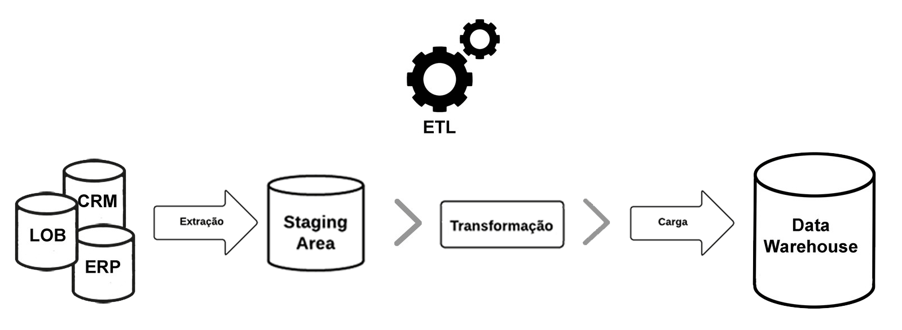
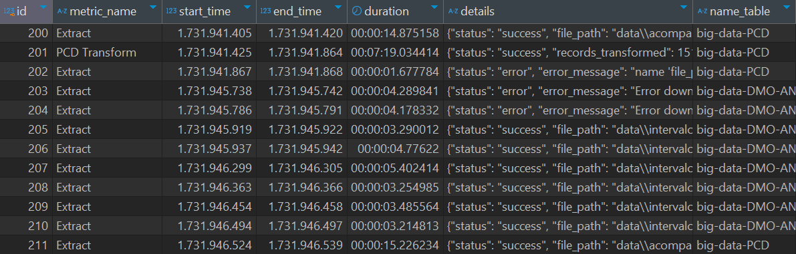
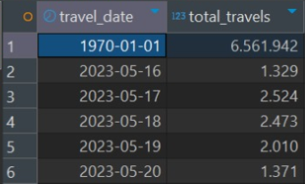
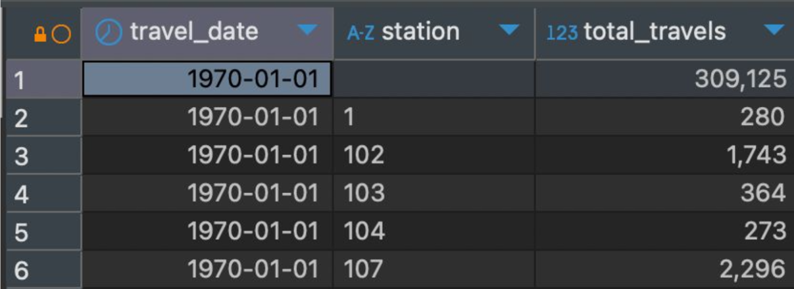
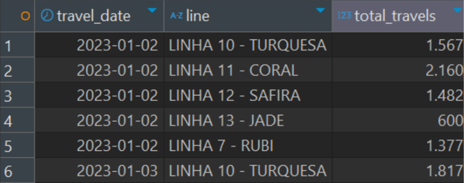
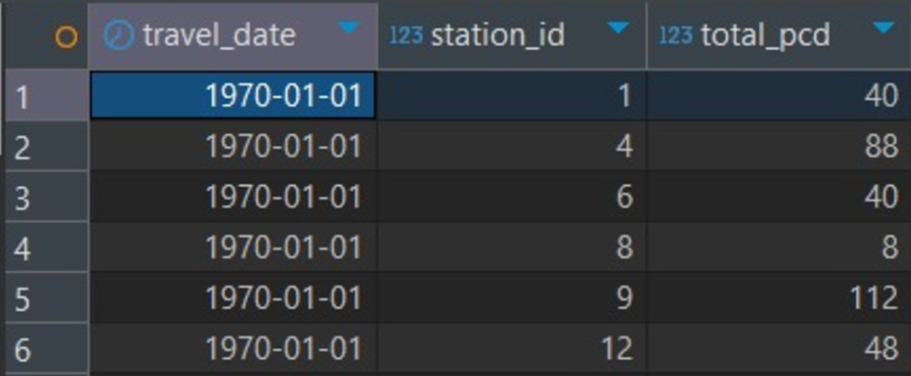
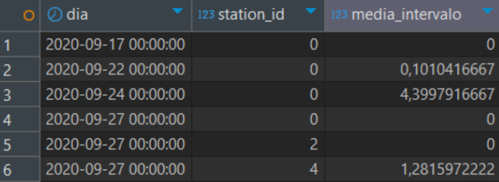
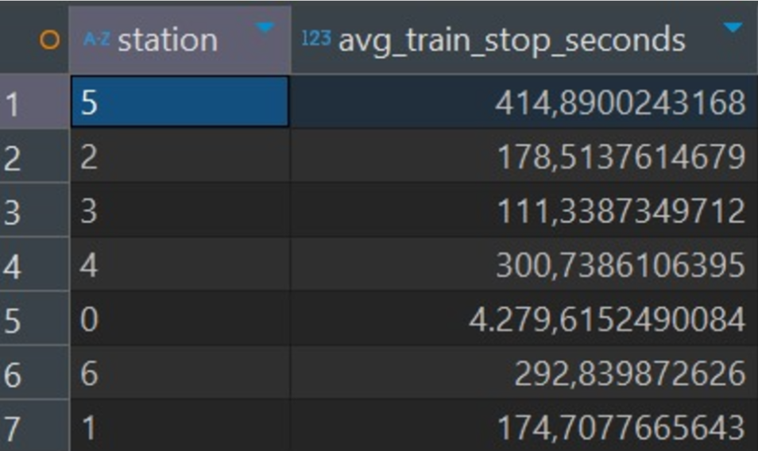
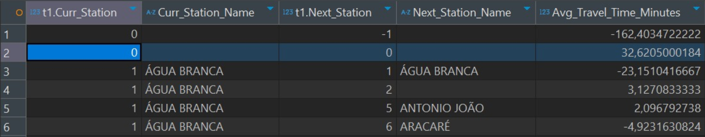

# 7. Documentação do ETL

## 7.1 Introdução

&emsp;&emsp;O processo **ETL (Extract, Transform, Load)** é uma metodologia essencial na gestão de dados, responsável por extrair informações de diferentes fontes, transformá-las conforme as necessidades do negócio e carregá-las em um ambiente centralizado, como um data warehouse ou data lake. Esse processo é utilizado para consolidar dados de várias origens, garantindo que estejam prontos para análises, relatórios e outras aplicações que exijam dados mais organizados. Abaixo segue uma introdução generalizada sobre cada um dos componentes do ETL.

<div align="center">
    <p>Imagem 21: Processo do ETL</p>

 <p>Fonte: UCommerce (2020)</p>
</div>

1. **Extract (Extração)**: É a fase em que os dados são coletados de diversas fontes, que podem incluir bancos de dados, APIs, sistemas legados e arquivos. Essa etapa assegura que os dados necessários estejam disponíveis para o processo ETL.

2. **Transform (Transformação)**: Na fase de transformação, os dados extraídos passam por várias operações, como limpeza, padronização e agregação. Essas transformações adequam os dados para análises e garantem sua qualidade.

3. **Load (Carregamento)**: Por fim, na etapa de carregamento, os dados transformados são inseridos em um repositório de destino, onde serão armazenados de forma organizada e acessível para futuras análises.

&emsp;&emsp;O ETL é um processo muito importante para otimizar a qualidade e a disponibilidade dos dados, sendo uma peça-chave para a tomada de decisões baseada nos mesmos. Esta documentação abordará cada uma dessas etapas detalhadamente, explorando as técnicas e ferramentas implementadas neste projeto para alcançar um processo ETL de qualidade.

### E (Extração)

&emsp;&emsp;A etapa de **Extração** é a primeira fase do processo ETL, onde os dados são coletados de diversas fontes de informação e preparados para o processamento posterior. Nesta fase, o objetivo é capturar os dados relevantes, para garantir que estejam prontos para as etapas de transformação e carregamento. 

&emsp;&emsp;Durante a extração, os dados podem ser obtidos de diversas fontes, incluindo bancos de dados relacionais, arquivos locais, sistemas legados, APIs externas e até fontes de dados em tempo real. A diversidade dessas fontes exige que a extração seja planejada para evitar duplicidade, perda de dados ou extração de dados desnecessários.

&emsp;&emsp;A extração é uma fase crítica porque a qualidade dos dados extraídos impacta diretamente as próximas fases do ETL. Dados incompletos ou mal formatados podem comprometer a eficiência da transformação e o resultado final no ambiente de armazenamento. Portanto, uma extração bem planejada garante que as informações sejam obtidas no formato e na estrutura mais adequada.

### T (Transformação)

&emsp;&emsp;A etapa de **Transformação** é o segundo componente do processo ETL, na qual os dados extraídos passam por uma série de transformações para serem padronizados e preparados para análise. O objetivo desta fase é garantir que os dados estejam em um formato consistente e utilizável, alinhado com as necessidades e especificações do projeto.

&emsp;&emsp;Na transformação, os dados podem ser submetidos a diversas operações, como:

- **Limpeza**: Remoção de dados inconsistentes, duplicados ou irrelevantes.
- **Padronização**: Conversão dos dados para formatos uniformes, facilitando a integração entre diversas fontes e melhorando a coesão da informação.
- **Enriquecimento**: Adição de informações complementares para aumentar o valor dos dados e tornar as análises mais significativas.
- **Agregação**: Consolidação dos dados, como cálculo de totais ou médias, que auxilia na geração de insights.
- **Mapeamento e Estruturação**: Reorganização e adaptação dos dados para que se ajustem ao formato final exigido pelo destino de armazenamento.

&emsp;&emsp;A transformação é uma fase necessária para assegurar que os dados estejam prontos para serem carregados, mantendo a qualidade e a relevância das informações para uso final.

### L (Carregamento)

&emsp;&emsp;A fase de **Carregamento** é o estágio final do processo ETL, em que os dados transformados são inseridos no ambiente de destino, como um data warehouse, data lake ou outro tipo de repositório centralizado. O objetivo desta etapa é garantir que os dados estejam organizados e prontos para análise e consumo pelas aplicações de negócios.

&emsp;&emsp;Existem diferentes estratégias de carregamento que podem ser aplicadas de acordo com as necessidades do projeto:

1. **Carregamento Completo**: Todos os dados são inseridos ou substituídos no destino a cada carga. Essa abordagem é útil quando o volume de dados é gerenciável e uma atualização total é necessária.
2. **Carregamento Incremental**: Apenas novos dados ou atualizações feitas desde o último carregamento são inseridos, reduzindo o tempo de processamento e o uso de recursos.
3. **Carregamento em Tempo Real**: Os dados são carregados continuamente conforme são extraídos e transformados, bom para casos em que decisões precisam ser tomadas em tempo real.

&emsp;&emsp;Nas próximas seções, cada etapa do processo ETL será detalhada para descrever como foi implementada neste projeto. A equipe apresentará as especificidades de cada fase, passando pelas operações de transformação, até as estratégias de carregamento adotadas. Essa explicação mais aprofundada ajudará na compreensão das decisões técnicas e das ferramentas utilizadas para garantir a eficiência e a qualidade dos dados ao longo do pipeline ETL.

## 7.2 Executando os Arquivos de ETL
&emsp;&emsp;Para garantir que o processo ETL nas tabelas de Viagem seja executado de maneira eficiente, esta seção oferece um guia passo a passo para configurar e rodar os arquivos necessários. Essas instruções cobrem a configuração do ambiente, instalação de dependências e execução dos scripts ETL desenvolvidos no projeto.

### 7.2.1 Estrutura de Pastas do Projeto

&emsp;&emsp;A seguir, é apresentado o organograma do esquema de pastas, focado nos arquivos relacionados ao processo de ETL do projeto. Essa organização facilita a manutenção, escalabilidade e compreensão dos diferentes componentes do ETL:

- **src**
  - **etlbronze**
    - **etlapps**
      - `intervalos.py` — Processamento ETL específico para a tabela de intervalos.
      - `pcd.py` — Processamento ETL específico para a tabela de PCD.
      - `viagens.py` — Processamento ETL específico para a tabela de viagens.
    - `app.py` — Script principal para orquestrar a execução do ETL para todas as tabelas.
    - `routes.py` — Script que conecta com a API Flask
    - **services**
      - **servicesetl**
         - **serviceextract**
          - `extract.py` — Código responsável pela extração de dados, independente da tabela de origem.
         - **serviceloading**
          - `loading.py` — Código responsável pelo carregamento de dados, aplicável a qualquer tabela.
         - **servicetransform**
          - `transformintervalos.py` — Transformações específicas para a tabela de intervalos.
          - `transformpcd.py` — Transformações específicas para a tabela de PCD.
          - `transformviagens.py` — Transformações específicas para a tabela de viagens.
      - `aws_conn.py` — Configuração de conexão com serviços AWS.
      - `connections.py` — Gerenciamento das conexões gerais do projeto.
      - `obs_conn.py` — Configuração de conexão com o OBS.

**Explicação da Estrutura:**

&emsp;&emsp;A pasta **services** contém funções genéricas para a execução do ETL. O processo de extração (`serviceextract/extract.py`) e carregamento (`serviceloading/loading.py`) são padronizados e independem da tabela. Já o processo de transformação é específico para cada tabela, com um script dedicado a cada uma dentro de **servicetransform**.

&emsp;&emsp;Na pasta **etlbronze**, o arquivo `app.py` é o ponto de entrada para orquestrar o ETL de todas as tabelas de viagens. A pasta **etlapps** armazena os scripts ETL dedicados a cada tabela, permitindo um controle granular e personalizado para cada uma delas. 

### 7.2.2 Preparação do Ambiente de Execução
&emsp;&emsp;Antes de iniciar o processo ETL, é necessário garantir que o ambiente esteja corretamente configurado, especialmente com as bibliotecas e credenciais necessárias. Siga os passos abaixo para preparar o ambiente de execução:
1. **Instale as dependências do projeto:**
   - O projeto utiliza o **Poetry** como gerenciador de pacotes para lidar com as dependências. No terminal, execute o comando para gerar um ambiente virtual:
     ```bash
     poetry shell
     ```
   - Logo depois, rode o comando a seguir para instalar as dependências:
     ```bash
     poetry install
     ```
   - Esse comando instalará todas as bibliotecas necessárias listadas no arquivo de configuração do Poetry (`pyproject.toml`).
   - **Dica:** Caso a biblioteca `pydantic` não esteja incluída no arquivo de dependências, você pode instalá-la manualmente com:
     ```bash
     poetry add pydantic
     ```
2. **Configuração das Credenciais AWS:**
   - Este projeto utiliza serviços da AWS para armazenamento e processamento de dados. Assim, é fundamental configurar as credenciais no arquivo `.env`, localizado no diretório `2024-2B-T10-SI08-G03/src/.env`.
   - **Instrução:** Abra o arquivo `.env` e adicione ou ajuste as chaves de acesso (`AWS_ACCESS_KEY_ID`, `AWS_SECRET_ACCESS_KEY`) conforme necessário para o projeto.
   - Essas credenciais permitirão que o código interaja com os serviços da AWS, como S3 ou RDS, para acessar e armazenar os dados processados.
3. **Navegue até a Pasta Correta:**
   - Em alguns casos, pode ser necessário navegar até a pasta `src` do projeto para garantir que os módulos e arquivos sejam referenciados corretamente durante a execução.
   - Use o seguinte comando no terminal para mudar para a pasta `src`:
     ```bash
     cd ./src/
     ```
### 7.2.3 Executando o Código ETL
&emsp;&emsp;Com as dependências instaladas e as credenciais configuradas, você já pode executar os scripts de ETL para processar os dados. Este projeto organiza seus scripts ETL por tipo de dado, como `viagem` e `PCD`. O exemplo abaixo mostra como rodar o código para cada uma dessas tabelas:
1.**Caminhe para o o etlbronze:""
    ```bash
    cd ./src/etlbronze/
    ```
2. **Executar o Script de ETL:**
   - Navegue até a raiz do projeto (`2024-2B-T10-SI08-G03`) e execute o comando principal do ETL:
     ```bash
     python run app.py
     ```
   - Esse código irá executar o processo de a integração do Flask do ETL para todas as tabelas que estão no domínio do grupo de viagens (PCD, Intervalos e Viagens). 

### 7.2.4 Integração do Flask com ETL

1. **Inicializando o Processo**
Certifique-se de que o servidor Flask está em execução. O código gerencia a integração ETL para as tabelas mencionadas, processando os dados conforme a lógica do domínio.

1. Execute o arquivo principal da aplicação Flask (por exemplo, `app.py`).
   - O servidor será iniciado na **porta 5000** por padrão, a menos que você tenha configurado outra porta.

2. **Testando a API com o Postman**
Para interagir com a API, utilize um software de testagem de API, como o **Postman**.

    a. **Conexão com a API:**
       - Acesse a API pela URL `http://localhost:5000` (ou a porta exibida no terminal).
    
    b. **Configuração no Postman:**
       - **Método HTTP**: Selecione **POST**.
       - **Headers**:
         - Adicione um campo `Authentication` com o valor da senha fornecida (`senha123`).

3. **Executando os Endpoints**
Você pode escolher entre executar o ETL para todas as tabelas ou para uma tabela específica.

    a. **Executar ETL para todas as tabelas:**
       - Endpoint: `http://localhost:5000/etl/all`
       - Este endpoint executará o processo de ETL para todas as tabelas: **PCD**, **Intervalos** e **Viagens**.
    
    b. **Executar ETL para uma tabela específica:**
       - Endpoint: `http://localhost:5000/etl/<nome_da_tabela>`
       - Substitua `<nome_da_tabela>` pelo nome da tabela desejada, como `intervalos` ou `viagens`.
         - Exemplo: `http://localhost:5000/etl/intervalos`

4. **Exemplos de Uso**
- **ETL para todas as tabelas:**
  - Configure o Postman:
    - URL: `http://localhost:5000/etl/all`
    - Método: **POST**
    - Header: `Authentication: senha123`

- **ETL para a tabela `intervalos`:**
  - Configure o Postman:
    - URL: `http://localhost:5000/etl/intervalos`
    - Método: **POST**
    - Header: `Authentication: senha123`

## 7.3 Extração e Trasformação da Tabela Viagem
&emsp;&emsp; Para a tabela referente às informações de viagens começou-se o processo de ETL (Extract, transform & load) com a extração dos dados. Esses estavam armazenados em um bucket S3. O Amazon Simple Storage Service (Amazon S3) se trata de um serviço para armazenamento de dados de forma escalável e que garante a disponibilidade em qualquer lugar, com isso facilitando o processo de Extração. Com isso, utilizando da biblioteca Boto3, é possível se conectar com os serviçõs da AWS e então realizar o download dos dados armazenados em um bucket S3 especificado. 

&emsp;&emsp; Após realizar a extração, é necessário realizar a transformação ou limpeza dos dados os quais foram salvos após o processo anterior. Com isso, é necessário uma análise dos tipos dos dados em cada coluna do dataset o que será usado no processo. Na tabela de Viagens, são encontradas algumas colunas referentes a data. Então torna-se imprescindível definir um formato para essas datas. A fim de tornar o dataset simples, todas as datas foram convertidas para unix timestamp. Os dados numéricos foram todos
convertidos para _integer_ou _float numbers_ de acordo com a necessidade da coluna.

&emsp;&emsp; Linhas com valores nulos foram análisadas. Se o valor faltante fosse um identificador, a linha era deletada, se o valor refere-se a uma medição, o mesmo era substituído pela média da coluna. Com esse processo é possível garantir um ETL eficiente e suficiente para uma etapa de dados em estado “bronze” de acordo com a arquitetura medalhão.

&emsp;&emsp; Para iniciar o processo de ETL (Extract, Transform, Load), a extração de dados foi realizada a partir de um bucket S3. O Amazon Simple Storage Service (Amazon S3) é um serviço de armazenamento escalável, garantindo disponibilidade dos dados em qualquer local. Utilizamos a biblioteca Boto3 para conectar com a AWS e realizar o download dos dados do bucket S3 especificado.

&emsp;&emsp; Após a extração, é necessária a transformação ou limpeza dos dados. Esse processo é feito em diversas etapas para garantir a consistência e qualidade dos dados. Os dados extraídos foram armazenados em um DataFrame do pandas, e então passou-se ao processo de transformação utilizando modelagem do Pydantic

&emsp;&emsp; Normalização dos Tipos de Dados:
- Para garantir consistência, colunas de data foram convertidas para o formato _unix timestamp_, padronizando o registrode datas em todo o dataset.
- Colunas numéricas foram convertidas para _inteiros_ ou _float_, conforme a necessidade da análise.

&emsp;&emsp; Tratamento de Valores Nulos:
- Caso o valor faltante fosse em uma coluna de identificador (como ID_LINHA, ID_ORIGEM, ID_DESTINO), a linha inteira era excluída.
- Para colunas numéricas que apresentavam valores nulos (como NR_DURACAO, NR_CCO_SIC, etc.), substituímos esses valores pela média da coluna.

&emsp;&emsp; Conversão de Tipos e Tratamento Específico:
- Colunas específicas, como ID_DESTINO_PROG, foram convertidas para string.
- Colunas com valores de data (DT_OPERACIONAL, DT_INI_VIAGEM, etc.) foram verificadas e convertidas para datetime utilizando o parâmetro errors='coerce' para tratar erros, substituindo valores inválidos por None.

## 7.4 Extração e Trasformação da Tabela Acompanhamento PCD

&emsp;&emsp; Para a etapa de extração da tabela Acompanhamento PCD, o processo foi realizado de forma idêntica ao da tabela Viagens, descrito na subseção anterior. Foi utilizado o serviço Amazon S3 para armazenar os dados e a biblioteca Boto3 para realizar o download dos arquivos diretamente do bucket especificado, garantindo uma extração eficiente e segura dos dados necessários para as etapas seguintes.

&emsp;&emsp; Após a extração, procedeu-se à etapa de transformação dos dados. Para garantir a qualidade dos dados, foi realizada uma análise dos tipos de dados em cada coluna, definindo formatos específicos e regras de limpeza para a tabela. Colunas que armazenam datas, como `Dt Destino`, `Dt Operacional` e `Dt Origem`, foram convertidas para o formato `Timestamp`, e valores inválidos foram tratados com a função `pd.to_datetime`, que define como nulo qualquer data que não pudesse ser convertida adequadamente.

&emsp;&emsp; Colunas com valores numéricos, como `Id Carro`, `Id Estacao Alerta`, `Id Estacao Destino`, `Id Estacao Origem` e `Id Registro`, foram convertidas para o tipo `integer`, e qualquer valor que não pudesse ser convertido foi definido como nulo. Para garantir a integridade dos dados textuais, colunas como `Tx Descr Linha`, `Tx Estacao Destino`, `Tx Linha` e `Tx Tipo Pcd` foram transformadas em strings, e valores vazios foram substituídos por nulos. As linhas com valores nulos em colunas essenciais foram excluídas para manter a consistência dos dados.

&emsp;&emsp; Com o processo de transformação finalizado, a tabela foi ajustada para refletir um estado "bronze" na arquitetura de dados em camadas, permitindo que os dados estejam prontos para serem utilizados em análises subsequentes ou outras etapas de processamento.

## 7.5 Extração e Trasformação da Tabela Intervalos
&emsp;&emsp;Para a etapa de extração da tabela Intervalos, o processo foi realizado de forma idêntica ao da tabela Viagens, descrita acima, utilizando o Amazon S3 como repositório dos dados e a biblioteca Boto3 para realizar o download dos arquivos diretamente do bucket especificado. Essa abordagem permite uma extração eficiente e segura dos dados necessários para as etapas de processamento subsequentes.

&emsp;&emsp;Após a extração, foi realizada a etapa de transformação dos dados para garantir a qualidade e consistência do conjunto. Primeiramente, cada coluna foi analisada quanto ao seu tipo de dado, e foram definidas regras de conversão e limpeza específicas para manter o padrão exigido. As colunas de datas, como `dt_hora_minuto`, `hora_ini` e `hora_fim`, foram convertidas para o tipo `Timestamp` utilizando a função `pd.to_datetime` , que substitui valores inválidos por `nulos` para garantir a consistência temporal dos dados.

&emsp;&emsp;Para as colunas numéricas, como duration_minutes, realizou-se a conversão para o tipo float, tratando valores não convertíveis como nulos.  Dessa forma, assegura-se que o tipo numérico seja mantido, evitando valores incorretos nas análises. Além disso, todas as linhas com valores nulos nas colunas essenciais (dt_hora_minuto, id_dt_hora_minuto, hora_ini, hora_fim, duration_minutes) foram removidas para garantir a integridade do conjunto.

&emsp;&emsp;Com a etapa de transformação concluída, a tabela Intervalos foi preparada para um estágio inicial na arquitetura de dados em camadas, categorizado como nível "bronze". Esse nível representa dados brutos que passaram por uma limpeza inicial e estão prontos para uso em análises ou processamento adicional, facilitando um fluxo de trabalho robusto e escalável.

## 7.6 Documentação do Carregamento (Load)

&emsp;&emsp;Como dito acima, o processo de loading é a etapa final do pipeline de ETL, em que os dados transformados são carregados. No contexto desse projeto o banco de dados foi o ClickHouse.

#### Detalhamento do Processo de Loading

&emsp;&emsp;O processo de carregamento é gerido pela classe Loading, que se conecta ao ClickHouse e executa a inserção dos dados. Essa classe é inicializada com as informações necessárias para se conectar ao servidor do ClickHouse, como o endereço do host, o nome do banco de dados e as credenciais de autenticação. Uma vez que a classe é instanciada, ela pode receber os dados a serem carregados e o data_tag, que identifica a origem dos dados, ou seja, nome da pasta e do arquivo que estão vindo do bucket no S3.

&emsp;&emsp;Antes da inserção, o método de carregamento prepara os dados a serem inseridos no banco. O campo data_ingestao é atribuído com o timestamp atual, representando a data e hora da ingestão dos dados. Além disso, o data_tag que foi gerado na etapa de extração é associado a cada linha de dados, permitindo rastrear a origem da informação.

&emsp;&emsp;Os dados são estruturados de forma que cada linha contém o data_ingestao, o data_tag e os dados provenientes das tabelas, que são armazenados em um campo denominado data_linha.

#### Inserção no ClickHouse

&emsp;&emsp;O processo de inserção é realizado utilizando a biblioteca clickhouse-connect, que permite interagir com o banco de dados ClickHouse de forma eficiente. Os dados preparados são convertidos para um DataFrame utilizando a biblioteca pandas, o que facilita a manipulação e a inserção dos dados. Em seguida, o DataFrame é passado para o método de inserção, que insere os dados na tabela de destino.

&emsp;&emsp;O nome da tabela de destino no ClickHouse é "working_travels", onde os dados das viagens são armazenados. O processo de inserção é otimizado para garantir que os dados sejam carregados de forma rápida e sem erros.

#### Resumo do processo

- **Extração:** Os dados são extraídos da fonte (S3) e o data_tag é gerado para identificar a origem.

- **Transformação:** Os dados são transformados para garantir que estejam no formato correto para inserção no banco.

- **Carregamento:** O método de carregamento insere os dados no ClickHouse, associando o data_ingestao e o data_tag a cada linha de dados, para que possam ser rastreados e analisados corretamente.

<div align="center">
  <p><b>Imagem 22</b> - Fluxo resumido do processo loading</p>


  <p><b>Fonte:</b> elaborado pela equipe Biggie.</p>
</div>

#### Guia de execução do arquivo de loading

&emsp;&emsp;Para rodar o arquivo **loading.py**, responsável pelo carregamento de dados no ClickHouse, siga os passos a seguir. Primeiro, certifique-se de que seu ambiente Python está configurado com o gerenciador de dependências Poetry instalado, o banco de dados ClickHouse está acessível, todas as dependências do projeto estão instaladas e o ambiente virtual está ativado. Além disso, é necessário que os dados tenham sido extraídos e transformados, e que o arquivo Parquet resultante tenha sido gerado pelo **transform.py**.

&emsp;&emsp;Para instalar as dependências, use o comando **poetry install**, que garante a instalação de todas as bibliotecas necessárias no ambiente virtual gerenciado pelo Poetry.

&emsp;&emsp;Também é essencial ter um arquivo **.env** configurado na raiz do projeto, contendo as credenciais e parâmetros de conexão com o ClickHouse. Um exemplo de configuração para o **.env** é:

```
CLICKHOUSE_HOST=seu_host_clickhouse
CLICKHOUSE_PORT=sua_porta_clickhouse
CLICKHOUSE_USER=seu_usuario
CLICKHOUSE_PASSWORD=sua_senha
CLICKHOUSE_DATABASE=seu_banco_de_dados
```

&emsp;&emsp;Para rodar o **loading.py**, utilize o seguinte comando:

```
poetry run python -m caminho_da_pasta.loading

```
&emsp;&emsp;Neste comando, poetry run executa o script dentro do ambiente virtual, enquanto **python -m caminho_da_pasta.loading** chama o módulo loading.py, responsável pelo carregamento dos dados no ClickHouse.

&emsp;&emsp;Certifique-se de que o arquivo Parquet contendo os dados transformados está no caminho correto, conforme esperado pelo código, e que os tipos de dados no arquivo são compatíveis com a tabela de destino no ClickHouse. Se encontrar erros de conexão, revise se o banco de dados ClickHouse está ativo e se as credenciais no .env estão corretas. Para problemas com tipos de dados, verifique o arquivo Parquet para confirmar que os campos correspondem aos tipos esperados na tabela do ClickHouse. Durante a execução, o script loading.py exibirá mensagens no console para indicar o progresso do carregamento e alertará sobre quaisquer erros ou exceções encontradas.

## 7.7 Implementação de Observability 

&emsp;&emsp;A equipe Biggie implementou uma camada de observability no projeto de ETL para monitorar e registrar o desempenho e a saúde das operações de extração, transformação e carregamento (ETL) dos dados, que foram citados nas seções acima. Essa camada permite que métricas sobre o processo de ingestão e transformação dos dados sejam registradas e monitoradas em um banco de dados PostgreSQL, promovendo um acompanhamento e a identificação de problemas.

#### Estrutura de Observability

&emsp;&emsp;O observability foi implementado com o objetivo de capturar dados sobre a execução do ETL e registrar informações importantes como:

1. **Início e término de execução**: Registra os horários de início e fim de cada etapa do processo ETL, no formato `unixtime`, permitindo cálculos precisos de duração.

2. **Duração**: Calcula o tempo total de execução, facilitando o acompanhamento de possíveis gargalos.

3. **Detalhes do processo**: Armazena informações específicas sobre as operações realizadas, como a quantidade de registros processados, em formato JSON.

4. **Origem dos Dados**:  Identifica a tabela de origem de cada operação através da coluna `name_table`, permitindo rastreamento detalhado e contextualização dos valores processados.

#### Componentes Principais

&emsp;&emsp;**1. Função `log_observability`**

&emsp;&emsp;A função `log_observability` foi implementada no módulo `observability.py` para centralizar o registro de métricas no banco de dados PostgreSQL. Ela recebe quatro parâmetros principais:
- **metric_name**: Nome da métrica (como `Extract`, `Transform`, `Load`), identificando a etapa do processo.
- **start_time** e **end_time**: Horários de início e término da operação, registrados em `unixtime` para padronização e eficiência.
- **details**: Informações adicionais sobre a operação realizada, armazenadas no formato JSON para maior flexibilidade.
- **name_table**: Nome da tabela de origem, fornecendo contexto adicional sobre os dados processados.

**Exemplo de Código da Função `log_observability`**:

```python
import datetime
from .connections import get_postgres_connection

def log_observability(metric_name, start_time, end_time, details):
    conn = get_postgres_connection()
    cursor = conn.cursor()

    cursor.execute('''
        CREATE TABLE IF NOT EXISTS modulo8si.observability_g3 (
            id SERIAL PRIMARY KEY,
            metric_name VARCHAR(255),
            start_time TIMESTAMP,
            end_time TIMESTAMP,
            duration INTERVAL,
            details TEXT
        )
    ''')

    duration = end_time - start_time
    cursor.execute('''
        INSERT INTO modulo8si.observability_g3 (metric_name, start_time, end_time, duration, details)
        VALUES (%s, %s, %s, %s, %s)
    ''', (metric_name, start_time, end_time, duration, details))

    conn.commit()
    cursor.close()
    conn.close()
    print(f"Logged {metric_name} metrics successfully.")
```

**2. Integração do Observability no Pipeline de ETL**

&emsp;&emsp;A função `log_observability`  foi integrada diretamente nas etapas de extração, transformação e carregamento do pipeline ETL, registrando métricas completas em cada fase:

Cada etapa utiliza o `log_observability` da seguinte forma:
- **Extração**: Loga o início e o fim do download dos dados do S3, além do nome da tabela de origem associada.
- **Transformação**: Registra a quantidade de registros transformados e os detalhes do processo no formato JSON.
- **Carregamento**: Loga o número de registros carregados no ClickHouse e utiliza o formato unixtime para os tempos de execução.

&emsp;&emsp;**3. Banco de Dados PostgreSQL para Observability**

&emsp;&emsp;Um banco de dados PostgreSQL foi configurado para armazenar as métricas de observability. A tabela observability_g3 possui as seguintes colunas:
- `id`: Identificador único para cada registro.
- `metric_name`: Nome da métrica associada à etapa do ETL.
- `start_time` e `end_time`: Horários de início e término, registrados em unixtime.
- `duration`: Duração da operação, calculada automaticamente.
- `details`: Informações detalhadas no formato JSON.
- `name_table`: Nome da tabela de origem dos dados processados.

#### Exemplo de Utilização no Pipeline

&emsp;&emsp;Cada etapa do ETL chama a função `log_observability` após a execução de sua operação principal, conforme o exemplo abaixo:

```python
# Exemplo de utilização no módulo de transformação
start_time = datetime.datetime.utcnow()
# Processo de transformação dos dados
end_time = datetime.datetime.utcnow()
log_observability("Viagem Transform", start_time, end_time, f"{len(transformed_data)} trips transformed.")
```

#### Visão Final do Observability

&emsp;&emsp;A imagem a seguir, extraída do DBeaver, mostra a visão final do observability implementado. Nela, podemos observar o resultado do monitoramento das diversas etapas do processo ETL, com colunas que indicam o nome da métrica (como Extract, Transform, Load), início e fim da execução (colunas start_time e end_time), duração da operação e detalhes específicos sobre cada etapa, como a quantidade de registros processados ou mensagens de erro encontradas. Essa visualização permite uma análise do desempenho do pipeline ETL, facilitando a identificação de etapas que demandam maior tempo e ajudando a equipe a responder rapidamente a qualquer problema ou atraso no processamento dos dados. Além disso será útil em entregas futuras relacionadas à métricas.

<br>
<div align="center">
<sub>Figura 23 - Visão do Log Observability no DBeaver</sub>

<sup>Fonte: Interface DBeaver 24.2.2 (2024)</sup>
</div>
<br>

&emsp;&emsp;A implementação de observability trouxe diversos benefícios ao projeto, incluindo:

- **Detecção de problemas em tempo real**: A equipe consegue identificar rapidamente etapas problemáticas no processo ETL, tomando ações corretivas com base nas métricas registradas.
- **Acompanhamento de desempenho**: As métricas de duração ajudam a monitorar o tempo de execução de cada etapa, possibilitando otimizações nas fases de transformação e carregamento.
- **Auditoria e rastreamento**: A documentação detalhada das operações realizadas permite o rastreamento completo do pipeline, fundamental para auditorias e controle de qualidade dos dados.
- **Rastreabilidade aprimorada**: A inclusão da coluna name_table permite identificar a origem dos dados processados em cada etapa, proporcionando uma visão clara sobre os valores manipulados no pipeline.
- **Flexibilidade na análise**: A transformação da coluna details para o formato JSON facilita a manipulação das informações registradas, alinhando-se a boas práticas de estruturação de dados.
- **Eficiência nos cálculos de tempo**: O uso do formato unixtime nas colunas de datas padroniza os registros, economiza espaço no banco de dados e simplifica cálculos temporais.

## 7.8 Automatização do ETL com Prefect

&emsp;&emsp;O processo de **ETL (Extract, Transform, Load)** é fundamental em soluções de Big Data e análise de dados, permitindo extrair dados de fontes diversas, transformá-los em informações úteis e carregá-los em bancos de dados para análises. A automação desse fluxo com o **Prefect** aumenta a eficiência, oferece monitoramento em tempo real e facilita a identificação e correção de falhas.

&emsp;&emsp;O Prefect é uma plataforma de orquestração de workflows que facilita o gerenciamento e monitoramento de pipelines de dados. Ele oferece suporte a:
- Monitoramento em tempo real.
- Registro detalhado de logs.
- Alertas em caso de falhas.
- Integração com diversas ferramentas e infraestruturas.

&emsp;&emsp;Conforme Barham et al. (2021), a orquestração de workflows com Prefect é particularmente vantajosa para pipelines complexos que exigem rastreabilidade e modularidade.

**Estrutura Geral do Código**

1. Importações:

- Prefect (`flow` e `task`): Para organizar e monitorar o pipeline.
- `dotenv`: Para carregar variáveis de ambiente, como credenciais.
- Pipelines específicos (`PcdPipeline`, `IntervalosPipeline`, `ViagensPipeline`): Cada tabela tem sua lógica específica para extração, transformação e carga.

2. Classe EtlPipeline

&emsp;&emsp;A classe encapsula o pipeline ETL e organiza os métodos em três categorias principais:

- Tarefas ETL:
  - extract: Responsável por extrair os dados da fonte.
  - transform: Processa os dados brutos.
  - load: Insere os dados no banco.

- Execução de Tabelas Específicas: Métodos dedicados para cada tabela (`run_intervalos`, `run_pcd`, `run_viagens`), que executam as etapas ETL de maneira sequencial.

- Execução Geral:
  - `run_all`: Executa o ETL para todas as tabelas.

3. Monitoramento com Prefect
- Tarefas (`@task`): As etapas do ETL são decoradas como @task, permitindo monitoramento individual.
- Fluxos (`@flow`): Orquestra o pipeline completo e captura logs automaticamente.
4. Modularidade: Cada tabela (Intervalos, PCD, Viagens) tem sua lógica encapsulada em uma classe separada, mantendo o código organizado e fácil de expandir.

**Como o Código Funciona?**

1. Inicialização: O arquivo principal carrega variáveis de ambiente com load_dotenv e inicializa a classe EtlPipeline.

2. Execução do Pipeline: O método run_all é chamado: Ele executa os métodos run_intervalos, run_pcd e run_viagens em sequência.

3. Pipeline para Cada Tabela:

- O método extract é chamado para coletar os dados brutos.
- O método transform processa os dados.
- O método load insere os dados no banco.
Monitoramento:

&emsp;&emsp;Cada etapa é rastreada no Prefect Cloud ou localmente, permitindo a visualização de status, logs e possíveis falhas.

**Vantagens do Código**

- Automatização Completa: O pipeline é totalmente automatizado, desde a extração até a carga no banco de dados.

- Monitoramento: Com o Prefect, é possível acompanhar a execução em tempo real, registrar logs e configurar alertas.

- Modularidade: A separação do pipeline por tabelas e etapas torna o código flexível e fácil de manter.

- Tratamento de Erros: Erros, como dados ausentes na extração, são tratados com mensagens claras e rastreáveis.

- Escalabilidade: É simples adicionar novos pipelines para processar tabelas adicionais.

### 7.8.1 Como Rodar o Pipeline

**Pré-Requisitos**
1. **Instalar dependências**:
   Certifique-se de que todas as dependências do projeto estão instaladas. Use o Poetry para gerenciar:
   ```bash
   poetry install
   ```

2. **Configurar o Prefect Cloud**:
   - Crie uma conta no Prefect Cloud ([https://app.prefect.io](https://app.prefect.io)).
   - Gere uma API Key.
   - Configure o ambiente local:
     ```bash
     prefect cloud login --key <YOUR_API_KEY>
     ```

3. **Configurar Banco de Dados**:
   Certifique-se de que o ClickHouse está configurado e acessível.


**Executar Localmente**

&emsp;&emsp;Para rodar o pipeline diretamente sem monitoramento:

```bash
poetry run python etl_pipeline.py
```

&emsp;&emsp;A automatização do pipeline ETL com Prefect melhora a eficiência e rastreabilidade, especialmente em ambientes de produção. Este projeto está pronto para rodar em escala, com monitoramento centralizado e notificações configuradas no Prefect Cloud.

## 7.9 Estrutura das Planilhas e Atributos

&emsp;&emsp;Nesta seção, será apresentada a documentação detalhada da estrutura das planilhas e dos atributos criados e utilizados durante o processo de ETL. O objetivo é fornecer uma visão clara das views desenvolvidas pela equipe, incluindo a explicação de suas respectivas estruturas e os dados gerados por elas. Essa documentação é fundamental para garantir a rastreabilidade dos dados e facilitar o entendimento das transformações aplicadas em cada etapa.

&emsp;&emsp;A estrutura das planilhas será descrita com base em atributos específicos, como nome das colunas, tipo de dado, descrição funcional e exemplos de valores. Além disso, serão detalhados os retornos de cada query executada e resultados obtidos a partir dessas operações. Dessa forma, a seção busca assegurar que todas as partes interessadas no projeto compreendam os artefatos gerados no pipeline de dados, promovendo transparência no uso das informações documentadas.

### Quantidade de Viagens por Dia

&emsp;&emsp;Query utilizada:

```SQL
SELECT
    toDate(JSONExtractFloat(data_linha, 'dt_origin')) AS travel_date,
    COUNT(*) AS total_travels
FROM grupo3.working_travels
GROUP BY
    travel_date
ORDER BY
    travel_date ASC;
```

&emsp;&emsp;Esta consulta realiza o seguinte:

- Extração e Conversão da Data: A coluna data_linha é tratada como JSON e o campo dt_origin é extraído e convertido para o tipo Date.
- Contagem de Viagens: É realizado o cálculo do número total de registros (viagens) para cada data.
- Agrupamento por Data: Os dados são agrupados pela data de viagem (travel_date) para que as contagens sejam realizadas de forma acumulativa por dia.
- Ordenação Crescente: O resultado final é ordenado pela data em ordem crescente.

<br>
<div align="center">
<sub>Figura 24 - Select de Quantidade de Viagens por Dia</sub>

<sup>Fonte: Interface DBeaver (2024)</sup>
</div>
<br>

&emsp;&emsp;O Select permite observar que, por exemplo, no dia 16 de maio de 2023, ocorreram 1329 viagens. Entretanto, a primeira linha representa todas as viagens registradas no banco de dados, desde o dia 1 de janeiro de 1970, até o dia 16 de maio de 2023.

### Quantidade de viagens por estação, por dia

```SQL
SELECT
    toDate(JSONExtractFloat(data_linha, 'dt_origin')) AS travel_date,
    JSONExtractString(data_linha, 'TX_ORIGEM_PROG') AS station,
    COUNT(*) AS total_travels
FROM grupo3.working_travels
GROUP BY
    travel_date,
    station
ORDER BY
    travel_date ASC,
    station ASC;
```

&emsp;&emsp;Esta consulta SQL foi desenvolvida para calcular a quantidade de viagens realizadas por estação, para cada dia registrado no dataset. Ela é útil para entender como as viagens estão distribuídas entre as estações de origem e como esses padrões se comportam ao longo do tempo. Os resultados dessa query podem auxiliar na identificação de padrões operacionais, como dias de maior movimentação ou estações mais utilizadas.

<br>
<div align="center">
<sub>Figura 25 - Select de Quantidade de Viagens por estação, por dia</sub>

<sup>Fonte: Interface DBeaver (2024)</sup>
</div>
<br>

&emsp;&emsp;A consulta demonstra a quantidade de viagens em dias específicos, por exemplo, na estação com o ID 1, tivemos 280 viagens no dia 1 de janeiro de 1970.

### Quantidade de viagens por linha, por dia

```SQL
SELECT
    toDate(JSONExtractFloat(data_linha, 'DT_INI_VIAGEM')) AS travel_date,
    JSONExtractString(data_linha, 'TX_DESCR_LINHA') AS line,
    COUNT(*) AS total_travels
FROM grupo3.working_travels
WHERE data_tag = 'big-data-viagem_viagem_tabela_principal'
GROUP BY
    travel_date,
    line
ORDER BY
    travel_date ASC,
    line ASC;
```

&emsp;&emsp;Esta consulta foi projetada para contar o número de viagens realizadas por linha de transporte em cada dia registrado no dataset.

<br>
<div align="center">
<sub>Figura 26 - Select de Quantidade de Viagens por linha, por dia</sub>

<sup>Fonte: Interface DBeaver (2024)</sup>
</div>
<br>

&emsp;&emsp;A partir desta consulta, podemos observar  que, no dia 2 de Janeiro de 2023, tivemos 1567 viagens totais na Linha 10 - Turquesa, por exemplo.

### Quantidade de PCD por Estação, por dia

```SQL
SELECT
    toDate(JSONExtractFloat(data_linha, 'dt_origin')) AS travel_date,
    JSONExtractInt(data_linha, 'alert_station_id') AS station_id,
    COUNT(*) AS total_pcd
FROM grupo3.working_travels
WHERE
    JSONExtractString(data_linha, 'pcd_type') != ''
GROUP BY
    travel_date,
    station_id
ORDER BY
    travel_date ASC,
    station_id ASC;
```

&emsp;&emsp;Essa consulta foi desenvolvida para contar o número de viagens realizadas por Pessoas com Deficiência (PCD) em cada estação, em cada dia registrado no dataset. A query filtra exclusivamente os registros relacionados a PCDs e organiza os resultados por estação e data, permitindo uma análise detalhada do uso das estações por esse grupo.

<br>
<div align="center">
<sub>Figura 27 - Select de Quantidade de PCD por estação, por dia</sub>

<sup>Fonte: Interface DBeaver (2024)</sup>
</div>
<br>

&emsp;&emsp;Essa consulta nos ajuda a identificar quais estações são mais utilizadas por Pessoas com Deficiência, auxiliando no planejamento de melhorias de acessibilidade. Ademais, ajuda a avaliar a necessidade de alocação de recursos ou adaptações em estações específicas.

### Intervalo de trens por estação, por linha, por dia

```SQL
WITH
   data_completa AS (
       SELECT
           JSONExtractString(data_linha, 'Open_Time') AS raw_open_time,
           trimBoth(JSONExtractString(data_linha, 'Open_Time')) AS open_time,
           JSONExtractInt(data_linha, 'Station_ID') AS station_id,
           parseDateTimeBestEffort(substring(trimBoth(JSONExtractString(data_linha, 'Open_Time')), 1, 10)) AS dia
       FROM
           grupo5.data_ingestion di
       WHERE
           JSONExtractString(data_linha, 'Open_Time') != '' 
   ),
   data_ordenada AS (
       SELECT
           dia,
           station_id,
           arraySort(groupArray(open_time)) AS horarios
       FROM
           data_completa
       GROUP BY
           dia, station_id
   ),
   intervalos AS (
       SELECT
           dia,
           station_id,
           arrayDifference(arrayMap(x -> toUnixTimestamp(parseDateTimeBestEffort(x)), horarios)) / 60 AS intervalos_minutos
       FROM
           data_ordenada
   )
SELECT
   dia,
   station_id,
   AVG(arrayJoin(intervalos_minutos)) AS media_intervalo
FROM
   intervalos
GROUP BY
   dia, station_id
ORDER BY
   dia, station_id;
```

&emsp;&emsp;A consulta calcula a média de intervalos entre trens para cada estação em cada dia. Isso é feito a partir dos horários de abertura (Open_Time) registrados no sistema, transformando-os em intervalos de tempo em minutos. O objetivo é identificar o intervalo médio entre chegadas de trens em cada estação e dia.

&emsp;&emsp;A função AVG calcula a média dos intervalos gerados para cada estação por dia, considerando todos os intervalos do array intervalos_minutos.

<br>
<div align="center">
<sub>Figura 28 - Intervalo de trens por estação, por linha, por dia</sub>

<sup>Fonte: Interface DBeaver (2024)</sup>
</div>
<br>

&emsp;&emsp;Média de Intervalos: Refere-se ao intervalo médio de tempo, em minutos, entre os trens registrados em uma estação durante um determinado dia. Valores mais altos indicam maior tempo de espera entre os trens, enquanto valores baixos indicam maior frequência.

- Possíveis Correções e Próximos Passos
    - Verificação de Valores Inválidos ou Zeros:
      Algumas estações apresentam média de intervalo como 0, o que pode indicar:
      - Apenas um horário registrado para aquele dia.
      - Registros com horários ausentes ou inválidos.
      - É necessário filtrar registros com menos de dois horários por estação antes de calcular os intervalos.

### Média de tempo parada de trem por estação

```SQL
SELECT
    JSONExtractString(data_linha, 'Station_ID') AS station,
    AVG(
        toUnixTimestamp(parseDateTimeBestEffort(JSONExtractString(data_linha, 'Closed_Time'))) -
        toUnixTimestamp(parseDateTimeBestEffort(JSONExtractString(data_linha, 'Open_Time')))
    ) AS avg_train_stop_seconds
FROM 
    grupo5.data_ingestion
WHERE 
    "data_tag" = 'caixapreta/trem_passageiros.parquet'
GROUP BY
    station;
```

&emsp;&emsp;Esta consulta calcula a média de tempo que os trens permanecem parados em cada estação, baseada nos registros de horário de abertura (Open_Time) e fechamento (Closed_Time). O resultado é expresso em segundos, representando a duração média da parada de cada trem em uma estação específica.

<br>
<div align="center">
<sub>Figura 29 - Select de Intervalo de trens por estação, por linha, por dia</sub>

<sup>Fonte: Interface DBeaver (2024)</sup>
</div>
<br>

- Média em Segundos: Os valores calculados representam o tempo médio de parada dos trens em segundos, podendo ser convertidos para minutos para maior facilidade de interpretação.
- Estação 0: O tempo de parada excepcionalmente alto pode indicar registros inconsistentes ou uma falha no sistema de registro para essa estação.

### Tempo de transição do trem entre estações

```SQL
WITH
    -- Dados filtrados com as viagens
    FilteredData AS (
        SELECT
            JSONExtractInt(data_linha, 'Station_ID') AS Curr_Station,
            JSONExtractInt(data_linha, 'NextStation_ID') AS Next_Station,
            JSONExtractInt(data_linha, 'Line_ID') AS Line_ID,
            JSONExtractInt(data_linha, 'Train_ID') AS Train_ID,
            parseDateTimeBestEffort(JSONExtractString(data_linha, 'Closed_Time')) AS Closed_Time,
            parseDateTimeBestEffort(JSONExtractString(data_linha, 'Open_Time')) AS Open_Time
        FROM grupo5.data_ingestion
        WHERE data_tag = 'caixapreta/trem_passageiros.parquet'
          AND JSONHas(data_linha, 'Station_ID') 
          AND JSONHas(data_linha, 'NextStation_ID') 
          AND JSONHas(data_linha, 'Closed_Time')
          AND JSONHas(data_linha, 'Open_Time')
    ),
    -- Numerando as estações para relacioná-las por viagens consecutivas
    NumberedStations AS (
        SELECT
            *,
            ROW_NUMBER() OVER (PARTITION BY Line_ID, Train_ID ORDER BY Closed_Time) AS Row_Num
        FROM FilteredData
    ),
    -- Mapeamento dos nomes das estações
    StationInfo AS (
        SELECT
            JSONExtractInt(replaceAll(data_linha, '''', '"'), 'id_estacao') AS Station_ID,
        	JSONExtractString(replaceAll(data_linha, '''', '"'), 'tx_nome') AS Station_Name
        FROM grupo3.working_travels wt 
        WHERE data_tag = 'big-data-estacoes/estacoes.parquet'
    )
SELECT
    t1.Curr_Station,
    s1.Station_Name AS Curr_Station_Name,
    t1.Next_Station,
    s2.Station_Name AS Next_Station_Name,
    AVG(dateDiff('second', t1.Closed_Time, t2.Open_Time)) / 60 AS Avg_Travel_Time_Minutes
FROM
    NumberedStations t1
INNER JOIN
    NumberedStations t2
    ON t1.Row_Num + 1 = t2.Row_Num
    AND t1.Line_ID = t2.Line_ID
    AND t1.Train_ID = t2.Train_ID
LEFT JOIN
    StationInfo s1
    ON t1.Curr_Station = s1.Station_ID
LEFT JOIN
    StationInfo s2
    ON t1.Next_Station = s2.Station_ID
GROUP BY
    t1.Curr_Station,
    s1.Station_Name,
    t1.Next_Station,
    s2.Station_Name
ORDER BY
    t1.Curr_Station,
    t1.Next_Station;
```

&emsp;&emsp;Esta consulta calcula o tempo médio de transição dos trens entre estações consecutivas em uma linha específica. A análise considera as informações de tempo de fechamento da estação atual e de abertura da próxima estação. O resultado é expresso em minutos e agrupado por pares de estações consecutivas.

<br>
<div align="center">
<sub>Figura 30 - Tempo de transição do trem entre estações
</sub>

<sup>Fonte: Interface DBeaver (2024)</sup>
</div>
<br>

&emsp;&emsp;Essa consulta permite identificar próximos passos de correção, podemos perceber isso através das 2 primeiras linhas com dados nulos, e as médias Avg_Travel_Time_Minutes possue valores negativos, o que pode indicar possíveis erros.

## 7.10  Conclusão da Documentação do ETL

&emsp;&emsp;O processo ETL implementado neste projeto garante um fluxo de dados estruturado, necessário para a confiabilidade e qualidade dos dados utilizados nas análises. A etapa de Extração viabiliza a coleta de informações a partir de múltiplas fontes, a Transformação realiza a padronização e enriquecimento dos dados para assegurar consistência, e o Carregamento finaliza o processo ao inserir os dados transformados no ambiente de destino, prontos para uso.

&emsp;&emsp;Essa arquitetura ETL permite uma escalabilidade do processo, facilitando integrações futuras e atualizações dos dados. A separação de cada etapa no pipeline assegura que o processo seja ajustável, mantendo a integridade dos dados e a adaptabilidade do sistema para atender às demandas do projeto.

# 8. Testar e Usar a Aplicação com Docker Compose

&emsp;&emsp;Com **Docker Compose**, você pode orquestrar múltiplos serviços necessários para a aplicação, como a API Flask, o frontend e o banco de dados ClickHouse, em um único comando. Isso simplifica o processo de configuração e execução, garantindo um ambiente consistente e isolado.

&emsp;&emsp;Abaixo, você encontrará as instruções detalhadas para executar a aplicação completa com suas dependências.

## **8.1. Pré-requisitos**

&emsp;&emsp;Certifique-se de que os seguintes requisitos estão atendidos antes de prosseguir:

1. **Docker**:
   - Instale o Docker no sistema.
   - [Guia de instalação do Docker](https://www.docker.com/products/docker-desktop)
   - Verifique se o Docker está funcionando:
     ```bash
     docker --version
     ```

2. **Docker Compose**:
   - Verifique se o Docker Compose está instalado:
     ```bash
     docker-compose --version
     ```
   - [Guia de instalação do Docker Compose](https://docs.docker.com/compose/install/)

## **8.2. Configuração do `docker-compose.yml`**

&emsp;&emsp;O arquivo `docker-compose.yml` define a configuração de todos os serviços necessários para a aplicação.

### **Serviços Definidos no `docker-compose.yml`**

1. **`flask-api`**:
   - Serviço principal da aplicação, que roda a API Flask.
   - Expõe a porta **5001**.

2. **`frontend-home`**:
   - Serviço responsável pelo frontend "Home".
   - Expõe a porta **8501**.

3. **`frontend-line`**:
   - Serviço responsável pelo frontend "Line".
   - Expõe a porta **8502**.

4. **`clickhouse`**:
   - Serviço para o banco de dados ClickHouse, utilizado pelo backend.
   - Expõe a porta **8123**.

5. **`backend`**:
   - Serviço backend que conecta ao banco ClickHouse e suporta as funcionalidades da aplicação.
   - Depende do serviço `clickhouse`.

6. **Volumes**:
   - **`clickhouse_data`**: Persistência dos dados do banco de dados.
   - **`clickhouse_log`**: Persistência dos logs do banco.


## **8.3. Executar os Contêineres**

&emsp;&emsp;Para iniciar todos os serviços, execute o comando abaixo no diretório onde o arquivo `docker-compose.yml` está localizado:

```bash
docker-compose up --build
```

### **Explicação do Comando**:
- **`up`**: Sobe os serviços definidos no `docker-compose.yml`.
- **`--build`**: Garante que as imagens Docker sejam reconstruídas com base no Dockerfile.

## **8.4. Testar os Serviços**

&emsp;&emsp;Após executar o comando acima, cada serviço estará disponível nas seguintes portas:

1. **Flask API**:
   - URL: [http://localhost:5001](http://localhost:5001)
   - Endpoints disponíveis:
     - **`POST /etl/intervalos`**
     - **`POST /etl/pcd`**
     - **`POST /etl/viagens`**
     - **`POST /etl/all`**

   Exemplo de teste com `curl`:
   ```bash
   curl -X POST http://localhost:5001/etl/all
   ```

2. **Frontend Home**:
   - URL: [http://localhost:8501](http://localhost:8501)

3. **Frontend Line**:
   - URL: [http://localhost:8502](http://localhost:8502)

4. **ClickHouse**:
   - Administra o banco de dados no backend.
   - URL padrão: [http://localhost:8123](http://localhost:8123)

## **8.5 Parar os Serviços**

&emsp;&emsp;Para parar todos os serviços, pressione `Ctrl + C` no terminal onde o Docker Compose está rodando.

&emsp;&emsp;Para remover os contêineres e volumes:

```bash
docker-compose down --volumes
```

## **8.6 Benefícios do Docker Compose**

1. **Orquestração Simples**: Um único comando para subir ou derrubar todos os serviços.
2. **Isolamento**: Cada serviço roda em seu próprio contêiner.
3. **Configuração Centralizada**: Todas as dependências e conexões estão definidas em um único arquivo.
4. **Reprodutibilidade**: Facilita a configuração do ambiente em diferentes máquinas.

### **Próximos Passos**

- Teste cada endpoint da API e valide o funcionamento do frontend e backend.
- Monitore o banco de dados ClickHouse para acompanhar as operações realizadas pela aplicação.

