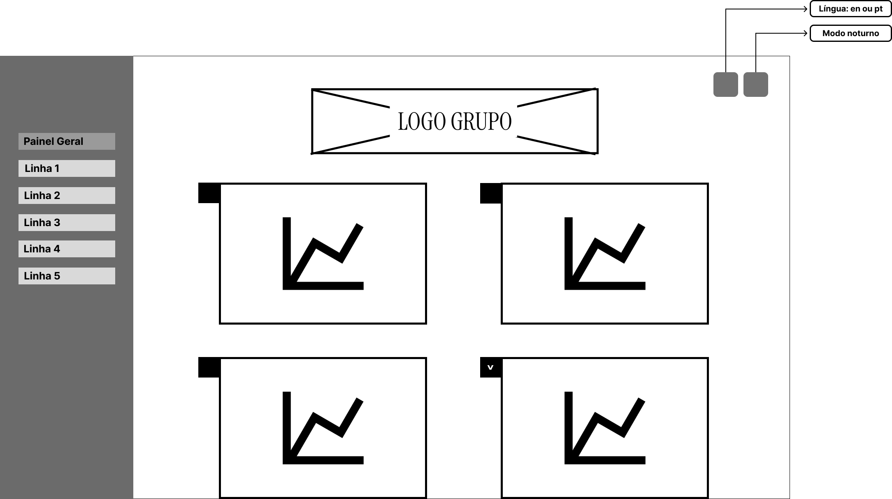

# 5. Wireframes

&emsp;&emsp;Este documento descreve o design dos wireframes que serão utilizados no desenvolvimento de um **data app**. As escolhas de layout e componentes foram pensadas com base nas características e limitações da plataforma, para garantir uma implementação eficiente e uma interface amigável ao usuário.

&emsp;&emsp;Um **wireframe** é uma representação visual simplificada de uma interface, que busca mostrar o layout dos elementos na tela, sem se aprofundar em detalhes visuais ou de estilo. Ele serve como um esboço do produto final, ajudando a definir a estrutura de navegação, o posicionamento dos elementos e a organização das informações. O propósito de um wireframe é comunicar a funcionalidade e o fluxo da interface, permitindo que equipes de desenvolvimento e design possam colaborar e alinhar suas expectativas antes da implementação.

&emsp;&emsp;Para o desenvolvimento do data app, foi escolhida a ferramenta **Streamlit**, ela permite a criação rápida e fácil de aplicações web interativas em Python, com foco em análise de dados e visualizações. O Streamlit foi selecionado por sua simplicidade e pela forma como facilita a integração com bibliotecas populares de análise de dados, como Pandas, Matplotlib e Plotly, além de suportar elementos interativos como gráficos e filtros.

## 5.1 Descrição e Justificativa de Design

**Dashboard Geral**

&emsp;&emsp;A tela inicial será basicamente um **dashboard resumido**, exibindo uma visão geral com infográficos mais generalistas e um menu lateral para navegação. O menu lateral será necessário para a troca entre seções da aplicação, basicamente terá um seção para cada uma das linhas da CPTM, contendo informações mais específicas do que a tela inicial. O logo centralizado reforça a identidade visual do grupo, enquanto os gráficos serão a visualização das KPIs (Key Performance Indicators). No canto superior direito, há botões que poderão ser usados para aplicar o **modo noturno** à página e para trocar a língua do site.

&emsp;&emsp;A escolha desse design foi guiada pelas capacidades do Streamlit. A plataforma oferece suporte a menus laterais usando `st.sidebar`, que garante uma navegação intuitiva e consistente. Os blocos modulares podem ser implementados com `st.columns` ou `st.metric`, favorecendo a exibição clara de indicadores ou conteúdos organizados. Além disso, a simplicidade do layout está alinhada à filosofia do Streamlit, que promove interfaces minimalistas e funcionais.

**Técnicas de UX Design Aplicadas:**

- **Hierarquia visual:** O logo no topo e os gráficos bem distribuídos facilitam a rápida identificação das informações mais importantes.
- **Consistência:** O menu lateral é mantido em todas as telas, reforçando a familiaridade para o usuário.
- **Acessibilidade:** A opção de modo noturno e a mudança de idioma promovem uma experiência inclusiva para diferentes públicos.
- **Design minimalista:** O uso de gráficos simples e um layout limpo evita sobrecarregar o usuário com informações desnecessárias.

**Dashboard Detalhado**

&emsp;&emsp;Ao clicar na opção de **dropdown** presente na tela inicial, a mesma é voltada para a exibição de conteúdos mais detalhados. Os blocos de texto exibem explicações e possíveis análises referentes aos infográficos, acompanhados do gráfico numa escala maior para complementar a informação. Há a presença de um menu lateral, pelo qual será possível aplicar filtros ao gráfico, por exemplo, filtrar a exibição do gráfico para um determinado período de tempo.

&emsp;&emsp;Para garantir a funcionalidade dessa tela, o Streamlit oferece ferramentas como `st.write` ou `st.markdown` para exibição de textos formatados. A inserção de gráficos pode ser feita com `st.pyplot` ou `st.plotly_chart`, que suportam visualizações interativas. A possibilidade de ocultar o menu lateral dinamicamente é útil para dar maior foco ao conteúdo em telas menores ou dispositivos móveis.

**Técnicas de UX Design Aplicadas:**

- **Progressive disclosure (revelação progressiva):** O conteúdo mais detalhado é mostrado apenas quando necessário, ajudando a evitar sobrecarga cognitiva.
- **Feedback imediato:** A interação com filtros e gráficos dá retorno visual imediato ao usuário, reforçando a sensação de controle sobre os dados.
- **Responsividade:** O menu lateral pode ser ocultado para melhorar a navegação em telas menores, garantindo uma boa experiência em dispositivos móveis.

**Página de Linhas**

&emsp;&emsp;A segunda tela apresenta detalhes sobre as **linhas da CPTM**, com um layout que organiza cards menores na parte superior que trarão os principais KPI's das linhas e logo em seguida os infográficos específicos da linha. O menu lateral é mantido para garantir a navegação em todas as abas do data app. O título principal exibe o nome da linha, orientando o usuário sobre o conteúdo da página.

&emsp;&emsp;No Streamlit, há métodos e ferramentas que ajudam na disposição dos elementos da página, facilitando a criação e organizados do layout. A estrutura modular favorece a apresentação clara de várias informações em uma única tela. O design também foi pensado para ser responsivo, garantindo uma boa experiência em dispositivos de diferentes tamanhos, mesmo considerando as limitações do Streamlit.

**Técnicas de UX Design Aplicadas:**

- **Design modular:** O uso de cards para apresentar KPIs facilita a organização e melhora a compreensão dos dados.
- **Uso de affordances:** A disposição dos gráficos e cards sinaliza claramente ao usuário que eles podem ser explorados e interagidos.
- **Consistência na navegação:** O menu lateral está presente em todas as telas, criando uma expectativa clara e reforçando a previsibilidade no uso do app.
- **Clareza e orientação:** A inclusão do nome da linha no título principal dá contexto imediato ao usuário sobre qual conteúdo está sendo exibido.

## 5.2 Apresentação dos Wireframes

&emsp;&emsp;Os wireframes a seguir foram projetados para oferecer uma visão estruturada da solução *Biggie*, com o objetivo de proporcionar uma experiência de usuário intuitiva e bem validada. Cada página foi planejada para atender a diferentes níveis de análise de dados das linhas de trem da CPTM.

&emsp;&emsp;A estrutura dos wireframes destaca três elementos, primeiramente a Página Principal, que oferece uma visão geral de todas as linhas, a **Página de Análise por Linha** com insights específicos e detalhados. Por fim, a seção de **Visualização Ampliada** onde o usuário pode explorar gráficos específicos em profundidade, com recursos interativos e filtros personalizados, todas as páginas são disponíveis para desktop e celular;

&emsp;&emsp;Esses wireframes servem como base para a interface final, proporcionando uma referência visual para o desenvolvimento da solução. O objetivo da equipe Biggie é realizar uma validação com o parceiro CPTM, garantindo que todas as necessidades de análise do usuário sejam atendidas de forma eficiente.

### Página Principal

 

Figura 9 - Wireframe: Página Principal

Fonte: Material produzido pelos autores (2024)

 

 

Figura 10 - Wireframe Mobile: Página Principal

Fonte: Material produzido pelos autores (2024)

 

&emsp;&emsp;A Página Principal da solução desenvolvida pela Equipe Biggie oferece uma visão integrada de todas as linhas operacionais, com dashboards e métricas gerais. O objetivo desta página é permitir que o usuário compare a performance das diversas linhas em relação aos principais KPIs, definidos em colaboração com a equipe de viagens da CPTM.

&emsp;&emsp;Esta solução foi projetada para ser responsiva, oferecendo versões para desktop e celular, disponibilizadas no wireframe. Ambas as versões contam com as mesmas funcionalidades, exceto se indicado de outra forma nesta documentação.

1. **Cabeçalho e Logo**: A logo da Equipe Biggie está centralizada no topo da página, destacando a identidade visual da equipe.
2. **Dashboards e Gráficos**: Abaixo da logo, encontram-se os gráficos principais, organizados em ordem de importância (conforme priorizado em conjunto com a CPTM). Cada gráfico representa uma métrica essencial para a análise de desempenho.
3. **Ajustes de Exibição**: No canto superior direito, há dois botões que permitem alternar para o modo noturno e alterar o idioma para inglês.
4. **Navegação Lateral**: À esquerda, a barra de navegação (navy bar) permite o acesso rápido a outras páginas da solução. Esta barra pode ser minimizada (ícones X e Y) para maximizar a área de visualização do conteúdo principal.

&emsp;&emsp;Além disso, com a intenção de ser responsiva, a *sidebar* pode ser minimizada, como mostra a imagem a seguir:

 

Figura 11 - Wireframe: Página de Análise por Linha sem SideBar

Fonte: Material produzido pelos autores (2024)

 

 

Figura 12 - Wireframe Mobile: Página de Análise por Linha sem SideBar

Fonte: Material produzido pelos autores (2024)

 

## Página de Análise por Linha

 

Figura 13 - Wireframe: Página de Análise por Linha

Fonte: Material produzido pelos autores (2024)

 

 

Figura 14 - Wireframe Mobile: Página de Análise por Linha

Fonte: Material produzido pelos autores (2024)

 

&emsp;&emsp;Com o objetivo de oferecer uma visão personalizada, cada uma das cinco linhas de trem da CPTM terá uma página individual, acessível na barra lateral. Cada página fornecerá insights específicos para a respectiva linha, mantendo uma identidade visual consistente com o restante da solução, incluindo a logo centralizada e os botões de “mudar visualização” e “alterar idioma”.

&emsp;&emsp;Na parte superior de cada página de linha, haverá uma seção inicial chamada “Insights Gerais”, com informações abrangentes sobre a linha, como: “A Linha Y registrou um aumento de X% nas viagens.” Logo abaixo, serão exibidos dashboards focados exclusivamente nos dados daquela linha, em um formato visual similar ao dos gráficos da página principal, mas com uma abordagem específica para cada linha.

## Página de Visualização Ampliada

 

Figura 15 - Wireframe: Página de Visualização Ampliada

Fonte: Material produzido pelos autores (2024)

 

 

Figura 16 - Wireframe Mobile: Página de Visualização Ampliada

Fonte: Material produzido pelos autores (2024)

 

&emsp;&emsp;Ao acessar qualquer página, o usuário verá os gráficos em uma visualização geral. Caso deseje examinar um gráfico específico com mais detalhes, ele poderá clicar no dashboard correspondente, expandindo-o para ocupar uma área maior. Na visualização ampliada, cada gráfico apresenta seu título seguido de uma breve descrição, que serve como legenda, ajudando o usuário a compreender melhor o propósito do gráfico.

&emsp;&emsp;O gráfico ampliado é interativo: ao passar o mouse sobre diferentes pontos, o usuário obtém informações detalhadas sobre os dados representados. À esquerda de cada gráfico, há um painel de filtros que permite personalizar a exibição dos dados conforme as preferências do usuário.

&emsp;&emsp;Os wireframes apresentados oferecem uma estrutura funcional e intuitiva para a solução Biggie, projetada para atender as necessidades de análise e navegação dos usuários da CPTM. Através de uma interface responsiva e elementos como dashboards interativos, filtros e visualizações ampliadas, a solução Biggie se alinha aos objetivos de eficiência na gestão de dados do parceiro. Esse projeto visual serve como um guia para o desenvolvimento do site no futuro.

## 5.3 Feedbacks coletados
&emsp;&emsp;Durante o desenvolvimento do Wireframe, a equipe Biggie procurou foca na qualidade do projeto, destacando a importância da coleta de feedbacks. No dia 31 de outubro de 2024, realizou-se uma reunião com o professor de User Experience, Francisco Escobar, contando com a participação dos alunos Izadora Luz e Pedro Henrique. Os feedbacks obtidos foram fundamentais para aprimoramentos subsequentes e são detalhados a seguir:

&emsp;&emsp;O feedback mais significativo destacou a necessidade de maior detalhamento dos componentes do wireframe. Como se tratava de um wireframe de baixa fidelidade, por vezes, os elementos na página pareciam confusos sem um texto explicativo adequado, dificultando o entendimento de suas funções. Para resolver esses problemas, foram realizadas as seguintes alterações:

- Substituição das imagens marcadas com um “x” por imagens de gráficos, para esclarecer que se tratavam de representações gráficas.
- Alteração dos campos de texto genéricos por textos reais ou lorem ipsum, para melhorar a visualização do conteúdo proposto.
- Diferenciação das formas utilizadas para indicar gráficos e KPIs, visando uma identificação mais intuitiva.
- Especificação clara que as áreas marcadas correspondiam a filtros de dados.

&emsp;&emsp;Com estas alterações, sugeridas pelo professor Francisco Escobar, espera-se facilitar a compreensão e o reconhecimento do wireframe pelo parceiro CPTM, além de otimizar a comunicação visual no projeto.

&emsp;&emsp;Seguem imagens do Wireframe antes dos feedbacks:

 

Figura 17 - Versão Antiga: Página Principal

Fonte: Material produzido pelos autores (2024)

 

 

Figura 18 - Versão Antiga: Análise por Linha

Fonte: Material produzido pelos autores (2024)

 

 

Figura 19 - Versão Antiga: Visualização Ampliada

Fonte: Material produzido pelos autores (2024)

 

&emsp;&emsp;Dessa forma, a equipe Biggie procura implementar as sugestões recebidas (como evidenciado na seção 5.2 Apresentação dos Wireframes), detalhadas e orientadas para a clareza e funcionalidade. Espera-se que essas mudanças, ao serem implementadas, atendam às expectativas do parceiro CPTM. Em suma, o processo de revisão e refinamento sublinha a importância de feedbacks construtivos e orientados por especialistas no desenvolvimento de soluções em design. Você pode acessar o wireframe completo nesse [link](https://www.figma.com/design/ve4UXxAbwdmGx4JwU1VctK/Wireframe?node-id=0-1&node-type=canvas&t=oYMpbujsVCNlObiP-0)

## 5.4 Conclusão

&emsp;&emsp;Dessa forma, a seção 5 discute em detalhes o design e a implementação dos wireframes para o **data app** desenvolvido com o Streamlit. O layout e os componentes escolhidos foram adaptados às limitações da ferramenta para criar uma interface simples, intuitiva e funcional. Diversas técnicas de UX foram incorporadas para otimizar a experiência do usuário, incluindo hierarquia visual, consistência e acessibilidade, através de funcionalidades como modo noturno e mudança de idioma.

&emsp;&emsp;Os wireframes detalhados para cada página—Página Principal, Página de Análise por Linha e Página de Visualização Ampliada—mostram uma estrutura que facilita a análise de dados e a navegação, com ênfase em gráficos interativos e filtros personalizados para uma análise mais profunda.

&emsp;&emsp;Finalmente, a seção aborda o feedback coletado durante a apresentação dos wireframes, que levou a ajustes significativos para melhorar a clareza e a funcionalidade do design, visando uma melhor compreensão e usabilidade para os usuários finais da CPTM. A equipe de desenvolvimento mostra um comprometimento com a melhoria contínua, fundamentada no feedback de especialistas e testes de usabilidade.